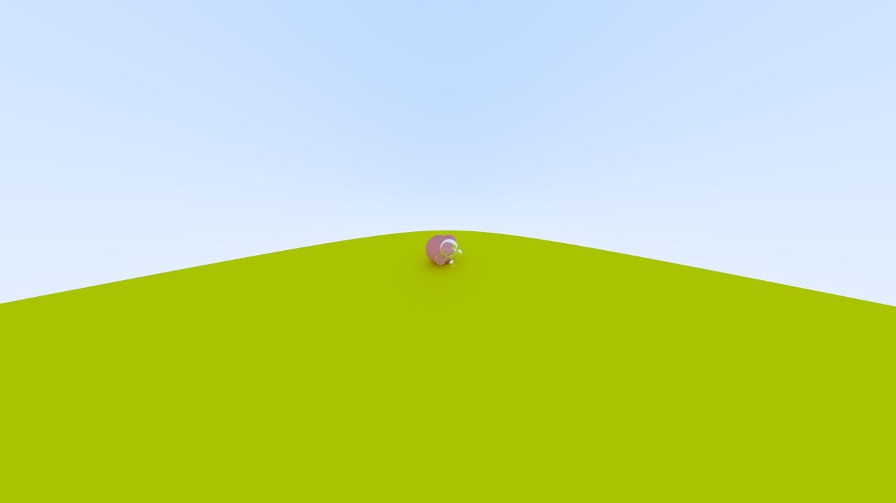

# Ray Tracing in One Weekend

「踏上旅途」

> [!NOTE]
> 
> 本书内容为 [Ray Tracing in One Weekend](https://raytracing.github.io/books/RayTracingInOneWeekend.html) 的 Rust 实现
> 
> 内容仍在更新中

## 目录

- [c01-ppm-image](./c01-ppm-image.md)

    ppm 图像格式、Log 和进度条

    
- [c02-ray](./c02-ray.md)

    光线 + 摄像机

    
- [c03-sphere](./c03-sphere.md)

    球体与光线相交、法线向量计算

    
- [c04-hittable](./c04-hittable.md)

    `Hittable` Trait 和 `World`

    
- [c05-refactor](./c05-refactor.md)

    全局 Logger、Camera 重构、使用 Range 表示 tmin 与 tmax

- [c06-antialiasing](./c06-antialiasing.md)

    反走样
    
    
- [c07-diffuse-materials](./c07-diffuse-materials.md)

    等概率漫反射、朗伯分布漫反射、image 图像编码 + rayon 并行

    
- [c08-gamma-correction](./c08-gamma-correction.md)

    伽马校正

    
- [c09-metal](./c09-metal.md)

    `Material` Trait、Lambertian 和 Metal 材质

    
- [c10-dielectric](./c10-dielectric.md)

    Dielectric 材质、折射、全反射、Schlick 近似

    
- [c11-camera-pro](./c11-camera-pro.md)

    FOV、位置、朝向、旋转

    
    
    
- [c12-defocus-blur](./c12-defocus-blur.md)

    景深模糊

    

