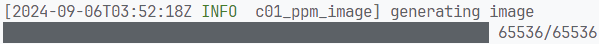

# c01-ppm-image

基础 ppm 格式，以及 Log 和进度条


---

## 一、输出图像

使用 Portable Pixel Map（PPM）[^1] 格式。

文件开头两个字节为两个 ASCII 字符，值为 `P3` 来表示文件格式类型[^2]，之后下一行两个整数表示图像的宽高，之后则是每个像素的值。

下面是一个例子：

```
P3
# "P3" means this is a RGB color image in ASCII
# "3 2" is the width and height of the image in pixels
# "255" is the maximum value for each color
# This, up through the "255" line below are the header.
# Everything after that is the image data: RGB triplets.
# In order: red, green, blue, yellow, white, and black.
3 2
255
255   0   0
  0 255   0
  0   0 255
255 255   0
255 255 255
  0   0   0
```

它所表示的图像如下图所示：


通过下面这段代码可以输出一张简单的 PPM 图像：

```rust
use std::{
    fs::File,
    io::{BufWriter, Write}
};

fn main() {
    // Image
    let image_width = 256;
    let image_height = 256;

    let file = File::create("image.ppm").unwrap();
    let mut writer = BufWriter::new(file);

    // Render
    writer.write_all(format!("P3\n{} {}\n255", image_width, image_height).as_bytes()).unwrap();

    for j in 0..image_height {
        for i in 0..image_width {
            let r = i as f64 / (image_width - 1) as f64;
            let g = j as f64 / (image_height - 1) as f64;
            let b = 0.0;

            let ir = (255.999 * r) as i32;
            let ig = (255.999 * g) as i32;
            let ib = (255.999 * b) as i32;

            writer.write_all(format!("\n{} {} {}", ir, ig, ib).as_bytes()).unwrap();
        }
    }
}
```


## 二、添加 Log 以及进度条

使用 `log` 以及 `env_logger` 库进行日志输出，使用 `indicatif` 实现进度条，并用 `indicatif-log-bridge` 来对两者进行集成。

```diff
use std::{
    fs::File,
    io::{BufWriter, Write},
};

+ use env_logger::Env;
+ use indicatif::{MultiProgress, ProgressBar};
+ use indicatif_log_bridge::LogWrapper;
+ use log::info;

fn main() {
+     let logger = env_logger::Builder::from_env(Env::default().default_filter_or("info")).build();
+     let level = logger.filter();
+     let multi = MultiProgress::new();

+     LogWrapper::new(multi.clone(), logger).try_init().unwrap();
+     log::set_max_level(level);

    // Image
    let image_width = 256;
    let image_height = 256;

    let file = File::create("image.ppm").unwrap();
    let mut writer = BufWriter::new(file);

    // Render
    writer
        .write_all(format!("P3\n{} {}\n255", image_width, image_height).as_bytes())
        .unwrap();

+     info!("generating image");
+     let pg = multi.add(ProgressBar::new(image_height * image_width));
    for j in 0..image_height {
        for i in 0..image_width {
            let r = i as f64 / (image_width - 1) as f64;
            let g = j as f64 / (image_height - 1) as f64;
            let b = 0.0;

            let ir = (255.999 * r) as i32;
            let ig = (255.999 * g) as i32;
            let ib = (255.999 * b) as i32;

            writer
                .write_all(format!("\n{} {} {}", ir, ig, ib).as_bytes())
                .unwrap();
+             pg.inc(1);
        }
    }
+     pg.finish();
+     multi.remove(&pg);
}

```

效果如下：



## 参考

[^1]: [Netpbm - Wikipedia](https://en.wikipedia.org/wiki/Netpbm#File_formats)
[^2]: [Netpbm - Wikipedia # Description](https://en.wikipedia.org/wiki/Netpbm#Description)