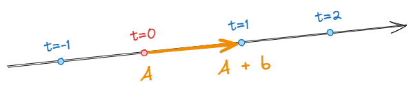
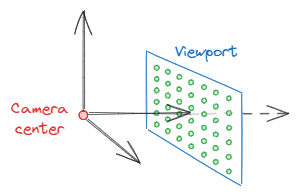

# c02-ray

光线 + 摄像机


---

## 一、光线



一条光线可以看作是一个函数：
$$
\mathbf{P}(t) = \mathbf{A} + t\mathbf{b}
$$
其中，$\mathbf{A}$ 为光线起始点，$\mathbf{b}$ 为光线的方向向量。

在 `lib.rs` 种定义一个 `Ray` 结构体类型：

```rust
pub struct Ray {
    pub origin: Vec3,
    pub direction: Vec3,
}

impl Ray {
    pub fn new(origin: Vec3, direction: Vec3) -> Self {
        Ray { origin, direction }
    }

    pub fn at(&self, t: f32) -> Vec3 {
        self.origin + self.direction * t
    }
}
```

## 二、向场景发射光线

「光线追踪」对每一个像素发射光线，收集并计算路径上的信息，最终得到每一个像素点的颜色。

为了避免混淆宽高，选择使用 16:9 的长宽比作为输出图像的大小：
$$
\text{aspect ratio} = \dfrac{\text{width}}{\text{height}} = \dfrac{16}{9} = 1.778
$$

```diff
// ...

+ const ASPECT_RATIO: f32 = 16.0 / 9.0;

fn main() {
	// ...
	
    // Image
-     let image_width = 256;
-     let image_height = 256;
+     let image_width = 400;
+     let image_height = ((image_width as f32 / ASPECT_RATIO) as u32).max(1);
	
	// ...
}
```



一个摄像机可以在三维空间中表示为一个摄像机中心，和一个视口。

输出图像上的像素被映射到视口上，对应像素的颜色即通过摄像机中心向对应像素中心在视口上的位置的光线计算出的结果。

```rust
// Camera
let focal_length = 1.0;
let viewport_height = 2.0;
let viewport_width =
(viewport_height as f32 * (image_width as f32 / image_height as f32)) as u32;
let camera_center = Vec3::new(0.0, 0.0, 0.0);
let viewport_u = Vec3::new(viewport_width as f32, 0.0, 0.0);
let viewport_v = Vec3::new(0.0, -viewport_height as f32, 0.0);

let pixel_delta_u = viewport_u / image_width as f32;
let pixel_delta_v = viewport_v / image_height as f32;

let viewport_upper_left =
camera_center - Vec3::new(0.0, 0.0, focal_length) - viewport_u / 2.0 - viewport_v / 2.0;
let viewport_center = viewport_upper_left + 0.5 * (pixel_delta_u + pixel_delta_v);
```

假设有一个函数 `ray_color` 可以计算出某一条光线的颜色：

```rust
pub fn ray_color(ray: &Ray) -> Vec3 {
    Vec3::new(0.0, 0.0, 0.0)
}
```

那么整张图片既可以这样计算出来：

```rust
for j in 0..image_height {
    for i in 0..image_width {
        let pixel_center =
        pixel00_loc + (i as f32 * pixel_delta_u) + (j as f32 * pixel_delta_v);
        let ray = Ray::new(camera_center, pixel_center - camera_center);

        let color = ray_color(&ray);
        let color_u8 = (255.999 * color).clamp(Vec3::ZERO, Vec3::splat(255.0));
        writer
        .write_all(format!("\n{} {} {}", color_u8.x, color_u8.y, color_u8.z).as_bytes())
        .unwrap();
        pg.inc(1);
    }
}
```

这样会得到一张全黑的图片。

接下来对 `ray_color` 进行稍加修改来绘制一张颜色根据 y 坐标渐变的图片。

渐变即一个十分简单的插值：
$$
blendedValue = (1-a) \cdot startValue + a \cdot endValue
$$

```rust
pub fn ray_color(ray: &Ray) -> Vec3 {
    let unit_direction = ray.direction.normalize();
    let a = 0.5 * (unit_direction.y + 1.0); // 从 [-1, 1] 映射到 [0, 1]
    (1.0 - a) * Vec3::new(1.0, 1.0, 1.0) + a * Vec3::new(0.5, 0.7, 1.0)
}
```

如此可以得到一张由蓝到白渐变的图像：


