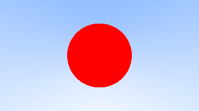

# c03-sphere

球体与光线相交、法线向量计算


---

## 一、光线与球体的相交

简单的解析几何，光线 $\mathbf{P}(t) = \mathbf{Q} + t\mathbf{d}$ 与半径为 $r$ 中心位于 $\mathbf{C}$ 的球体相交的方程为：
$$
\begin{align}
r^2 &= (\mathbf{C} - \mathbf{P}) \cdot (\mathbf{C} - \mathbf{P})\\
r^2 &= (\mathbf{C} - (\mathbf{Q} + t\mathbf{d})) \cdot (\mathbf{C} - (\mathbf{Q} + t\mathbf{d}))\\
r^2 &= ((\mathbf{C} - \mathbf{Q}) - t\mathbf{d}) \cdot ((\mathbf{C} - \mathbf{Q}) - t\mathbf{d})\\
\end{align}
$$
令 $\mathbf{O_c} = \mathbf{C} - \mathbf{Q}$ 则可写作：
$$
\begin{align}
r^2 &= t^2\mathbf{d}^2 - 2t\mathbf{d}\cdot\mathbf{O_c} + \mathbf{O_c}^2\\
0 &= \mathbf{d}^2t^2 - 2\mathbf{d}\cdot\mathbf{O_c}t + \mathbf{O_c}^2 - r^2\\
\end{align}
$$


根据根的数量即可得到光线与球体的相交情况：
$$
\begin{align}
a &= \mathbf{d}^2\\
b &= 2 \mathbf{d} \cdot \mathbf{O_c}\\
c &= \mathbf{O_c}^2 - r^2
\end{align}
$$

$$
\Delta = b^2 - 4ac = 4(\mathbf{d} \cdot \mathbf{O_c})^2 - 4\mathbf{d}^2(\mathbf{O_c}^2 - r^2)
$$

```rust
fn hit_sphere(center: Vec3, radius: f32, ray: &Ray) -> bool {
    let oc = center - ray.origin;
    let a = ray.direction.dot(ray.direction);
    let b = -2.0 * oc.dot(ray.direction);
    let c = oc.dot(oc) - radius * radius;
    let discriminant = b * b - 4.0 * a * c;
    discriminant - 0.0 >= f32::EPSILON
}
```

```diff
pub fn ray_color(ray: &Ray) -> Vec3 {
+     if hit_sphere(Vec3::new(0.0, 0.0, -1.0), 0.5, ray) {
+         return Vec3::new(1.0, 0.0, 0.0);
+     }

    let unit_direction = ray.direction.normalize();
    // ...
}
```

可以得到这样的一张图像：



不过会有一个问题，如果将球心坐标设定为 $z=1$，会得到同样的一张图（因为方程计算的是光线直线与球体的交点），这个问题会在之后的环节解决。

## 二、法线

后续的着色过程中会需要用到法线，球体上某一点 $P$ 的法线向量很好计算，减去球心 $C$ 即可。

选取更靠近光线原点的根作为光线在 $P$ 点处的 $t$：
$$
t_P = \dfrac{-b - \sqrt{\Delta}}{2a}
$$
然后通过光线方程即可得到 $P$ 点坐标，进而计算法线向量。

法线向量可以在标准化后将 xyz 映射到 rgb 来可视化：

```diff
fn hit_sphere(center: Vec3, radius: f32, ray: &Ray) -> f32 {
    let oc = center - ray.origin;
    let a = ray.direction.dot(ray.direction);
    let b = -2.0 * oc.dot(ray.direction);
    let c = oc.dot(oc) - radius * radius;
    let discriminant = b * b - 4.0 * a * c;
-     discriminant - 0.0 >= f32::EPSILON
+     if discriminant - 0.0 < f32::EPSILON {
+         return -1.0;
+     }
+ 
+     (-b - discriminant.sqrt()) / (2.0 * a)
}

pub fn ray_color(ray: &Ray) -> Vec3 {
-     if hit_sphere(Vec3::new(0.0, 0.0, -1.0), 0.5, ray) {
-         return Vec3::new(1.0, 0.0, 0.0);
-     }
+     let t = hit_sphere(Vec3::new(0.0, 0.0, -1.0), 0.5, ray);
+     if t > 0.0 {
+         let n = (ray.at(t) - Vec3::new(0.0, 0.0, -1.0)).normalize();
+         return 0.5 * (Vec3::new(n.x, n.y, n.z) + 1.0);
+     }

    let unit_direction = ray.direction.normalize();
    let a = 0.5 * (unit_direction.y + 1.0); // 从 [-1, 1] 映射到 [0, 1]
    (1.0 - a) * Vec3::new(1.0, 1.0, 1.0) + a * Vec3::new(0.5, 0.7, 1.0)
}
```


## 三、简化 `hit_sphere` 函数

可以注意到先前的 $\Delta$ 中可以提出一个 $4$，判断符号的时候并不需要计算它。

同时这个 $4$ 开根号出来就是 $2$，同时 $b$ 以及分母中都有一个 $2$，可以约掉。

简化一下计算：

```diff
fn hit_sphere(center: Vec3, radius: f32, ray: &Ray) -> f32 {
    let oc = center - ray.origin;
    let a = ray.direction.dot(ray.direction);
-     let b = -2.0 * oc.dot(ray.direction);
+     let b = oc.dot(ray.direction);
    let c = oc.dot(oc) - radius * radius;
-     let discriminant = b * b - 4.0 * a * c;
+     let discriminant = b * b - a * c;

    if discriminant - 0.0 < f32::EPSILON {
        return -1.0;
    }

-     (-b - discriminant.sqrt()) / (2.0 * a)
+     (b - discriminant.sqrt()) / a
}
```


