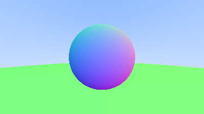

# c04-hittable

`Hittable` Trait 和 `World`



---

## 一、Hittable

很容易将 `hit` 的部分提炼为以一个 `Hittable` Trait：

```rust
pub struct HitRecord {
    pub point: Vec3,
    pub normal: Vec3,
    pub t: f32,
}

pub trait Hittable {
    fn hit(&self, ray: &Ray, t_min: f32, t_max: f32) -> Option<HitRecord>;
}
```

对应的可以重新实现 `Sphere`：

```rust
pub struct Sphere {
    center: Vec3,
    radius: f32,
}

impl Sphere {
    pub fn new(center: Vec3, radius: f32) -> Self {
        Sphere { center, radius }
    }
}

impl Hittable for Sphere {
    fn hit(&self, ray: &Ray, t_min: f32, t_max: f32) -> Option<HitRecord> {
        let oc = ray.origin - self.center;
        let a = ray.direction.dot(ray.direction);
        let b = oc.dot(ray.direction);
        let c = oc.dot(oc) - self.radius * self.radius;
        let discriminant = b * b - a * c;
        if discriminant < 0.0 {
            return None;
        }
        let t = (-b - discriminant.sqrt()) / a;
        if t < t_min || t > t_max {
            return None;
        }

        let point = ray.at(t);
        let normal = (point - self.center) / self.radius;

        let front_face = ray.direction.dot(normal) < 0.0;
        let normal = if front_face { normal } else { -normal };

        Some(HitRecord {
            point,
            normal,
            t,
            front_face,
        })
    }
}
```

## 二、World

一个世界，可以看作是很多个 `Hittable` 的列表：

```rust
pub type World = Vec<Box<dyn Hittable>>;
```

同样可以为 `World` 实现 `Hittable`，即对全部 `Hittable` 物体返回最近的交点（或没有）：

```rust
impl Hittable for World {
    fn hit(&self, ray: &Ray, t_min: f32, t_max: f32) -> Option<HitRecord> {
        let mut closest = t_max;
        let mut hit_record = None;
        for object in self.iter() {
            if let Some(record) = object.hit(ray, t_min, closest) {
                closest = record.t;
                hit_record = Some(record);
            }
        }
        hit_record
    }
}
```

对应的还需要修改 `ray_color` 函数：

```diff
- pub fn ray_color(ray: &Ray) -> Vec3 {
-     let t = hit_sphere(Vec3::new(0.0, 0.0, -1.0), 0.5, ray);
-     if t > 0.0 {
-         let n = (ray.at(t) - Vec3::new(0.0, 0.0, -1.0)).normalize();
-         return 0.5 * (Vec3::new(n.x, n.y, n.z) + 1.0);
-     }
+ pub fn ray_color<W: Hittable>(ray: &Ray, world: &W) -> Vec3 {
+     if let Some(record) = world.hit(ray, 0.0, f32::INFINITY) {
+         let n = record.normal.normalize();
+         return 0.5 * (Vec3::new(n.x, n.y, n.z) + 1.0);
+     }

    let unit_direction = ray.direction.normalize();
    let a = 0.5 * (unit_direction.y + 1.0); // 从 [-1, 1] 映射到 [0, 1]
    (1.0 - a) * Vec3::new(1.0, 1.0, 1.0) + a * Vec3::new(0.5, 0.7, 1.0)
}
```

## 三、渲染 World

Very Easy！

```rust
fn main() {
    // ...

    // Setup world
    let world: Vec<Box<dyn Hittable>> = vec![
        Box::new(Sphere::new(Vec3::new(0.0, 0.0, -1.0), 0.5)),
        Box::new(Sphere::new(Vec3::new(0.0, -100.5, -1.0), 100.0)),
    ];

    // Render
    render_to_ppm(&world, image_width, image_height, &multi, &mut writer);
}
```

`render_to_ppm` 是封装后的渲染的代码：

```rust
fn render_to_ppm<W: Hittable(
    world: &W,
    image_width: u32,
    image_height: u32,
    multi: &MultiProgress,
    writer: &mut BufWriter<File>,
) {
    // Camera
    // ...

    info!("generating image");
    writer
        .write_all(format!("P3\n{} {}\n255", image_width, image_height).as_bytes())
        .unwrap();
    let pg = multi.add(ProgressBar::new((image_height * image_width).into()));
    for j in 0..image_height {
        for i in 0..image_width {
            // ...
        }
    }
    pg.finish();
    multi.remove(&pg);
}
```

最终得到图像：


