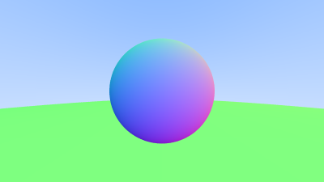

# c06-antialiasing

反走样


---


放大观察生成的图像，可以看到边缘处有锯齿的形状，这就是走样。

为何会有这种现象出现？现实中的相机的成像过程与光线追踪的过程几乎完全符合，问题出在哪里？

在我的解释方式中（更详细的见 A Pixel Is Not A Little Square[^1]），原因是，现实的相机传感器上的某一个像素所接受到的光照，并不是单一来源的。一个像素并不是一个点，而是有面积的。而目前实现的光线追踪中对于每一个像素只采样了一个像素。

那么很自然可以得到一种解决方案 —— 对于一个像素，在其范围内进行多次随机采样并混合得到的颜色。

## 一、反走样

为 `Camera` 添加一个 `samples_per_pixel` 属性，然后修改 `render_to_ppm`：

```rust
impl Camera {
    pub fn render_to_ppm(
        &self,
        world: &Vec<Box<dyn Hittable>>,
        output_width: u32,
        path: impl AsRef<Path>,
    ) {
        // ...
      
        for j in 0..output_height {
            for i in 0..output_width {
                let mut color = Vec3::ZERO;

                let pixel_center =
                    pixel00_loc + (i as f32 * pixel_delta_u) + (j as f32 * pixel_delta_v);
                for _ in 0..self.samples_per_pixel {
                    let rand_offset = Vec3::new(
                        (random::<f32>() - 0.5) * pixel_delta_u.x,
                        (random::<f32>() - 0.5) * pixel_delta_v.y,
                        0.0,
                    );

                    let ray = Ray::new(
                        self.camera_center,
                        pixel_center + rand_offset - self.camera_center,
                    );

                    color += ray_color(&ray, world);
                }
                color /= self.samples_per_pixel as f32;

                // ...
                pb.inc(1);
            }
        }
        pb.finish();
        multi.remove(&pb);
    }
}
```

对比效果如下：


还可以进一步增加 `samples_per_pixel` 至 100：


输出图片：



## 参考

[^1]: [(PDF) A Pixel Is Not A Little Square, A Pixel Is Not A Little Square, A Pixel Is Not A Little Square](https://www.researchgate.net/publication/244986797_A_Pixel_Is_Not_A_Little_Square_A_Pixel_Is_Not_A_Little_Square_A_Pixel_Is_Not_A_Little_Square)