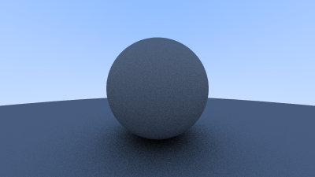

# c07-diffuse-materials

漫反射材质、image 图像编码 + rayon 并行




---

漫反射物体本身并不发光，它接受其周围环境的光，并以自身的固有颜色来对其进行调制。从漫反射表面反射的光具有随机的方向。

在反射的光之外，也会有被吸收的光。表面越暗，吸收的光就更多。

## 一、等概率反射


首先实现一个最直观的漫反射材质 —— 光线被等概率反射到所有的方向。

一个指向法线方向半球面的随机向量可以这样得到：

```rust
use glam::Vec3;
use rand::random;

pub fn random_in_unit_sphere() -> Vec3 {
    loop {
        let p = Vec3::new(random::<f32>() * 2.0 - 1.0, random::<f32>() * 2.0 - 1.0, random::<f32>() * 2.0 - 1.0);
        if p.length() - 0.0 >= f32::EPSILON && p.length_squared() - 1.0 <= f32::EPSILON {
            return p;
        }
    }
}

pub fn random_on_hemisphere(normal: Vec3) -> Vec3 {
    let p = random_in_unit_sphere().normalize();
    if p.dot(normal) > 0.0 {
        p
    } else {
        -p
    }
}
```

当光线在材质上反射时保留 100% 的颜色，那么这个材质就是白色的，如果保留 0% 的颜色，那么这个材质就是黑色的。

在这里假设保留 50% 的颜色，当光线发生碰撞时，生成随机方向的反射向量并返回该光线的颜色。

那么 `ray_color` 函数就变为了递归的，所以还要为 `Camera` 添加一个 `max_depth` 来限制递归深度：

```diff
- pub fn ray_color(ray: &Ray, world: &Vec<Box<dyn Hittable>>) -> Vec3 {
+ pub fn ray_color(ray: &Ray, world: &Vec<Box<dyn Hittable>>, depth: u32) -> Vec3 {
+ 		if depth <= 0 {
+ 				return Vec3::ZERO;
+ 		}

    if let Some(record) = world.hit(ray, 0.0..f32::INFINITY) {
-         let n = record.normal.normalize();
-         return 0.5 * (Vec3::new(n.x, n.y, n.z) + 1.0);
+     		let reflect_ray = Ray::new(record.point, random_on_hemisphere(record.normal));
+         return 0.5 * ray_color(&reflect_ray, world, depth - 1);
    }

    let unit_direction = ray.direction.normalize();
    let a = 0.5 * (unit_direction.y + 1.0); // 从 [-1, 1] 映射到 [0, 1]
    (1.0 - a) * Vec3::new(1.0, 1.0, 1.0) + a * Vec3::new(0.5, 0.7, 1.0)
}
```

于是可以得到这样一张图像：


## 二、image 图像编码 + rayon 并行

对于屏幕上的每一个像素，其颜色计算是完全独立的，甚至每一条光线的计算是完全独立的，因此整个光线追踪过程有极大的可并行化空间。

这里使用 rayon 来对屏幕上的每一个像素的颜色计算进行并行化。

然而 ppm 这种格式并不能很好的支持，因此使用 image 库来支持对图像的随机读写。

非常幸运的是，image 库提供了对 rayon 的支持，可以直接对一张图像中的像素并行地进行迭代。

函数 `render_to_ppm` 被更名为 `render_to_path`，传入路径的文件后缀可以使用 image 支持的任何后缀类型。

```rust
let calc_pixel_color = |x: u32, y: u32| {
    // ...

    let color_u8 = (255.999 * color).clamp(Vec3::ZERO, Vec3::splat(255.0));
    Rgb([color_u8.x as u8, color_u8.y as u8, color_u8.z as u8])
};

let mut image: ImageBuffer<Rgb<u8>, Vec<u8>> =
    ImageBuffer::new(output_width, output_height);

// ...

image.par_enumerate_pixels_mut().for_each(|(x, y, pixel)| {
    *pixel = calc_pixel_color(x, y);
    pb.inc(1);
});
// ...

image.save(&path).unwrap();
info!("cost: {:?}", t.elapsed());
```

对应的，需要将 `World` 修改为 `Send + Sync` 的：

```rust
pub type World = Vec<Box<dyn Hittable + Send + Sync>>;
```

此外在 `calc_pixel_color` 中还可以进一步对每一次采样进行并行化：

```rust
let calc_pixel_color = |x: u32, y: u32| {
    let pixel_center =
        pixel00_loc + (x as f32 * pixel_delta_u) + (y as f32 * pixel_delta_v);

    let color = (0..self.samples_per_pixel)
        .into_par_iter()
        .map(|_| {
            let rand_offset = Vec3::new(
                (random::<f32>() - 0.5) * pixel_delta_u.x,
                (random::<f32>() - 0.5) * pixel_delta_v.y,
                0.0,
            );

            let ray = Ray::new(
                self.camera_center,
                pixel_center + rand_offset - self.camera_center,
            );

            ray_color(&ray, world, self.max_depth)
        })
        .sum::<Vec3>()
        / self.samples_per_pixel as f32;

    let color_u8 = (255.999 * color).clamp(Vec3::ZERO, Vec3::splat(255.0));
    Rgb([color_u8.x as u8, color_u8.y as u8, color_u8.z as u8])
};
```

## 三、Shadow Acne

如果放大图像，可以看到下方的阴影存在一圈一圈不自然的图案，且不该黑的地方存在偏黑的情况：


这是由于向 `hit` 传递的 `t_range` 是 `f32::EPSILON..f32::INFINITY`，`f32::EPSILON` 太小了，光线容易与自己相交，将其修改为 `0.001` 可以显著的改善这个问题：


## 三、真正的朗伯反射

在上面的直观的模型中，通过令光线等概率地反射到法线方向的半球面，已经可以产生较为真实的图像。

然而现实中存在一个更加精准的漫反射的描述 —— 朗伯分布。

即，光线以与 $\cos(\phi)$ 成正比的方式进行散射（$\phi$ 为反射光线与表面法线夹角）。

这种分布可以通过在法向量上叠加随机单位向量的方式来进行实现：

```diff
pub fn ray_color(ray: &Ray, world: &World, depth: u32) -> Vec3 {
		// ...
    // use 0.001 to avoid shadow acne
    if let Some(record) = world.hit(ray, 0.001..f32::INFINITY) {
-         let reflect_ray = Ray::new(record.point, random_on_hemisphere(record.normal));
+         let scatter_direction = record.normal + random_in_unit_sphere();
+         let reflect_ray = Ray::new(record.point, scatter_direction);
        return 0.5 * ray_color(&reflect_ray, world, depth - 1);
    }
		// ...
}
```

最终得到这样的图像，效果更好：


