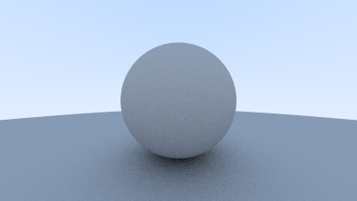

# c08-gamma-correction

伽马校正




---

如果将反射率从 0.0 逐渐提升到 1.0，会发现，物体的亮度变化并不太符合现实：

连续的：

```rust
pub fn ray_color(ray: &Ray, world: &World, depth: u32) -> Vec3 {
    // ...
    let unit_direction = ray.direction.normalize();

    let reflectance = 0.5 * (unit_direction.x + 1.0); // 从 [-1, 1] 映射到 [0, 1]
    // use 0.001 to avoid shadow acne
    if let Some(record) = world.hit(ray, 0.001..f32::INFINITY) {
        // ...
        return reflectance * ray_color(&reflect_ray, world, depth - 1);
    }
    // ...
}
```


分成五个等级的：

```rust
pub fn ray_color(ray: &Ray, world: &World, depth: u32) -> Vec3 {
    // ...
    let reflectance_leveled = (reflectance * 4.0).round() / 4.0;
    // use 0.001 to avoid shadow acne
    if let Some(record) = world.hit(ray, 0.001..f32::INFINITY) {
        // ...
        return reflectance_leveled * ray_color(&reflect_ray, world, depth - 1);
    }
    // ...
}
```


从左到右的五个等级：0.0, 0.25, 0.5, 0.75, 1.0。

可以发现 50% 的亮度似乎并不对应黑与白之间的 50%，反而 75% 的亮度更接近。

其原因是虽然在自然界中的光强是线性的，但是人眼感知亮度的方式并不是线性的。

人眼对于暗部的亮度变化更加敏感，而对于亮部的亮度变化则不那么敏感。

根据费希纳感知曲线，人们实际感受到的强度变化是实际变化的对数曲线[^1]。

伽马矫正通过 $V_{out} = V_{in}^{\gamma}$ [^2] 将线性变化转换为感知上的线性变化。

可以简单地通过对 rgb 进行开方来实现线性空间到伽马空间的转换：

```rust
pub fn linear_to_gamma(linear: Vec3) -> Vec3 {
    linear.map(|x| if x > 0.0 { x.sqrt() } else { x })
}
```

矫正前后效果对比：


矫正前后的渲染图像对比：


## 参考

[^1]: [4K【Taran】进阶LOG知识体系（一）从伽马矫正到LOG起源](https://www.bilibili.com/video/BV1jx411Z75Q/?vd_source=b89f32f1706e5d008ebee234af40c76d)
[^2]: [Gamma correction - Wikipedia](https://en.wikipedia.org/wiki/Gamma_correction)