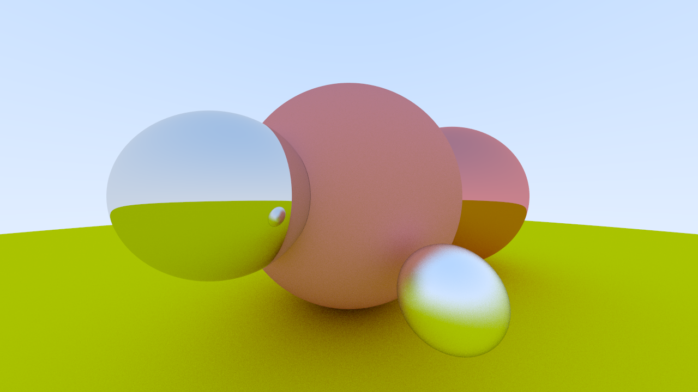

# c09-metal

`Material` Trait，以及 Lambertian 和 Metal 材质



---

## 一、Material

对于不同的材质，都会有散射的方式，因此可以提炼出 `Material` Trait：

```rust
pub trait Material {
    fn scatter(&self, ray: &Ray, record: &HitRecord) -> Option<(Vec3, Ray)>;
}
```

对应可以将原先的漫反射材质实现为一个 `Lambertian` 结构体：

```rust
pub struct Lambertian {
    albedo: Vec3,
}

impl Lambertian {
    pub fn new(albedo: Vec3) -> Self {
        Lambertian { albedo }
    }
}

impl Material for Lambertian {
    fn scatter(&self, _ray: &Ray, record: &HitRecord) -> Option<(Vec3, Ray)> {
        let mut scatter_direction = record.normal + random_in_unit_sphere();
        if scatter_direction.length_squared() <= f32::EPSILON {
            scatter_direction = record.normal;
        }

        let scattered_ray = Ray::new(record.point, scatter_direction);
        Some((self.albedo, scattered_ray))
    }
}
```

> *albedo* 为漫反射系数，表示了各个颜色的光被反射的比例
> 
> 这里还处理了一个之前遗留的小问题，当法线向量与随机生成的向量和为零的时候（虽然概率很小），将法线向量作为散射方向

然后修改 `HitRecord` 以及 `Sphere` 结构体，使其包含材信息：

```diff
pub struct HitRecord {
    pub point: Vec3,
    /// Unit normal vector
    pub normal: Vec3,
    pub t: f32,
    pub front_face: bool,
+     pub material: Arc<Box<dyn Material + Send + Sync>>,
}
```

```diff
pub struct Sphere {
    center: Vec3,
    radius: f32,
+     material: Arc<Box<dyn Material + Send + Sync>>,
}

impl Hittable for Sphere {
    fn hit(&self, ray: &Ray, t_range: Range<f32>) -> Option<HitRecord> {
        // ...

        Some(HitRecord {
            // ...
+             material: self.material.clone(),
        })
    }
}
```

这样，在 `ray_color` 函数中，就可以使用材质信息计算颜色：

```rust
pub fn ray_color(ray: &Ray, world: &World, depth: u32) -> Vec3 {
    // ...

    // use 0.001 to avoid shadow acne
    if let Some(record) = world.hit(ray, 0.001..f32::INFINITY) {
        return record
            .material
            .scatter(ray, &record)
            .map(|(attenuation, scattered_ray)| {
                attenuation * ray_color(&scattered_ray, world, depth - 1)
            })
            .unwrap_or(Vec3::ZERO);
    }

    // ...
}
```

## 二、Metal

对于金属材质来说，它的散射方式是镜面反射，很容易可以实现：

```rust
pub struct Metal {
    albedo: Vec3,
}

impl Metal {
    pub fn new(albedo: Vec3) -> Self {
        Metal { albedo }
    }
}

impl Material for Metal {
    fn scatter(&self, ray: &Ray, record: &HitRecord) -> Option<(Vec3, Ray)> {
        let reflected = ray.direction.reflect(record.normal);
        let scattered_ray = Ray::new(record.point, reflected);
        Some((self.albedo, scattered_ray))
    }
}
```

## 三、加几个金属球渲染一下

```rust
let world: World = vec![
    // Middle lambertian sphere
    Box::new(Sphere::new(
        Vec3::new(0.0, 0.0, -1.0),
        0.5,
        Box::new(Lambertian::new(Vec3::new(0.8, 0.3, 0.3))),
    )),
    // Metal spheres
    Box::new(Sphere::new(
        Vec3::new(0.7, 0.0, -1.5),
        0.5,
        Box::new(Metal::new(Vec3::new(0.8, 0.3, 0.3))),
    )),
    Box::new(Sphere::new(
        Vec3::new(-0.3, 0.0, -0.5),
        0.2,
        Box::new(Metal::new(Vec3::new(0.8, 0.8, 0.8))),
    )),
    // Ground
    Box::new(Sphere::new(
        Vec3::new(0.0, -100.5, -1.0),
        100.0,
        Box::new(Lambertian::new(Vec3::new(0.8, 0.8, 0.0))),
    )),
];
```

产生的结果如下：


## 四、模糊效果

在 `Metal` 材质中，可以引入一个 `fuzz` 参数，表示模糊程度。在 `scatter` 方法中，将反射向量加上一个随机向量，以实现模糊效果：

```rust
impl Material for Metal {
    fn scatter(&self, ray: &Ray, record: &HitRecord) -> Option<(Vec3, Ray)> {
        let reflected = ray.direction.reflect(record.normal);
        let reflected = reflected.normalize() + self.fuzz * random_in_unit_sphere();

        if reflected.dot(record.normal) > 0.0 {
            let scattered_ray = Ray::new(record.point, reflected);
            Some((self.albedo, scattered_ray))
        } else {
            None
        }
    }
}
```

渲染结果如下：


