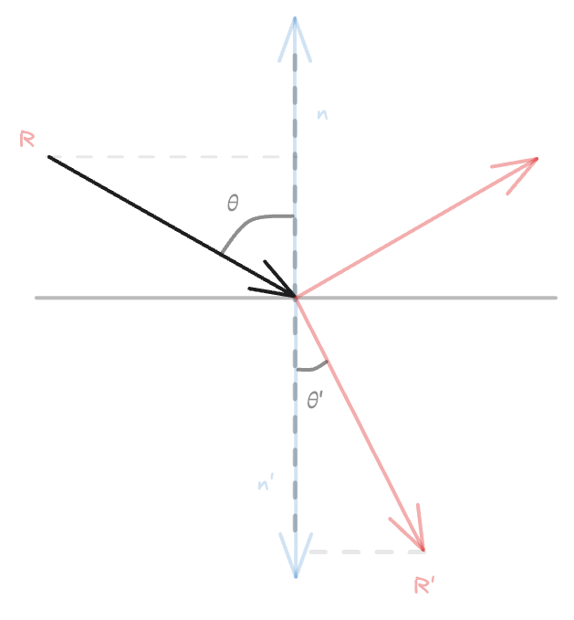

# c10-dielectric

折射、全反射、Schlick 近似


---

## 一、折射

当光线从一种介质进入另一种介质时，会发生折射。折射定律由斯涅尔定律描述：

$$
\eta \sin \theta = \eta' \sin \theta'
$$

其中，$\eta$ 和 $\eta'$ 分别是两种介质的折射率，$\theta$ 和 $\theta'$ 分别是入射角和折射角。



考虑一条光线 $\mathbf{R}$ 经过折射后得到光线 $\mathbf{R'}$。可以将 $\mathbf{R}$ 按照折射法线 $\mathbf{n}'$ 方向和垂直折射法线方向分解为两个分量：

$$
\mathbf{R} = \mathbf{R}_{\parallel} + \mathbf{R}_{\perp}
$$

其中，$\mathbf{R}_{\parallel}$ 是平行于法线的分量，$\mathbf{R}_{\perp}$ 是垂直于法线的分量。

注意 $\mathbf{R}$ 和 $\mathbf{n}$ 都是单位向量。

可以得到 $\mathbf{R}_{\parallel}$ 和 $\mathbf{R}_{\perp}$ 的表达式：

$$
\begin{align}
\mathbf{R}'_{\perp} &= \dfrac{\mathbf{R} + \mathbf{n} \cos \theta}{\sin \theta} \cdot \sin \theta' = (\mathbf{R} + \mathbf{n} \cos \theta) \cdot \dfrac{\eta}{\eta'} \\
\mathbf{R}'_{\parallel} &= - \sqrt{1 - \left| \mathbf{R}'_{\perp} \right|^2} \mathbf{n}
\end{align}
$$

而 $\cos \theta$ 可以通过 $-\mathbf{R}$ 和 $\mathbf{n}$ 的点积得到（因为 $\mathbf{R}$ 和 $\mathbf{n}$ 都是单位向量）：

$$
\cos \theta = -\mathbf{R} \cdot \mathbf{n}
$$

所以

$$
\begin{align}
\mathbf{R}'_{\perp} &= \dfrac{\eta}{\eta'} (\mathbf{R} + \mathbf{n} (-\mathbf{R} \cdot \mathbf{n})) \\
\mathbf{R}'_{\parallel} &= - \sqrt{1 - \left| \mathbf{R}'_{\perp} \right|^2} \mathbf{n}
\end{align}
$$

```rust
pub fn refract(uv: Vec3, n: Vec3, etai_over_etat: f32) -> Vec3 {
    let cos_theta = (-uv).dot(n).min(1.0);
    let r_out_perp = etai_over_etat * (uv + cos_theta * n);
    let r_out_parallel = -(1.0 - r_out_perp.length_squared()).sqrt() * n;
    r_out_perp + r_out_parallel
}
```

## 二、`Dielectric` 材质

```rust
pub struct Dielectric {
    refraction_index: f32,
}

impl Default for Dielectric {
    fn default() -> Self {
        Dielectric { refraction_index: 1.5 }
    }
}

impl Dielectric {
    pub fn new(refraction_index: f32) -> Self {
        Dielectric { refraction_index }
    }
}

impl Material for Dielectric {
    fn scatter(&self, ray: &Ray, record: &HitRecord) -> Option<(Vec3, Ray)> {
        let attenuation = Vec3::new(1.0, 1.0, 1.0);

        let ri = if record.front_face {
            1.0 / self.refraction_index
        } else {
            self.refraction_index
        };

        let refracted = refract(ray.direction.normalize(), record.normal, ri);
        let scattered_ray = Ray::new(record.point, refracted);

        Some((attenuation, scattered_ray))
    }
}
```

```rust
let world: World = vec![
    // Middle lambertian sphere
    Box::new(Sphere::new(
        Vec3::new(0.0, 0.0, -1.0),
        0.5,
        Box::new(Lambertian::new(Vec3::new(0.8, 0.3, 0.3))),
    )),
    // Metal spheres
    Box::new(Sphere::new(
        Vec3::new(0.7, 0.0, -1.5),
        0.35,
        Box::new(Metal::new(Vec3::new(0.8, 0.3, 0.3))),
    )),
    Box::new(Sphere::new(
        Vec3::new(-0.3, 0.0, -0.4),
        0.15,
        Box::new(Dielectric::new(1.5)),
    )),
    Box::new(Sphere::new(
        Vec3::new(0.2, -0.4, -0.6),
        0.1,
        Box::new(Metal::new(Vec3::new(1.0, 1.0, 1.0)).fuzz(0.5)),
    )),
    // Ground
    Box::new(Sphere::new(
        Vec3::new(0.0, -100.5, -1.0),
        100.0,
        Box::new(Lambertian::new(Vec3::new(0.8, 0.8, 0.0))),
    )),
];
```

渲染得到：


## 三、全反射

当光从光密介质进入光疏介质时，如果入射角大于临界角，会发生全反射，斯涅尔定律不再适用。

全反射条件：

$$
\sin \theta \cdot \dfrac{\eta'}{\eta} \geq 1
$$

```rust
let cos_theta = (-ray.direction.normalize()).dot(record.normal).min(1.0);
let sin_theta = (1.0 - cos_theta * cos_theta).sqrt();

let scattered = if ri * sin_theta > 1.0 {
    ray.direction.reflect(record.normal)
} else {
    refract(ray.direction.normalize(), record.normal, ri)
};

let scattered_ray = Ray::new(record.point, scattered);
```

再添加一个模拟水中气泡的球体：

```rust
Box::new(Sphere::new(
    Vec3::new(0.3, 0.0, -0.4),
    0.15,
    Box::new(Dielectric::new(1.0 / 1.33)),
)),
```

渲染结果如下：


## 四、菲涅尔方程与 Schlick 近似

菲涅尔方程描述了光线在两种介质之间传播时的反射与折射比例[^1]，Schlick 近似是一种用于计算菲涅尔项的近似方法。

视线与水面/玻璃的夹角越小时，反射越强，折射越弱。

```rust
/// Schlick's approximation for reflectance
pub fn reflectance(cosine: f32, ref_idx: f32) -> f32 {
    let r0 = (ref_idx - 1.0) / (ref_idx + 1.0);
    let r0 = r0 * r0;
    r0 + (1.0 - r0) * (1.0 - cosine).powi(5)
}
```

然后修改 `scatter` 方法，当 `reflectance` 大于随机数时进行反射，以控制反射与折射比例：

```rust
let scattered = if ri * sin_theta > 1.0 || reflectance(cos_theta, ri) > random() {
    ray.direction.reflect(record.normal)
} else {
    refract(ray.direction.normalize(), record.normal, ri)
};
```

渲染效果：


## 五、空心玻璃球

玻璃球里面再塞上一个折射率为其导数的球：

```rust
Box::new(Sphere::new(
    Vec3::new(-0.1, 0.3, -0.3),
    0.25,
    Box::new(Dielectric::new(1.5)),
)),
Box::new(Sphere::new(
    Vec3::new(-0.1, 0.3, -0.3),
    0.2,
    Box::new(Dielectric::new(1.0 / 1.5)),
)),
```

渲染效果如下：


## 参考

[^1]: [菲涅耳方程和Schlick近似 | FengBo`s Blog](https://sparkfengbo.github.io/post/gl-fei-nie-er-fang-cheng-he-schlick-jin-si/)