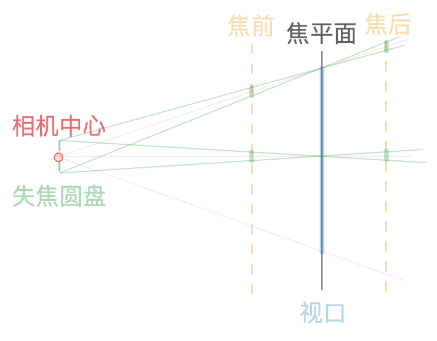

# c12-defocus-blur

失焦模糊


---

失焦，在摄影中有一个对应的景深概念，在远离焦点一定距离之外的物体都会变得模糊，其现实原理是大光圈下入瞳径扩大，导致弥散圆扩大景深变小[^1]。

然而在光线追踪的过程中模拟一整个完整的相机成像模型过于复杂，因此，模型被简化为如下：



将视口置于焦平面上，只需将由相机中心发射的光线的起始点进行随机偏移，即可使焦前、焦后的采样不是一个具体的点，而是一个模糊的圆。

```rust
let ray_origin = if self.defocus_angle <= f32::EPSILON {
    self.pos
} else {
    let rand_vec = random_in_unit_disk();
    self.pos + (defocus_disk_u * rand_vec.x) + (defocus_disk_v * rand_vec.y)
};
let ray = Ray::new(ray_origin, pixel_center + rand_offset - ray_origin);

```
渲染效果如下：


## 参考
[^1]: [关于相机景深的基础指南：及影响景深的几个要素距离焦距光圈 - bilibili](https://www.bilibili.com/video/BV1uF411s7Tj/?vd_source=b89f32f1706e5d008ebee234af40c76d)

