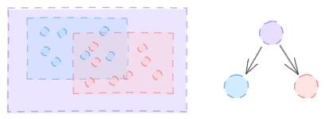
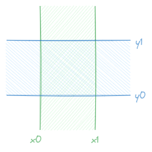
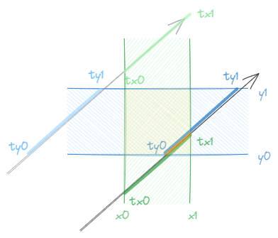

# Bounding Volume Hierarchies

光线与物体的相交判断是光线追踪器中最主要的性能瓶颈，通过遍历每一个的物体并做相应的相交检测是十分耗时的，时间复杂度为 $O(n)$。不难想到通过将问题划分来降低复杂度，而这通常有两种实现方式：

- 划分场景
- 划分物体

后者实现起来更加容易一些，并且具有不错的效率，BVH（Bounding Volume Hierarchies）就属于后一种。

## 一、基本思想

BVH 的核心思想是通过一个个的 **边界框** 来将物体分组 —— 只要光线与边界框没有交点，那么它就必然不可能与这个边界框内部的物体相交。

而 **边界框** 之间又可以组成一颗具有 **层级结构** 的树：



只要控制好这颗树的构造过程，就在 $\log$ 级别的复杂度下完成整个场景的计算。

## 二、AABB（Axis-Aligned Bounding Boxes ）



如其名，与坐标轴对齐的边界框。

以 $x$ 轴为例，可以计算出光线进入、离开 $x_0$ 到 $x_1$ 范围内的时间 $t_0$ 和 $t_1$：
$$
\begin{align}
t_0 &= \dfrac{x_0 - Q_x}{d_x}\\
t_1 &= \dfrac{x_1 - Q_x}{d_x}\\
\end{align}
$$
对于每一个轴都同理：



那么只要每一个轴的 $t_0$ 到 $t_1$ 的范围的交集不是空集，就是与边界框相交。

```rust
#[derive(Debug, Clone)]
pub struct Aabb {
    min: Vec3,
    max: Vec3,
}

impl Aabb {
    pub fn new(min: Vec3, max: Vec3) -> Self {
        Aabb { min, max }
    }

    pub fn union(&self, other: &Aabb) -> Aabb {
        Aabb::new(self.min.min(other.min), self.max.max(other.max))
    }
}
```

之前的 `Hittable` 也可以用于 `Aabb`，但是 `HitRecord` 需要修改一下：

```diff
pub struct HitRecord {
    pub point: Vec3,
    /// Unit normal vector
    pub normal: Vec3,
    pub t: f32,
    pub front_face: bool,
-     pub material: Arc<Box<dyn Material + Send + Sync>>,
+     pub material: Option<Arc<Box<dyn Material + Send + Sync>>>,
}
```

```rust
impl Hittable for Aabb {
    fn hit(&self, ray: &Ray, t_range: Range<f32>) -> Option<HitRecord> {
        let mut t_min = t_range.start;
        let mut t_max = t_range.end;

        for i in 0..3 {
            let inv_d = 1.0 / ray.direction[i];
            let t0 = (self.min[i] - ray.origin[i]) * inv_d;
            let t1 = (self.max[i] - ray.origin[i]) * inv_d;

            t_min = t_min.max(t0.min(t1));
            t_max = t_max.min(t0.max(t1));

            if t_max <= t_min {
                return None;
            }
        }

        // 其实这里的信息不一定用得到，可以随便填
        // 因为对于 Aabb，其实只在乎是 Some 还是 None
        let point = ray.at(t_min);
        Some(HitRecord {
            point,
            normal: Vec3::ZERO,
            t: t_min,
            front_face: false,
            material: None,
        })
    }
}
```

同时，创建了一个新的 `HasAabb` Trait：

```rust
pub trait HasAabb {
    fn aabb(&self) -> Aabb;
}
```

并为之前的 `Sphere` 实现：

```rust
impl HasAabb for Sphere {
    fn aabb(&self) -> Aabb {
        Aabb::new(
            self.center - Vec3::splat(self.radius),
            self.center + Vec3::splat(self.radius),
        )
    }
}
```

为了方便后续使用，创建了一个标记 Trait `AabbHittable`：

```rust
pub trait AabbHittable: Hittable + HasAabb {}

impl<T: HasAabb + Hittable> AabbHittable for T {}
```

## 三、BVH 构建

BVH 的构建从根节点开始，每次将传入的物体分为两部分并分别用来构造左右子树。

我们希望这个“划分”的过程尽量平均 —— 不论是从空间上还是物体数量上，所以可以按照这样的策略划分：

- 每次随机选取一个坐标轴
- 按照坐标轴排序物体
- 按照排序平分为两半分入子树中

那么首先显然，一个 `BvhNode` 可以是只包含单独一个 `AabbHittable` 的叶子节点，也可以是包含左右子树和边界框的普通节点：

```rust
pub enum BvhNode {
    Leaf(Box<dyn AabbHittable + Send + Sync>),
    Node {
        left: Box<BvhNode>,
        right: Box<BvhNode>,
        aabb: Aabb,
    },
}
```

可以为其实现 `HasAabb` 和 `Hittable`：

```rust
impl HasAabb for BvhNode {
    fn aabb(&self) -> Aabb {
        match self {
            BvhNode::Leaf(object) => object.aabb(),
            BvhNode::Node { aabb, .. } => aabb.clone(),
        }
    }
}
```

```rust
impl Hittable for BvhNode {
    fn hit(&self, ray: &Ray, t_range: Range<f32>) -> Option<HitRecord> {
        match self {
            BvhNode::Leaf(object) => object.hit(ray, t_range),
            BvhNode::Node { left, right, aabb } => {
                if aabb.hit(ray, t_range.clone()).is_none() {
                    return None;
                }
                let hit_left = left.hit(ray, t_range.clone());
                let hit_right = right.hit(
                    ray,
                    t_range.start..hit_left.as_ref().map(|rec| rec.t).unwrap_or(t_range.end),
                );
                hit_right.or(hit_left)
            }
        }
    }
}
```

之后为其实现一个 `from_objects` 方法：

```rust
impl BvhNode {
    pub fn from_objects(mut objects: Vec<Box<dyn AabbHittable + Send + Sync>>) -> Self {
        let axis = random::<usize>() % 3;
        objects.sort_by(|a, b| a.aabb().min[axis].partial_cmp(&b.aabb().min[axis]).unwrap());

        return if objects.len() == 1 {
            let object = objects.remove(0);
            BvhNode::Leaf(object)
        } else {
            let left = Box::new(BvhNode::from_objects(
                objects.drain(..objects.len() / 2).collect(),
            ));
            let right = Box::new(BvhNode::from_objects(objects));
            let aabb = left.aabb().union(&right.aabb());
            BvhNode::Node { left, right, aabb }
        };
    }
}
```

为了方便对比，把之前的 `World` 重新实现为了一个 `List` 结构体：

```rust
pub struct List(pub(super) Vec<Box<dyn Hittable + Send + Sync>>);

impl List {
    pub fn from_objects(objects: Vec<Box<dyn Hittable + Send + Sync>>) -> Self {
        List(objects)
    }
}

impl Hittable for List {
    fn hit(&self, ray: &Ray, t_range: Range<f32>) -> Option<HitRecord> {
        let mut closest = t_range.end;
        let mut hit_record = None;
        for object in self.0.iter() {
            if let Some(record) = object.hit(ray, t_range.start..closest) {
                closest = record.t;
                hit_record = Some(record);
            }
        }
        hit_record
    }
}
```

## 四、性能测试

```rust
fn main() {
    // ...
    
    // i9-9900k: cost: 419.357666s
    // let objects = objects
    //     .into_iter()
    //     .map(|obj| obj as Box<dyn Hittable + Send + Sync>)
    //     .collect();
    // let world = List::from_objects(objects);
    // camera.render_to_path(&world, image_width, "image.png");

    // i9-9900k: cost: 76.5858159s
    let objects = objects
        .into_iter()
        .map(|obj| obj as Box<dyn AabbHittable + Send + Sync>)
        .collect();
    let world = BvhNode::from_objects(objects);
    camera.render_to_path(&world, image_width, "image.png");
}
```

## 五、更进一步的优化

在构造 BVH 时与其选择随机的轴进行划分，不如选取最长的轴进行划分：

```rust
impl Aaab {
    // ...
    
    pub fn longest_axis(&self) -> usize {
        let x = self.max.x - self.min.x;
        let y = self.max.y - self.min.y;
        let z = self.max.z - self.min.z;
        let max = x.max(y).max(z);

        let arr = [x, y, z];
        arr.iter().position(|&x| x == max).unwrap()
    }
}
```

```diff
impl BvhNode {
    pub fn from_objects(mut objects: Vec<Box<dyn AabbHittable + Send + Sync>>) -> Self {
-         let axis = random::<f32>() % 3;
+         let aabb = objects
+             .iter()
+             .map(|obj| obj.aabb())
+             .reduce(|a, b| a.union(&b))
+             .unwrap();
+         let axis = aabb.longest_axis();
        objects.sort_by(|a, b| a.aabb().min[axis].partial_cmp(&b.aabb().min[axis]).unwrap());

        return if objects.len() == 1 {
            let object = objects.remove(0);
            BvhNode::Leaf(object)
        } else {
            let left = Box::new(BvhNode::from_objects(
                objects.drain(..objects.len() / 2).collect(),
            ));
            let right = Box::new(BvhNode::from_objects(objects));
-             let aabb = left.aabb().union(&right.aabb());
            BvhNode::Node { left, right, aabb }
        };
    }
}
```

耗时 69.4391338s，稍微快了一点。
