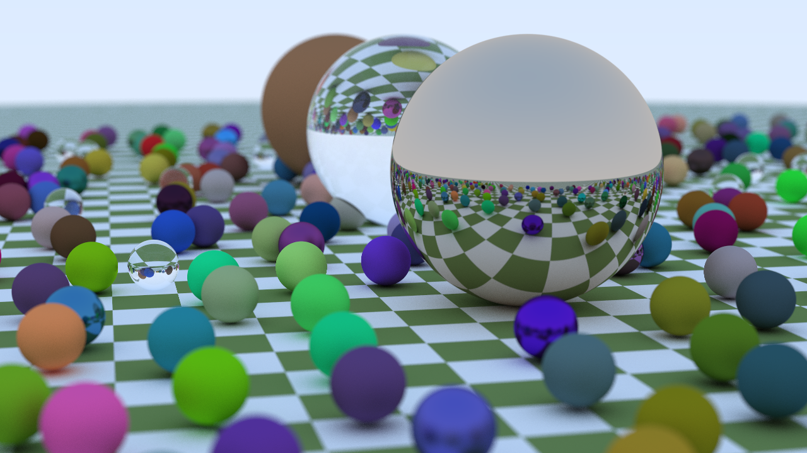
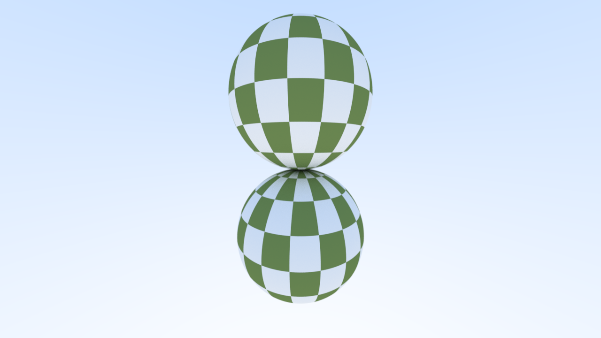
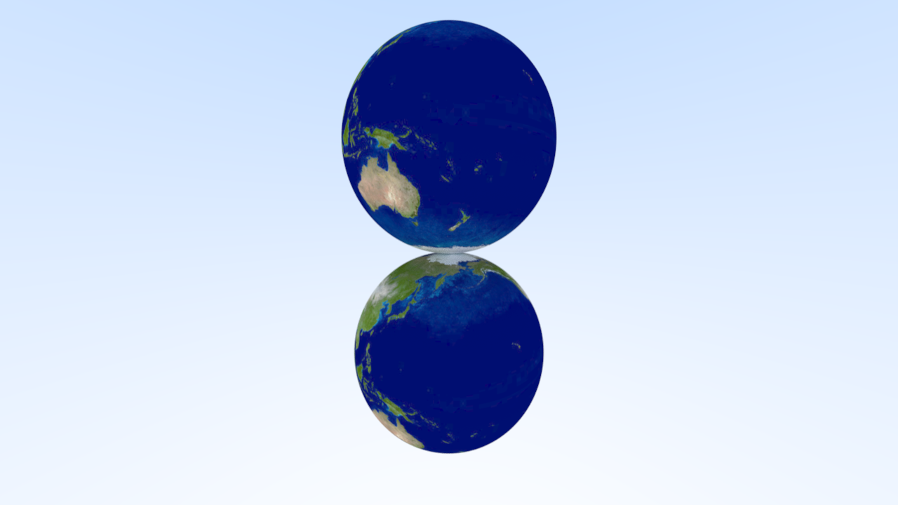
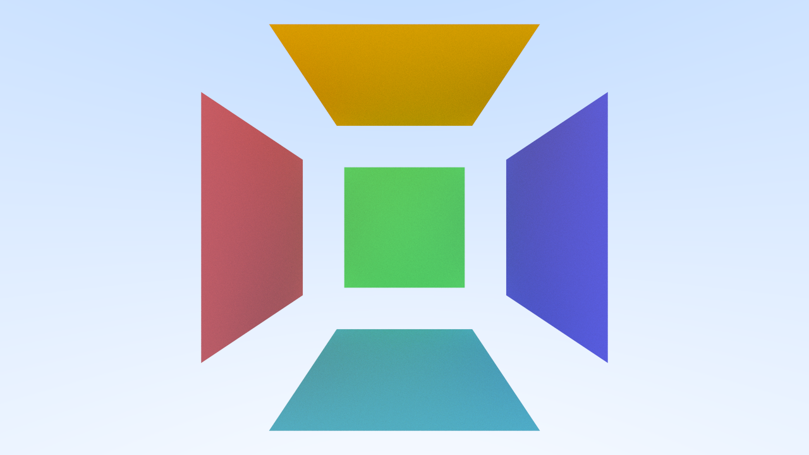

# Ray Tracing: The Next Week

>  [!NOTE]
>
> 本书内容为 [Ray Tracing: The Next Week]([Ray Tracing: The Next Week](https://raytracing.github.io/books/RayTracingTheNextWeek.html)) 的 Rust 实现

## 目录

- [BVH](./BVH.md)

    BVH 加速
    
- [Texture Mapping](./Texture Mapping.md)

    纹理映射

    

    

    
    
- [Quadrilaterals](./Quadrilaterals.md)

    