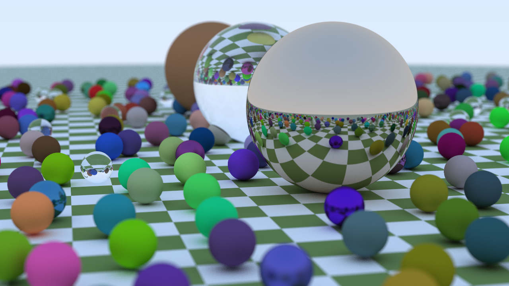
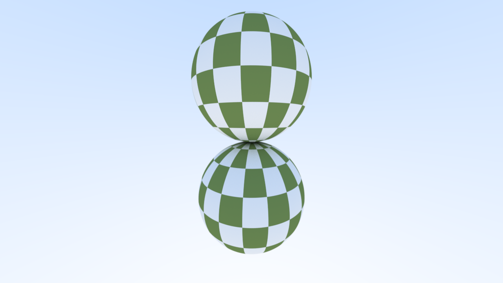
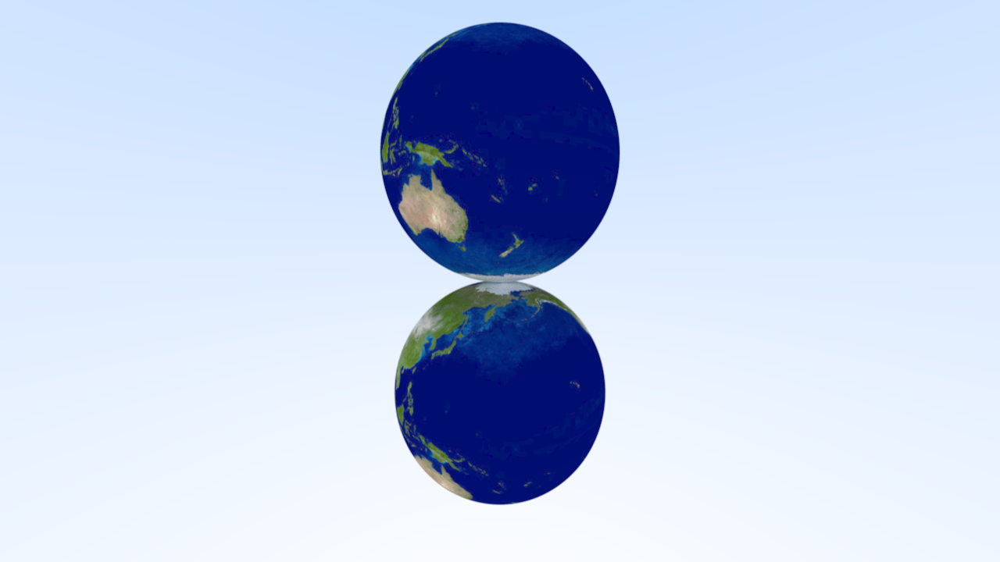
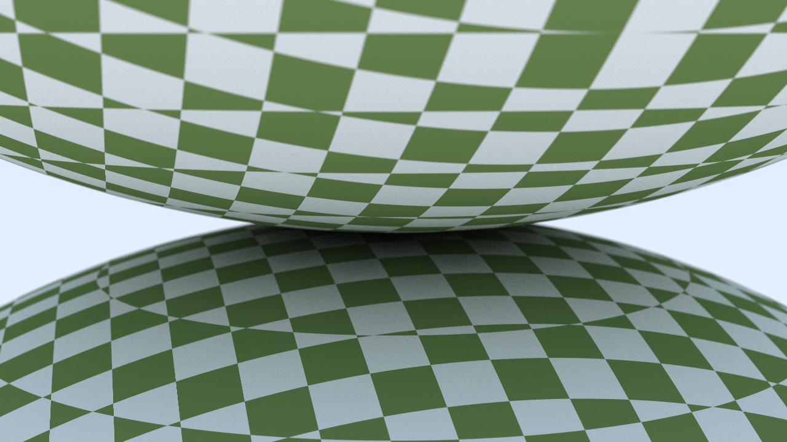

# Texture Mapping

> [Comparing 95419e5...f483f08 · AzurIce/Notes (github.com)](https://github.com/AzurIce/Notes/compare/95419e5...f483f08)







---

纹理映射，“纹理”是效果，“映射”是将一个空间映射到另一个空间的数学过程。

其中“纹理”并不局限于颜色信息，同样可以是亮度信息、凹凸信息，甚至是物体部分的存在与否的信息。

最常见的纹理映射就是将一张图片“贴”到一个物体表面，在实现中，目标物体上会有一个纹理坐标（一般表示为 $(u, v)$），纹理映射的过程即根据纹理坐标获取对应颜色的过程。

## 一、Texture Trait

根据上面的描述，不难将纹理抽象出一个 `Texture` Trait：

```rust
pub trait Texture {
    fn value(&self, u: f32, v: f32) -> Vec3;
}
```

## 二、实色材质

当然就是对于任何的 $(u, v)$ 都返回相同的一个固定的颜色：

```rust
pub struct SolidColor {
    albedo: Vec3,
}

impl SolidColor {
    pub fn new(albedo: Vec3) -> Self {
        Self { albedo }
    }
}

impl Texture for SolidColor {
    fn value(&self, _u: f32, _v: f32) -> Vec3 {
        self.albedo
    }
}
```

## 三、令 Material 使用 Texture

将 `Lambertian` 和 `Metal` 中的 `albedo` 都更改为 `texture: Arc<Box<dyn Texture>>`，并在 `scatter` 方法中使用 `texture` 的 `value()` 方法获取 `attenuation`。

那 `u` 和 `v` 怎么来？

所以还需要更改 `HitRecord`，添加 `u` 和 `v`。在未来需要为物体的 `hit` 方法实现计算碰撞点 `u` 和 `v` 的逻辑，不过对于目前的实色材质，可以随便填一个。

```diff
pub struct Lambertian {
-     albedo: Vec3,
+     texture: Arc<Box<dyn Texture + Send + Sync>>,

impl Lambertian {
-     pub fn new(albedo: Vec3) -> Self {
-         Lambertian { albedo }
+     pub fn new(texture: Arc<Box<dyn Texture + Send + Sync>>) -> Self {
+         Lambertian { texture }
    }
}

impl Material for Lambertian {
    fn scatter(&self, _ray: &Ray, record: &HitRecord) -> Option<(Vec3, Ray)> {
        let mut scatter_direction = record.normal + random_in_unit_sphere();
        if scatter_direction.length_squared() <= f32::EPSILON {
            scatter_direction = record.normal;
        }

        let scattered_ray = Ray::new(record.point, scatter_direction);
-         Some((self.albedo, scattered_ray))
+         let attenuation = self.texture.value(record.u, record.v);
+         Some((attenuation, scattered_ray))
    }
}
```

```diff
pub struct Metal {
-     albedo: Vec3,
+     texture: Arc<Box<dyn Texture + Send + Sync>>,
    fuzz: f32,
}

impl Metal {
-     pub fn new(albedo: Vec3) -> Self {
+     pub fn new(texture: Arc<Box<dyn Texture + Send + Sync>>) -> Self {
        Metal {
-             albedo,
+             texture,
            fuzz: 0.0,
        }
    }

    pub fn fuzz(mut self, fuzz: f32) -> Self {
        self.fuzz = fuzz;
        self
    }
}

impl Material for Metal {
    fn scatter(&self, ray: &Ray, record: &HitRecord) -> Option<(Vec3, Ray)> {
        let reflected = ray.direction.reflect(record.normal);
        let reflected = reflected.normalize() + self.fuzz * random_in_unit_sphere();

        if reflected.dot(record.normal) > 0.0 {
            let scattered_ray = Ray::new(record.point, reflected);
-             Some((self.albedo, scattered_ray))
+             let attenuation = self.texture.value(record.u, record.v);
+             Some((attenuation, scattered_ray))
        } else {
            None
        }
    }
}
```

## 四、固体纹理 —— 棋盘网格纹理

固体纹理，又称空间纹理，仅取决于空间中每一个点的位置（相当于为空间中的每一个点设置了对应的颜色）

为了实现这种材质，需要对 `Texture` Trait 做一点修改，引入点的空间坐标：

```rust
pub trait Texture {
    fn value(&self, u: f32, v: f32, point: Vec3) -> Vec3;
}
```

棋盘网格纹理的最简单的实现方法就是对空间坐标的每一个分量取整，但是要注意不能直接忽略小数部分（否则 0 两侧颜色会相同），要向下或向上取整。然后对分量求和，根据其奇偶决定颜色。在这个基础之上可以添加一个缩放系数来控制棋盘的缩放比例。

```rust
pub struct SolidCheckerTexture {
    inv_scale: f32,
    even: Arc<Box<dyn Texture + Send + Sync>>,
    odd: Arc<Box<dyn Texture + Send + Sync>>,
}

impl SolidCheckerTexture {
    pub fn new(scale: f32, even: Arc<Box<dyn Texture + Send + Sync>>, odd: Arc<Box<dyn Texture + Send + Sync>>) -> Self {
        let inv_scale = 1.0 / scale;
        Self { inv_scale, even, odd }
    }
}

impl Texture for SolidCheckerTexture {
    fn value(&self, u: f32, v: f32, point: Vec3) -> Vec3 {
        let p = point.to_array().map(|v| (self.inv_scale * v).floor() as i32).iter().sum::<i32>();

        if p % 2 == 0 {
            self.even.value(u, v, point)
        } else {
            self.odd.value(u, v, point)
        }
    }
}
```

然后修改一下作为地面的最大的那个球的材质：

```rust
objects.push(Box::new(Sphere::new(
    Vec3::new(0.0, -1000.0, 0.0),
    1000.0,
    Box::new(Lambertian::new(Arc::new(Box::new(CheckerTexture::new(
        0.5,
        Arc::new(Box::new(SolidColor::new(Vec3::new(0.2, 0.3, 0.1)))),
        Arc::new(Box::new(SolidColor::new(Vec3::new(0.9, 0.9, 0.9)))),
    ))))),
)));
```

效果：


看起来不错，再看看另一个场景：

```rust
fn checkered_spheres() -> impl AabbHittable + Send + Sync {
    let mut objects = Vec::new();

    let checker_texture: Arc<Box<dyn Texture + Send + Sync>> =
        Arc::new(Box::new(SolidCheckerTexture::new(
            0.32,
            Arc::new(Box::new(SolidColor::new(Vec3::new(0.2, 0.3, 0.1)))),
            Arc::new(Box::new(SolidColor::new(Vec3::new(0.9, 0.9, 0.9)))),
        )));
    let material: Arc<Box<dyn Material + Send + Sync>> =
        Arc::new(Box::new(Lambertian::new(checker_texture)));

    objects.push(Box::new(Sphere::new(
        Vec3::new(0.0, -10.0, 0.0),
        10.0,
        material.clone(),
    )));
    objects.push(Box::new(Sphere::new(
        Vec3::new(0.0, 10.0, 0.0),
        10.0,
        material.clone(),
    )));

    let objects = objects
        .into_iter()
        .map(|obj| obj as Box<dyn AabbHittable + Send + Sync>)
        .collect();
    BvhNode::from_objects(objects)
}
```



直观上看，好像有点不对？但是实际上空间网格被球体裁切所得到的图形就是这样的：


那么如何解决？答案就是为球体构造一个 $(u, v)$ 坐标。

## 五、球体纹理坐标

对于球体来说，其纹理坐标经常基于类似于经纬坐标的形式。

令 $\theta$ 和 $\phi$ 分别为与 $-Y$ 和 $-X$ （自顶向下看逆时针）夹角，可以将 $(\theta, \phi)$ 归一化得到 $(u, v)$：
$$
\begin{align}
u &= \dfrac{\phi}{2\pi}\\
v &= \dfrac{\theta}{\pi}
\end{align}
$$
而在笛卡尔坐标系下，对于单位球体有这样一个方程组：
$$
\begin{cases}
y &= -\cos\theta\\
x &= -\cos\phi \cdot \sin\theta\\
z &= \sin\phi \cdot \sin\theta
\end{cases}
$$
首先很显然有：
$$
\cos\theta = -y
$$
即：
$$
\theta = \arccos(-y)
$$
而对于 $\phi$，不难想到通过将 $z$ 与 $x$ 相约消掉 $\sin\theta$ 得到 $\tan\phi$，即 $\tan\phi = -\dfrac{z}{x}$，进而借助 $\arctan$ 求解 $\phi$，但是存在一个问题：


那就是当 $x = 0\ (\cos\phi = 0)$ 即 $\theta = \dfrac{\pi}{2}, \dfrac{3\pi}{2}$ 时，$\tan\phi$ 是无定义的，对应也自然无法通过 $\arctan(-\dfrac{z}{x})$ 求解。

不过有另一个函数 $\text{atan2}(y, x)$：
$$
\text{atan2}(y, x) = \begin{cases}
\arctan(\dfrac{y}{x})       &  x > 0\\
\arctan(\dfrac{y}{x}) + \pi &  x < 0,\ y \geq 0\\
\arctan(\dfrac{y}{x}) - \pi &  x < 0,\ y < 0\\
+\dfrac{\pi}{2}             &  x = 0,\ y > 0\\
-\dfrac{\pi}{2}             &  x = 0,\ y < 0\\
undefined                   & x = 0,\ y = 0
\end{cases}
$$


- 当 $x>0$ 时，也就是对应着 $\phi \in ({-\dfrac{\pi}{2}}, \dfrac{\pi}{2})$，这部分与 $\arctan$ 相同，

- 当 $x = 0$ 时，则根据 $y$ 的正负分别返回 $\dfrac{\pi}{2}$ 或 $-\dfrac{\pi}{2}$
- 当 $x < 0$ 时，则根据 $y$ 的正负分别对应着 $\phi \in (\dfrac{\pi}{2}, \pi]$ 和 $\phi \in (-\pi, -\dfrac{\pi}{2})$，原本的 $\tan$ 函数在这部分上是与 $(-\dfrac{\pi}{2}, 0)$ 以及 $(0, \dfrac{\pi}{2})$ 相同的另一个周期，然而实际的角度其实是加上了个 $\pm\pi$。

而由于在按照 $-Z \to +X \to +Z \to -X \to -Z$ 的顺序取值时，相当于是按照 第一象限 -> 第二象限 -> 第三象限 -> 第四象限 取值的，因此 $\text{atan2}$ 的输出先是 $0 \to \pi$ 然后是 $-\pi \to 0$，而不是连续的 $-\pi \to \pi$，所以对输入的两个自变量都取个反（相当于把上图左右上下全部对称一下）就可以得到连续的 $-\pi \to \pi$，而最终我们想要的是 $0 \to 2\pi$，那也很简单，再加上 $\pi$ 即可
$$
\begin{cases}
z = \sin\phi \cdot \sin\theta\\
-x = \cos\phi \cdot \sin\theta
\end{cases}
\implies
\phi = \text{atan2}(-z, x) + \pi
$$
所以最终有：
$$
\begin{cases}
\theta &= \arccos(-y)\\
\phi &= \text{atan2}(z, -x) + \pi
\end{cases}
$$

```rust
impl Sphere {
    // ...
    
    pub fn get_uv(&self, point: Vec3) -> (f32, f32) {
        let theta = (-point.y).acos();
        let phi = point.z.atan2(-point.x) + PI;
        let u = phi / (2.0 * PI);
        let v = theta / PI;
        (u, v)
    }
}
```

```diff
fn hit(&self, ray: &Ray, t_range: Range<f32>) -> Option<HitRecord> {
    // ...
	
+     let (u, v) = self.get_uv(normal);

    Some(HitRecord {
        point,
        normal,
        t,
        front_face,
        material: Some(self.material.clone()),
-         u: 0.0,
-         v: 0.0,
+         u,
+         v,
    })
}
```

基于此，可以重新实现一个基于物体纹理坐标的棋盘材质：

```rust
pub struct CheckerTexture {
    lng_scale: u32, // 经
    lat_scale: u32, // 纬
    even: Arc<Box<dyn Texture + Send + Sync>>,
    odd: Arc<Box<dyn Texture + Send + Sync>>,
}

impl CheckerTexture {
    pub fn new(lng_scale: u32, lat_scale: u32, even: Arc<Box<dyn Texture + Send + Sync>>, odd: Arc<Box<dyn Texture + Send + Sync>>) -> Self {
        Self { lng_scale, lat_scale, even, odd }
    }
}

impl Texture for CheckerTexture {
    fn value(&self, u: f32, v: f32, point: Vec3) -> Vec3 {
        let p = [u * self.lng_scale as f32, v * self.lat_scale as f32].map(|v| v.floor() as i32).iter().sum::<i32>();

        if p % 2 == 0 {
            self.even.value(u, v, point)
        } else {
            self.odd.value(u, v, point)
        }
    }
}

```

```rust
let checker_texture: Arc<Box<dyn Texture + Send + Sync>> =
    Arc::new(Box::new(CheckerTexture::new(
        18,
        9,
        Arc::new(Box::new(SolidColor::new(Vec3::new(0.2, 0.3, 0.1)))),
        Arc::new(Box::new(SolidColor::new(Vec3::new(0.9, 0.9, 0.9)))),
    )));
```

然后稍微调整一下相机（调整 fov 到 90，位置拉远一倍）：

```rust
    let camera = Camera::new(aspect_ratio)
        .samples_per_pixel(500)
        .fov(90.0)
        .pos(Vec3::new(13.0, 2.0, 3.0) * 2.0)
        .look_at(Vec3::ZERO)
        .focus_distance(10.0)
        .defocus_angle(0.6);
```

效果如下（仿地球仪经纬度的网格）：


## 六、纹理图片

```rust
pub struct ImageTexture {
    // ! Use ImageBuffer directly causes rayon error, so use Vec<u8> instead
    data: Vec<u8>,
    width: u32,
    height: u32,
}

impl ImageTexture {
    pub fn new(image: ImageBuffer<Rgb<u8>, Vec<u8>>) -> Self {
        let width = image.width();
        let height = image.height();
        let data = image.to_vec();
        Self {
            data,
            width,
            height,
        }
    }

    pub fn from_path(path: impl AsRef<Path>) -> Self {
        let image = image::open(path).unwrap().to_rgb8();
        Self::new(image)
    }
}

impl Texture for ImageTexture {
    fn value(&self, u: f32, v: f32, _point: Vec3) -> Vec3 {
        let u = u.clamp(0.0, 1.0);
        let v = 1.0 - v.clamp(0.0, 1.0);

        let i = (u * self.width as f32) as usize;
        let j = (v * self.height as f32) as usize;

        let index = (j * self.width as usize + i) * 3;
        let rgb = self.data.get(index..index + 3).unwrap();

        Vec3::new(
            rgb[0] as f32 / 255.0,
            rgb[1] as f32 / 255.0,
            rgb[2] as f32 / 255.0,
        )
    }
}
```

使用这张图片：


```rust
let earth_texture = ImageTexture::from_path("assets/earthmap.jpg");
    let earth_texture: Arc<Box<dyn Texture + Send + Sync>> = Arc::new(Box::new(earth_texture));
    let material: Arc<Box<dyn Material + Send + Sync>> =
        Arc::new(Box::new(Lambertian::new(earth_texture)));
```

效果如下：


