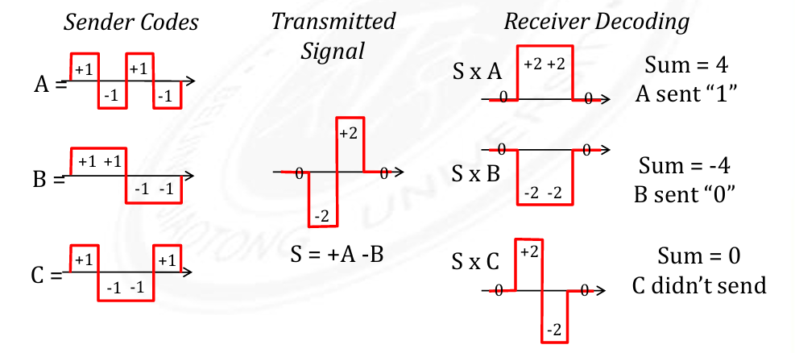

## 调制（Modulation）与多路复用（Multiplexing）

要想将二进制的数据（一堆 0 或 1）传播出去，在不同的传播方式中会有对应的不同的方式。

**载波**：一个周期性的波形，可以在其上进行修改以混入信息

**调制信号**：要混入的信息的信号

在同一个载波上，可以借助一些方法同时混入多个信号，并仍然能够分别读出，这就是 **多路复用**。

多路复用方法：

- **FDM**

    将通讯介质的带宽（整个频率空间）分为一个个互相不重叠的频率带，每一个频率带用于携带一个单独的信号。比如 FM 广播就是非常典型的 FDM，不同的频率对应不同的频道

- **TDM**

    按照固定时间片长度轮转的方式传输不同频道的信号

- **CDMA**

    3G

    

- **OFDM**

    4G、Wifi（302.11a, 802.11j, 802.11y, 802.11p, 802.11bd）

    使用在频率上正交的多个固定频率间隔的子载波

## 帧

分帧方法：

- Byte Count

    每帧的第一个字节表示字节数

- Byte Stuffing

    用一个特定的标记字节 FLAG 来分割每个帧

    对应就需要有一个转义标记字节 ESC 来对帧内的 FLAG 和 ESC 进行转义

- Bit Stuffing

    FLAG 为 6 个连续的 1

    传输时每 5 个连续的 1 后会添加一个 0

    接收时每 5 个连续的 1 后的 0 会被删除