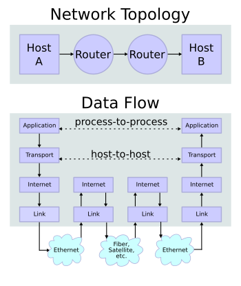
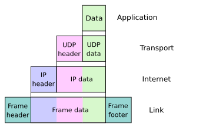

# 网络模型

## OSI 模型（七层）

应用层（Application Layer）

表现层（Presentation Layer）

会话层（Session Layer）

传输层（Transport Layer）

网络层（Network Layer）

数据链路层（Data Link Layer）

物理层（Physical Layer）

## TCP/IP 模型（四层）

应用层（Application Layer）

传输层（Transport Layer）

网络层（Network Layer）

链路层（Link Layer）

Packet switching network

将数据分组为固定格式的较短的信息

调制：将数字信号转换为模拟信号

