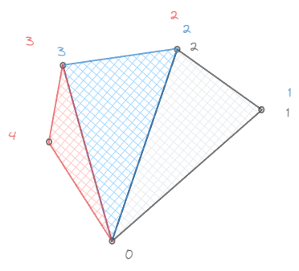
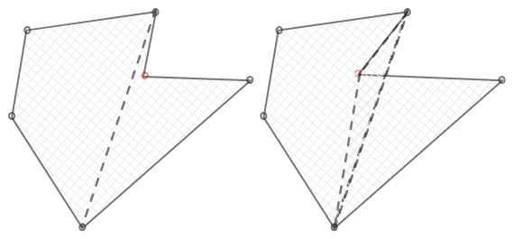
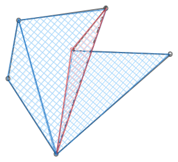
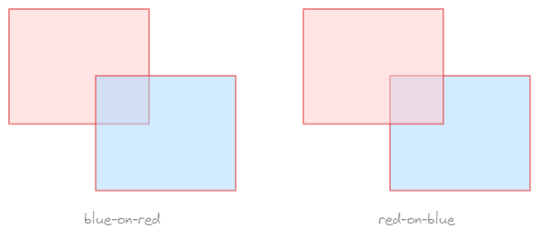
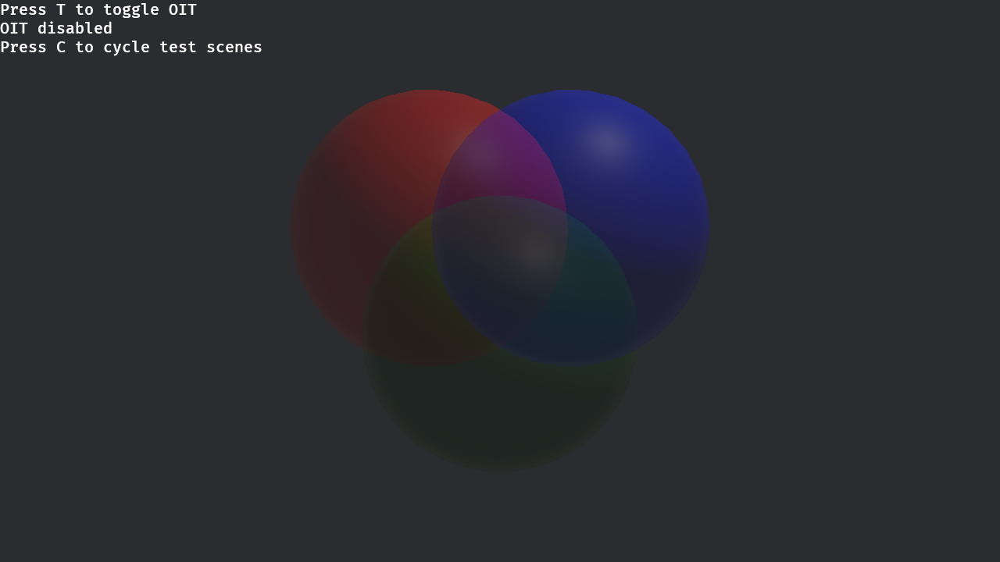
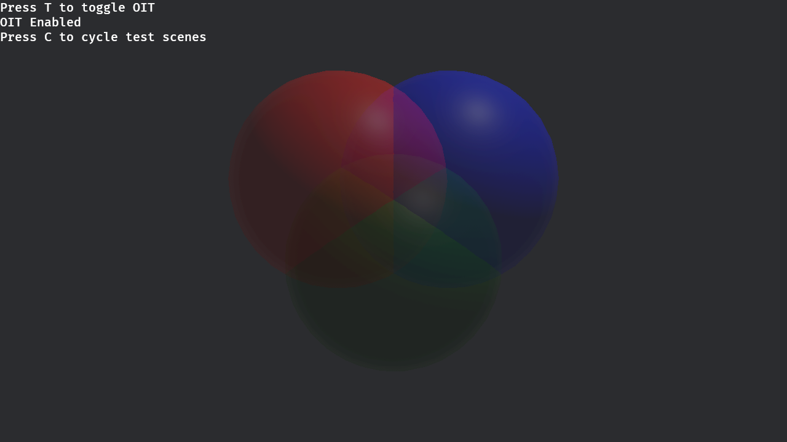

# Alpha Blending

## 一、基本概念

对于不透明物体的重叠绘制，可以按照其遮挡关系先绘制在远处的物体再绘制在近处的物体，或者借助深度缓冲来控制写入像素的覆盖关系。

但是对于半透明物体，则需要将二者的颜色进行混合。

令绘制目标上的值为 $dst$，待绘制的值为 $src$，混合后的输出为 $out$，那么一个常用的透明度混合方法是：
$$
out = (1 - A_{src}) \cdot dst + A_{src} \cdot src
$$

这个混合方法对应到具体的图形 API 上往往是一个状态选项：

- 比如对于 OpenGL，就是 `gl_BlendEquation` 和 `gl_BlendFunc`
- 比如对于 wgpu，就是 `wgpu::BlendState`

对于它们，可配置的选项一般有三个：`src_factor`、`dst_factor`、`operation`：

- `src_factor`：被施加在 $src$ 上的系数
- `dst_factor`：被施加在 $dst$ 上的系数
- `operation`：对 $src$ 和 $dst$ 如何操作

比如对上面那个混合方法，在 wgpu 中就是如下的一个状态：

```rust
wgpu::BlendComponent {
    src_factor: wgpu::BlendFactor::SrcAlpha,
    dst_factor: wgpu::BlendFactor::OneMinusSrcAlpha,
    operation: wgpu::BlendOperation::Add,
}
```

此外，颜色的混合与透明度的混合也可以分开来，利用这个可以实现一些很妙的功能🥰。

## 二、妙用 —— 填充多边形

假如我有一个多边形的所有顶点，想要填充其内部区域，该如何做？

对于一个凸多边形，这样的填充很好进行，只要以一个点为 *base_point*，按照某个方向（比如逆时针）按照 TriangleStrip 的方式连接每个三角形的后两个顶点即可：



但是这个方法对于一些凹多边形，就会有问题：



但是假如让方向相反的三角形相互抵消，那么其实就可以得到正确的结果：



问题就是，如何才能让方向相反的三角形相互抵消。

首先，如何判断三角形的方向？

假如三角形按照逆时针的三个顶点为 $P_0, P_1, P_2$，令 $\vec{v}_1 = P_1 - P_0, \vec{v}_2 = P_2 - P_1$，那么将 $\vec{v}_1 \times \vec{v}_2$ 与这个多边形的法向量的方向进行比较即可区分反向与正向三角形。

然后就是，如何让方向相反的三角形相互抵消？

一个十分简单的思路就是，将反向的三角形的 alpha 值设取负，即 $A_{src} = - A_{dst}$，这样一来在透明度混合时正向与反向的三角形将相互抵消：
$$
out
= (1-A_{src}) \cdot dst +  A_{src} \cdot src\\
= (1+A_{dst}) \cdot dst - A_{dst} \cdot src\\
= A_{dst} \cdot (dst - src)
$$
相同的颜色确实会被抵消，但是如果是不同的颜色会导致颜色混合错误，且 alpha 值也有问题。

*manim*[^1] 中的解决方案是使用 $A_{src} = - A_{dst} / (1-A_{dst})$ 来表示负向的三角形 alpha，同时为了防止分母出现 0，对 alpha 事先 $\times 0.95$，这样可以保证分母非零，同时透明度的轻微看上去区别不大，肉眼难以辨认。

## 二、混合与排序 —— 潜在问题


由于两个半透明物体的遮挡关系是会影响其混合结果的，因此，透明度混合不可避免地依赖于排序来控制混合顺序：



也因此，又很多情况会导致透明度混合失效，比如如果有三个半透明的球体彼此相交，使用简单的透明度混合就无法正确渲染：



于是有各种技术用于解决这样的问题，比如 OIT（Order Independent Transparency）[^2]，不过那又是其他的故事了（）：



[^1]: [manim/manimlib/shaders/quadratic_bezier/fill/frag.glsl · 3b1b/manim](https://github.com/3b1b/manim/blob/8239f1bf3510cd327c58d470b3808b5f4ce33720/manimlib/shaders/quadratic_bezier/fill/frag.glsl#L33)
[^2]: [Add Order Independent Transparency by IceSentry · Pull Request #14876 · bevyengine/bevy](https://github.com/bevyengine/bevy/pull/14876)