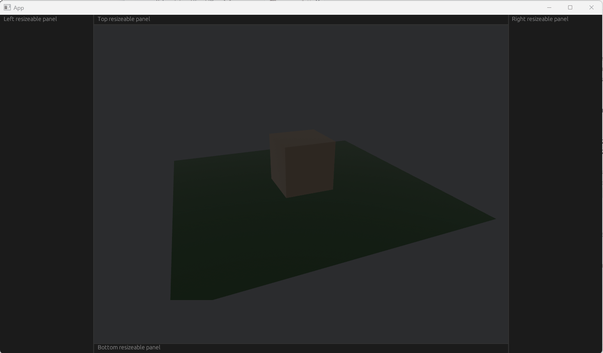
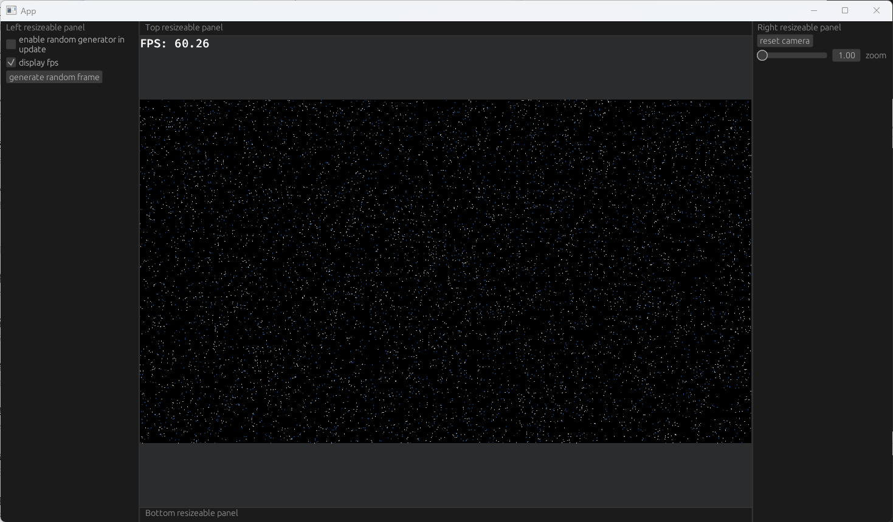
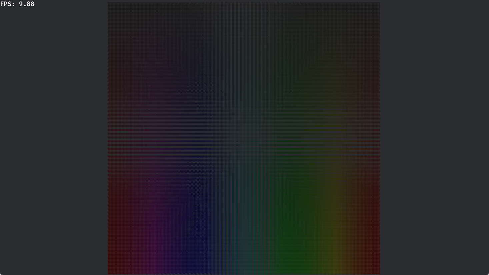
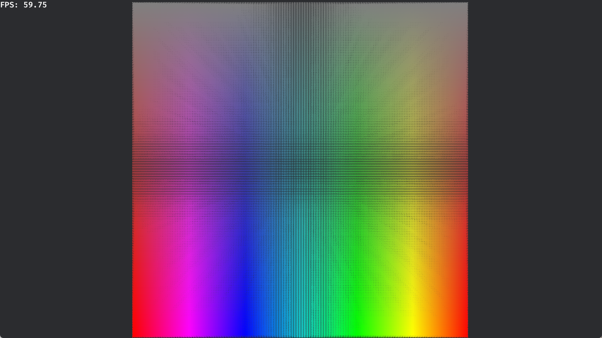

# Bevy

本目录由若干 Bevy 的 Playground 组成，每一个 Playground 都包含着一些 Bevy 相关的知识与应用实例，对应的笔记在相应目录的 README 中。

## 目录

### [p1-basic](playgrounds/p1-basic/README.md)

概述、Bevy 中 App、System、Component、Resource 的基本概念

### [p2-2d-shapes](playgrounds/p2-2d-shapes/README.md)

重要概念：`Assets`、`Handle`、`AssetId`

Component Bundle：`Camera2dBundle` 相机简单使用、`MaterialMesh2dBundle` 2d 图形、`TextBundle` 简单文字

Plugin：`Wireframe2dPlugin` 2d 图形线框显示

`Mesh2dHandle`、`Mesh`、`Transform`

### [p3-bevy-egui](playgrounds/p3-bevy-egui/README.md)

egui 与 bevy 的基础集成

通过控制相机 `Viewport` 实现固定宽高比画面 `object-fit: contain` 式的绘制

### [p4-evt-viewer](playgrounds/p4-evt-viewer/README.md)

二维相机 `Camera2dBundle`：

- `Viewport`

- `OrthographicProjection`：`scale` 缩放、`scaling_mode` AutoMin

- `Transform`：拖拽移动相机

Plugin：`FPSOverlayPlugin`

EntityCommands 的 `despawn`与 Commands 的 `spawn_batch`

`FromWorld` 的基本用法、`Local` 的基本用法

System 的 `run_if`、`chain` 以及 `EventReader<MouseWheel>` 和 `common_conditions::input_pressed`

> 下面两个帧数变低是因为把事件数 x3 了（）

### [p5-evt-viewer-plugin](playgrounds/p5-evt-viewer-plugin/README.md)

使用 `Plugin` 来封装 [p4-evt-viewer](../p4-evt-viewer/README.md) 并添加对多个相机的支持

### [p6-render-to-texture](playgrounds/p6-render-to-texture/README.md)

`Image`、`RenderLayer`、`Camera` 的 target 与 order。

### [p7-shader-instancing](playgrounds/p7-shader-instancing/README.md)

Extract、Prepare、Queue、Pipeline

### [p8-noise-terrain](./playground/p8-noise-terrain)

## 一些资源

- [Bevy Examples in WebGPU (bevyengine.org)](https://bevyengine.org/examples-webgpu/)
- [Introduction - Unofficial Bevy Cheat Book (bevy-cheatbook.github.io)](https://bevy-cheatbook.github.io/introduction.html)