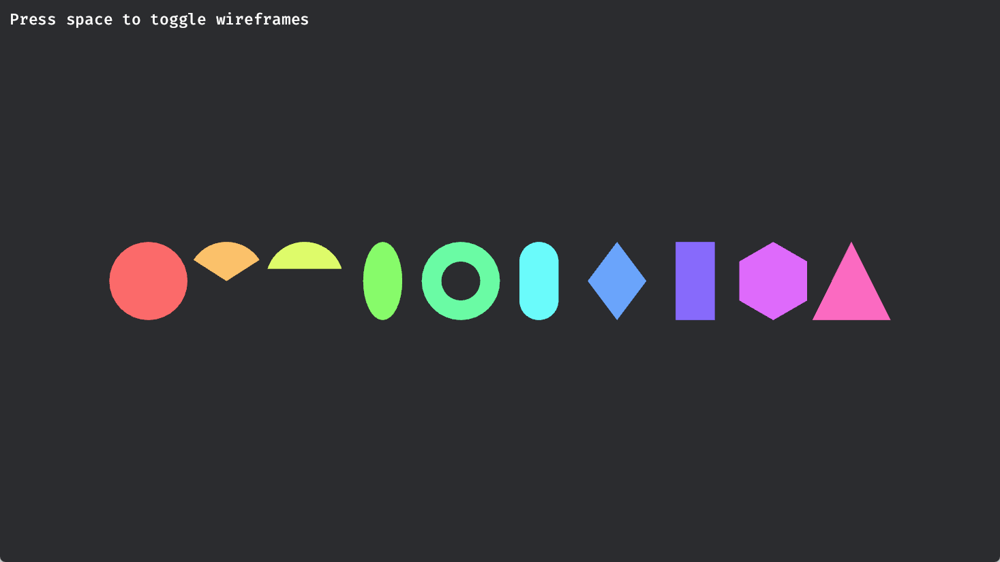
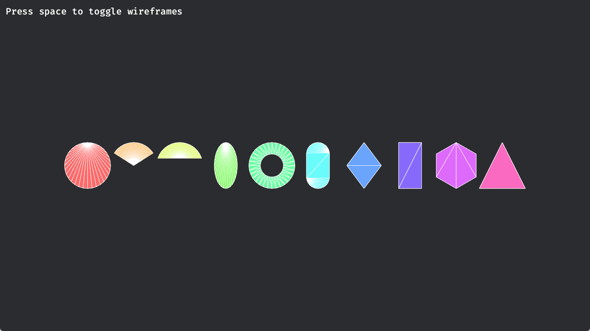

# Bevy

本目录由若干 Bevy 的 Playground 组成，每一个 Playground 都包含着一些 Bevy 相关的知识与应用实例，对应的笔记在相应目录的 README 中。

## 目录

- [p1-basic](playgrounds/p1-basic/README.md)

    概述、Bevy 中 App、System、Component、Resource 的基本概念

- [p2-2d-shapes](playgrounds/p2-2d-shapes/README.md)

    重要概念：`Assets`、`Handle`、`AssetId`

    Component Bundle：`Camera2dBundle` 相机简单使用、`MaterialMesh2dBundle` 2d 图形、`TextBundle` 简单文字

    Plugin：`Wireframe2dPlugin` 2d 图形线框显示

    `Mesh2dHandle`、`Mesh`、`Transform`

    

    

## 一些资源

- [Bevy Examples in WebGPU (bevyengine.org)](https://bevyengine.org/examples-webgpu/)
- [Introduction - Unofficial Bevy Cheat Book (bevy-cheatbook.github.io)](https://bevy-cheatbook.github.io/introduction.html)