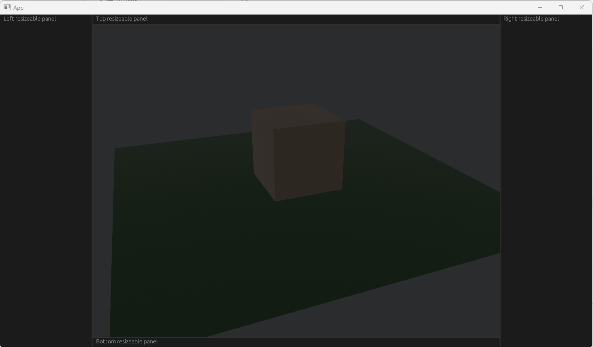

# p3-bevy-egui

egui 与 bevy 的基础集成

通过控制相机 `Viewport` 实现固定宽高比画面 `fit-contain` 式的绘制

---

## 一、bevy 与 egui 的基础集成

bevy-egui 提供了一个 `EguiPlugin`，添加这个插件后，可以在 System 中使用 `EguiContexts` 绘制 egui 界面：

```rust
use bevy::prelude::*;
use bevy_egui::{egui, EguiContexts, EguiPlugin};

fn main() {
    App::new()
        .add_plugins(DefaultPlugins)
        .add_plugins(EguiPlugin)
        // Systems that create Egui widgets should be run during the `CoreSet::Update` set,
        // or after the `EguiSet::BeginFrame` system (which belongs to the `CoreSet::PreUpdate` set).
        .add_systems(Update, ui_example_system)
        .run();
}

fn ui_example_system(mut contexts: EguiContexts) {
    egui::Window::new("Hello").show(contexts.ctx_mut(), |ui| {
        ui.label("world");
    });
}
```

Ui 状态等全局状态可以使用 Resource 来作为一个全局资源来管理：

```rust
#[derive(Default, Resource)]
struct UiState {
    // ...
}

// ...

fn main() {
    App::new()
    	.init_resource::<UiState>()
    	// ...
    	.run();
}

fn ui_example_system(mut contexts: EguiContexts, mut ui_state: ResMut<UiState>) {
    egui::Window::new("Hello").show(contexts.ctx_mut(), |ui| {
        ui.label("world");
    });
}
```

## 二、egui 上下左右面板 + Camera 中间区域 渲染

```rust
use std::time::Duration;

use bevy::{
    prelude::*,
    render::{camera::Viewport, primitives::Frustum},
    window::PrimaryWindow,
    winit::WinitSettings,
};
use bevy_egui::{egui, EguiContexts, EguiPlugin};

const CAMERA_TARGET: Vec3 = Vec3::ZERO;

#[derive(Resource, Deref, DerefMut)]
struct OriginalCameraTransform(Transform);

fn main() {
    App::new()
        .insert_resource(WinitSettings::desktop_app())
        .add_plugins(DefaultPlugins)
        .add_plugins(EguiPlugin)
        .add_systems(Startup, setup_system)
        .add_systems(Update, ui_example_system)
        .run();
}

fn ui_example_system(
    mut is_last_selected: Local<bool>,
    mut contexts: EguiContexts,
    mut occupied_screen_space: ResMut<OccupiedScreenSpace>,
) {
    let ctx = contexts.ctx_mut();

    egui::SidePanel::left("left_panel")
        .resizable(true)
        .show(ctx, |ui| {
            ui.label("Left resizeable panel");
            ui.allocate_rect(ui.available_rect_before_wrap(), egui::Sense::hover());
        });
    egui::SidePanel::right("right_panel")
        .resizable(true)
        .show(ctx, |ui| {
            ui.label("Right resizeable panel");
            ui.allocate_rect(ui.available_rect_before_wrap(), egui::Sense::hover());
        });
    egui::TopBottomPanel::top("top_panel")
        .resizable(true)
        .show(ctx, |ui| {
            ui.label("Top resizeable panel");
            ui.allocate_rect(ui.available_rect_before_wrap(), egui::Sense::hover());
        })
        .response
        .rect
        .height();
    occupied_screen_space.bottom = egui::TopBottomPanel::bottom("bottom_panel")
        .resizable(true)
        .show(ctx, |ui| {
            ui.label("Bottom resizeable panel");
            ui.allocate_rect(ui.available_rect_before_wrap(), egui::Sense::hover());
        });
}

fn setup_system(
    mut commands: Commands,
    mut meshes: ResMut<Assets<Mesh>>,
    mut materials: ResMut<Assets<StandardMaterial>>,
) {
    commands.spawn(PbrBundle {
        mesh: meshes.add(Plane3d::default().mesh().size(5.0, 5.0)),
        material: materials.add(Color::srgb(0.3, 0.5, 0.3)),
        ..Default::default()
    });
    commands.spawn(PbrBundle {
        mesh: meshes.add(Cuboid::new(1.0, 1.0, 1.0)),
        material: materials.add(Color::srgb(0.8, 0.7, 0.6)),
        transform: Transform::from_xyz(0.0, 0.5, 0.0),
        ..Default::default()
    });
    commands.spawn(PointLightBundle {
        point_light: PointLight {
            intensity: 1500.0,
            shadows_enabled: true,
            ..Default::default()
        },
        transform: Transform::from_xyz(4.0, 8.0, 4.0),
        ..Default::default()
    });

    let camera_pos = Vec3::new(-2.0, 2.5, 5.0);
    let camera_transform =
        Transform::from_translation(camera_pos).looking_at(CAMERA_TARGET, Vec3::Y);
    commands.insert_resource(OriginalCameraTransform(camera_transform));

    commands.spawn(Camera3dBundle {
        transform: camera_transform,
        ..Default::default()
    });
}
```



## 三、中心 Camera 区域的 Content-Fit 实现

`Camera` Component 有一个 `viewport` 属性，可以指定用于输出渲染结果的区域信息：

```rust
pub struct Viewport {
    pub physical_position: UVec2,
    pub physical_size: UVec2,
    pub depth: Range<f32>,
}
```

思路：

1. 从 egui 的 `Response` 获取表示 UI 组件逻辑大小的 `Rect`，计算边栏占用的区域大小，维护在全局状态中：

    ```rust
    #[derive(Default, Resource)]
    struct OccupiedScreenLogicalSpace {
        left: f32,
        top: f32,
        right: f32,
        bottom: f32,
    }
    
    //...
    
    fn main() {
        App::new()
        	.init_resource::<OccupiedScreenLogicalSpace>
        	// ...
        	.run();
    }
    
    fn ui_example_system(
        mut contexts: EguiContexts,
        mut occupied_screen_space: ResMut<OccupiedScreenLogicalSpace>,
    ) {
        // 绘制 UI 并更新 occupied_screen_space ...
    }
    ```

2. 增加一个用于更新相机 `Viewport` 的 System：

    1. 通过 `Query<&Window, With<PrimaryWindow>>` 获取窗口信息（逻辑大小、物理大小 以及之间的换算关系）

    2. 通过全局状态中保存的信息计算 `Viewport` 的逻辑大小，并通过 `scale_factor` 换算为物理大小，设置到 `Camera` 的 `Viewport` 中：

        ```rust
        fn update_camera_transform_system(
            occupied_screen_space: Res<OccupiedScreenLogicalSpace>,
            windows: Query<&Window, With<PrimaryWindow>>,
            mut camera: Query<&mut Camera>,
        ) {
            let window = windows.single();
        
            let aspect_ratio = 1280.0 / 720.0;
            let logical_width = window.width() - occupied_screen_space.left - occupied_screen_space.right;
            let logical_height = window.height() - occupied_screen_space.top - occupied_screen_space.bottom;
            let logical_size = if logical_width / logical_height < aspect_ratio {
                Vec2::new(logical_width, logical_width / aspect_ratio)
            } else {
                Vec2::new(logical_height * aspect_ratio, logical_height)
            };
            let logical_position = Vec2::new(
                occupied_screen_space.left + (logical_width - logical_size.x) / 2.0,
                occupied_screen_space.top + (logical_height - logical_size.y) / 2.0,
            );
            let mut physical_position = (logical_position * window.scale_factor()).as_uvec2();
            let mut physical_size = (logical_size * window.scale_factor()).as_uvec2();
            if physical_size.x * physical_size.y == 0 {
                physical_position = UVec2::ZERO;
                physical_size = UVec2::new(1, 1);
            }
            // println!("position: {:?} -> {:?}", logical_position, physical_position);
            // println!("size: {:?} -> {:?}", logical_size, physical_size);
        
            let mut camera = camera.get_single_mut().unwrap();
            camera.viewport = Some(Viewport {
                physical_position,
                physical_size,
                depth: 0.0..1.0,
            });
        }
        ```

    效果：

    