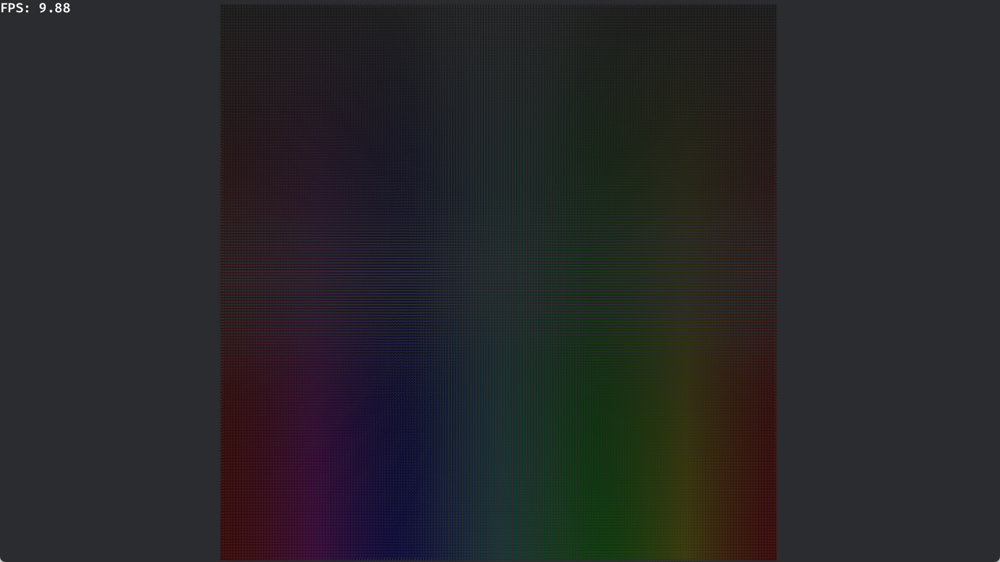

# p7-shader-instancing

200 * 200 个立方体。

直接渲染：

自己实现 Instancing：

---

## 参考

[Rendering ten thousand cubes... : r/bevy (reddit.com)](https://www.reddit.com/r/bevy/comments/11gcm7q/rendering_ten_thousand_cubes/)

[Instancing (bevyengine.org)](https://bevyengine.org/examples/shaders/shader-instancing/)

