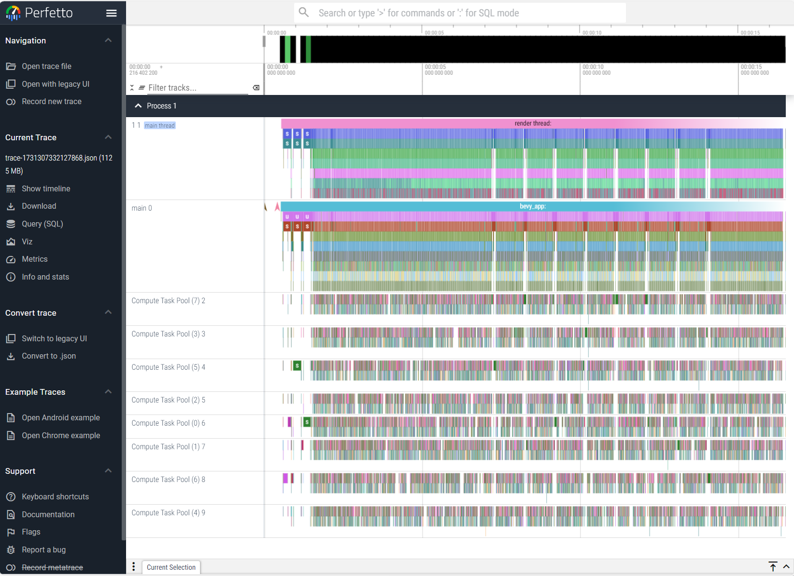
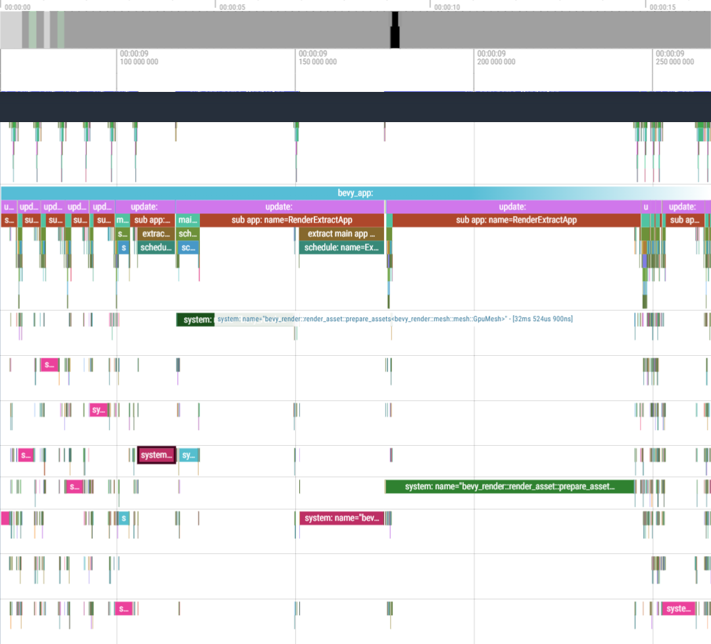
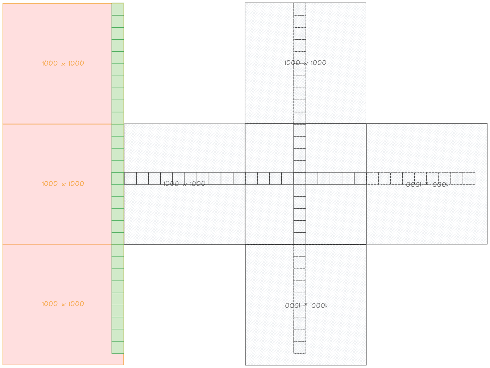
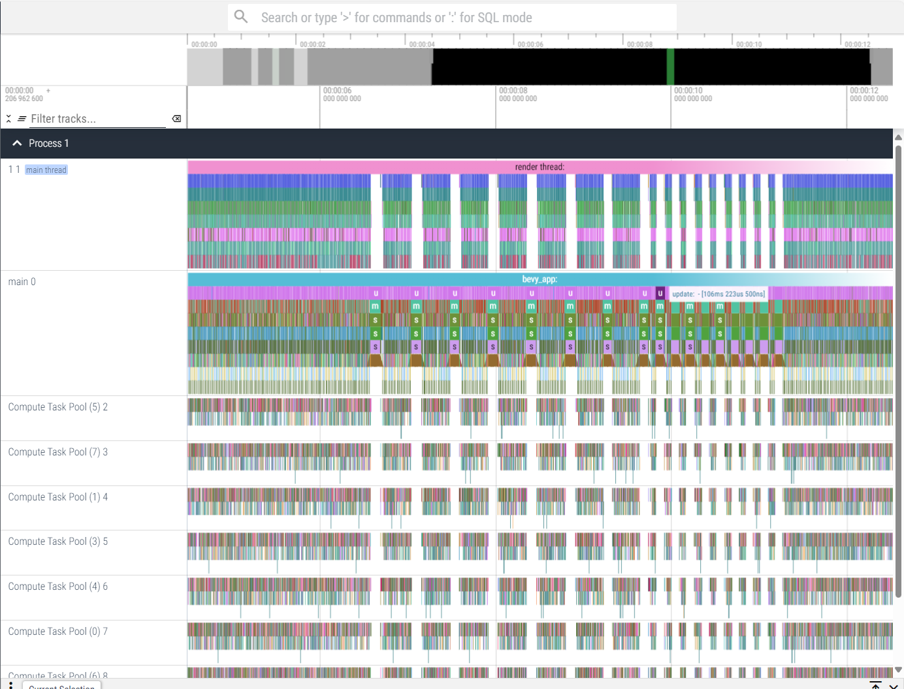

# low-poly-terrain

[Build low poly terrain from planes meshes in Bevy](https://www.youtube.com/watch?v=Ky43Od2Ons8)


---

## 一、地形的生成 & 展示

利用噪声生成地形的过程可以看作是一个简单的函数：输入 $XY$ 坐标，输出高度。*noise* crate 可以提供所需的噪声函数：

```rust
let noise = BasicMulti::<Perlin>::default();
// let val = noise.get([x, y]);
```

同时，为了展示 $XY$ 平面上的点的高度，可以使用 `Mesh`：

1. 首先生成一个 Plane

    ```rust
    let mut terrain = Mesh::from(
        Plane3d::default()
        .mesh()
        .size(1000.0, 1000.0)
        .subdivisions(1000), // Mesh 的两个方向被几条线划分
    );
    ```

2. 然后去调整这个 `Mesh` 的顶点参数（位置、颜色、法线）

    ```rust
    if let Some(VertexAttributeValues::Float32x3(
        positions,
    )) = terrain.attribute_mut(Mesh::ATTRIBUTE_POSITION)
    {
        for pos in positions.iter_mut() {
            let val = noise.get([
                pos[0] as f64 / 300.,
                pos[2] as f64 / 300.,
            ]);
    
            pos[1] = val as f32 * terrain_height;
        }
    
        let colors: Vec<[f32; 4]> = positions
        .iter()
        .map(|[_, g, _]| {
            let g = *g / terrain_height * 2.;
    
            if g > 0.8 {
                (Color::LinearRgba(LinearRgba {
                    red: 20.,
                    green: 20.,
                    blue: 20.,
                    alpha: 1.,
                }))
                .to_linear()
                .to_f32_array()
            } else if g > 0.3 {
                Color::from(AMBER_800)
                .to_linear()
                .to_f32_array()
            } else if g < -0.8 {
                Color::BLACK.to_linear().to_f32_array()
            } else {
                (Color::from(GREEN_400).to_linear())
                .to_f32_array()
            }
        })
        .collect();
        terrain.insert_attribute(
            Mesh::ATTRIBUTE_COLOR,
            colors,
        );
    }
    terrain.compute_normals();
    ```

最后用这个 Mesh 生成一个 `PbrBundle` 即可，超级简单：

```rust
commands.spawn((
    PbrBundle {
        mesh: meshes.add(terrain),
        material: materials.add(Color::WHITE),
        ..default()
    },
    Terrain,
));
```

通过 *bevy_panorbit_camera* 可以很便捷地添加一个 PanOrbit 相机：

```rust
commands.spawn((
        Camera3dBundle {
            transform: Transform::from_xyz(0.0, 20., 75.0)
                .looking_at(Vec3::new(0., 1., 0.), Vec3::Y),
            ..default()
        },
        PanOrbitCamera::default(),
    ));
```

以及记得加光源：

```rust
// directional 'sun' light
    commands.spawn(DirectionalLightBundle {
        directional_light: DirectionalLight {
            illuminance: light_consts::lux::OVERCAST_DAY,
            shadows_enabled: true,
            ..default()
        },
        transform: Transform {
            translation: Vec3::new(0.0, 2.0, 0.0),
            rotation: Quat::from_rotation_x(-PI / 4.),
            ..default()
        },
        ..default()
    });
```

## 二、虚拟“角色”及相机

目前的“地形”只有 1000x1000 这么大，为了实现无限大小的地形，需要根据角色的位置展示其周围一定范围内的“区块”的地形。因此在这里实现一个十分简单的虚拟的“角色”，以及跟随着它的一个摄像机。

```rust
#[derive(Component)]
struct Player;

#[derive(Component)]
struct PlayerCam;

fn player_control_system(
    input: Res<ButtonInput<KeyCode>>,
    mut players: Query<&mut Transform, With<Player>>,
) {
    let mut direction = Vec2::new(0., 0.);
    if input.pressed(KeyCode::KeyW) {
        direction.y += 1.;
    }
    if input.pressed(KeyCode::KeyS) {
        direction.y -= 1.;
    }
    if input.pressed(KeyCode::KeyA) {
        direction.x += 1.;
    }
    if input.pressed(KeyCode::KeyD) {
        direction.x -= 1.;
    }
    if input.pressed(KeyCode::ShiftLeft) {
        direction *= 4.;
    }
    for mut player in &mut players {
        player.translation.x += direction.x * 2.;
        player.translation.z += direction.y * 2.;
    }
}

fn sync_player_camera_system(
    players: Query<
        &Transform,
        (With<Player>, Without<PlayerCam>),
    >,
    mut camera: Query<&mut PanOrbitCamera, With<PlayerCam>>,
) {
    let Ok(player) = players.get_single() else {
        return;
    };
    let mut orbit = camera.single_mut();

    orbit.target_focus = Vec3::new(
        player.translation.x,
        player.translation.y,
        player.translation.z,
    );
}
```

以及为了方便调试，添加了一个 `uv_debug_texture`：

```rust
fn uv_debug_texture() -> Image {
    const TEXTURE_SIZE: usize = 8;

    let mut palette: [u8; 32] = [
        255, 102, 159, 255, 255, 159, 102, 255, 236, 255,
        102, 255, 121, 255, 102, 255, 102, 255, 198, 255,
        102, 198, 255, 255, 121, 102, 255, 255, 236, 102,
        255, 255,
    ];

    let mut texture_data =
        [0; TEXTURE_SIZE * TEXTURE_SIZE * 4];
    for y in 0..TEXTURE_SIZE {
        let offset = TEXTURE_SIZE * y * 4;
        texture_data[offset..(offset + TEXTURE_SIZE * 4)]
            .copy_from_slice(&palette);
        palette.rotate_right(4);
    }

    Image::new_fill(
        Extent3d {
            width: TEXTURE_SIZE as u32,
            height: TEXTURE_SIZE as u32,
            depth_or_array_layers: 1,
        },
        TextureDimension::D2,
        &texture_data,
        TextureFormat::Rgba8UnormSrgb,
        RenderAssetUsages::RENDER_WORLD,
    )
}
```

```rust
let debug_material = materials.add(StandardMaterial {
    base_color_texture: Some(
        images.add(uv_debug_texture()),
    ),
    ..default()
});
```

然后将 Player 和 PlyaerCam 添加到世界中：

```rust
commands.spawn((PbrBundle {
    mesh: meshes.add(Cuboid::default()),
    material: debug_material.clone(),
    transform: Transform::from_xyz(0., 50., 0.),
    ..default()
}, Player));

// 为原先的 PanOrbitCamera 添加 PlayerCam 标记
commands.spawn((
    Camera3dBundle {
        transform: Transform::from_xyz(0.0, 20., 75.0)
        .looking_at(Vec3::new(0., 1., 0.), Vec3::Y),
        ..default()
    },
    PanOrbitCamera::default(),
    PlayerCam
));
```


## 三、区块管理

像是 Minecraft 中的区块管理，当玩家距离较远时，将区块卸载，而当玩家较近时将未生成区块生成，将区块加载。

那么就需要一个全局的 Resource 来管它们，一个从区块编号到区块 Mesh 的 HashMap 刚刚好：

```rust
#[derive(Resource, Default)]
struct TerrainStore(HashMap<IVec2, Handle<Mesh>>);

fn main() {
    App::new()
        .init_resource::<TerrainStore>()
        // ...
}
```

为了方便使用，将“区块生成”封装为一个 Command 输入是区块编号，作用就是生成对应区块的网格并存入 TerrainStore 中：

```rust
struct SpawnTerrain(IVec2);

impl Command for SpawnTerrain {
    fn apply(self, world: &mut World) {
        if world
            .get_resource_mut::<TerrainStore>()
            .expect("TerrainStore to be available")
            .0
            .get(&self.0)
            .is_some()
        {
            // mesh already exists
            // do nothing for now
            warn!("mesh {} already exists", self.0);
            return;
        };

        // ... generate mesh

        world
            .get_resource_mut::<TerrainStore>()
            .expect("TerrainStore to be available")
            .0
            .insert(self.0, mesh.clone());

        world.spawn((
            PbrBundle {
                mesh,
                material,
                transform: Transform::from_xyz(
                    self.0.x as f32 * mesh_size,
                    0.,
                    self.0.y as f32 * mesh_size,
                ),
                ..default()
            },
            Terrain,
        ));
    }
}
```

于是，可以添加一个根据玩家位置来加载/卸载区块的系统：

```rust
fn chunk_manage_system(
    mut commands: Commands,
    mut current_chunk: Local<IVec2>,
    player: Query<&Transform, With<Player>>,
    mut terrain_store: ResMut<TerrainStore>,
    terrain_entities: Query<
        (Entity, &Handle<Mesh>),
        With<Terrain>,
    >,
) {
    // same as mesh_size for us
    let chunk_size = 1000.;

    let Ok(transform) = player.get_single() else {
        warn!("no player!");
        return;
    };

    // Convert from world location to chunk index
    let xz = (transform.translation.xz() / chunk_size)
        .trunc()
        .as_ivec2();

    if *current_chunk != xz || terrain_store.0.get(&xz).is_none() {
        *current_chunk = xz;
        let chunks_to_render = [
            *current_chunk + IVec2::new(-1, -1),
            *current_chunk + IVec2::new(-1, 0),
            *current_chunk + IVec2::new(-1, 1),
            *current_chunk + IVec2::new(0, -1),
            *current_chunk + IVec2::new(0, 0),
            *current_chunk + IVec2::new(0, 1),
            *current_chunk + IVec2::new(1, -1),
            *current_chunk + IVec2::new(1, 0),
            *current_chunk + IVec2::new(1, 1),
        ];
        let chunks_to_despawn: Vec<(IVec2, Handle<Mesh>)> = terrain_store
            .0
            .extract_if(|key, _| !chunks_to_render.contains(&key))
            .collect();

        chunks_to_despawn
            .iter()
            .filter_map(|(chunk, handle)| {
                terrain_entities
                    .iter()
                    .find(|(_, h)| h == &handle)
                    .map(|(entity, _)| (entity, chunk))
            })
            .for_each(|(entity, chunk)| {
                commands.entity(entity).despawn_recursive();
                terrain_store.0.remove(chunk);
            });

        for chunk in chunks_to_render {
            commands.add(SpawnTerrain(chunk));
        }
    }
}
```


可以看到，在抵达边界处时由于生成新的区块的 Mesh 需要消耗一定时间，会出现明显的卡顿。

## 四、优化 —— 异步

一种解决方式是将地形生成的任务作为一个 Task 在后台执行。

Bevy 提供了一个特殊的 `AsyncComputeTaskPool`，可以向其中生成在后台任务线程中执行的任务，每一个任务被生成时都会返回一个对应的 `Task` handle，可以用于检查任务是否完成。

首先，将生成 Mesh 的部分抽离到一个单独的函数中：

```rust
fn generate_chunk(chunk: IVec2) -> Mesh {
    // ...
}
```

然后需要一个全局的资源来追踪正在生成的区块：

```rust
#[derive(Resource, Default)]
struct GeneratingChunk(HashMap<IVec2, Task<Mesh>>);

fn main() {
    App::new()
        .init_resource::<TerrainStore>()
        .init_resource::<GeneratingChunk>()
        // ...
}
```

之后修改原先的 Command 只负责向 `AsyncCompoteTaskPool` 中生成任务：

```rust
impl Command for SpawnTerrain {
    fn apply(self, world: &mut World) {
        // ...
        let mut generating_chunk = world
            .get_resource_mut::<GeneratingChunk>()
            .expect("GeneratingChunk to be available");

        if generating_chunk.0.get(&self.0).is_some() {
            warn!("mesh {} is already generating", self.0);
            return;
        }

        let task_pool = AsyncComputeTaskPool::get();
        let task = task_pool.spawn(async move { generate_chunk(self.0) });
        generating_chunk.0.insert(self.0, task);
    }
}
```

之后添加一个系统来接受完成的任务，并用得到的 Mesh 生成 PbrBundle：

```rust
fn receive_generated_chunk_system(
    mut commands: Commands,
    mut generating_chunk: ResMut<GeneratingChunk>,
    mut terrain_store: ResMut<TerrainStore>,
    mut meshes: ResMut<Assets<Mesh>>,
    mut materials: ResMut<Assets<StandardMaterial>>,
) {
    generating_chunk.0.retain(|chunk, task| {
        let status = block_on(future::poll_once(task));
        let retain = status.is_none();

        if let Some(chunk_mesh) = status {
            let mesh_size = 1000.;

            let mesh = meshes.add(chunk_mesh);
            let material = materials.add(Color::WHITE);

            terrain_store.0.insert(*chunk, mesh.clone());
            commands.spawn((
                PbrBundle {
                    mesh,
                    material,
                    transform: Transform::from_xyz(
                        chunk.x as f32 * mesh_size,
                        0.,
                        chunk.y as f32 * mesh_size,
                    ),
                    ..default()
                },
                Terrain,
            ));
        }

        retain
    });
}
```


现在可以发现卡顿已经被大幅降低。

但是卡顿依然存在，推测可能是生成过大的 Mesh 会消耗一定时间。不过具体的原因需要用更加科学的方式来分析。

## 五、Profiling

Bevy 提供了大量对 Bevy 应用进行性能记录的方式[^1]，具体使用方式略。这是记录到的信息：



观察中间的几段空白空间：



可以发现时间消耗在将 Mesh 上传到 GPU 并进行准备。这个结论是合理的，因为地形生成是在 CPU 端完成的，而一个被 1000 次划分的 Mesh 具有 1001x1001x2 = 2004002 个三角形，确实是很庞大的数据。

将划分数改为 100 可以发现卡顿消失，但是带来的问题就是地形变得模糊。

> [What's the best way to load new mesh assets after Startup without blocking the main thread? : r/bevy](https://www.reddit.com/r/bevy/comments/1gi2o66/whats_the_best_way_to_load_new_mesh_assets_after/)

## 五、优化

### 1. 缩小区块大小

将区块大小缩小，保持划分数与大小的比例（分辨率），那么每一个 Chunk 的 Mesh 大小将会大大缩小，上传 GPU 的速度将会加快。

修改 Mesh 的大小为 100x100，`subdivisions` 为 100，然后按照区块距离更新区块：

```rust
let chunk_distance = 9;

let chunks_to_render = (-chunk_distance..chunk_distance)
    .flat_map(|i| (-chunk_distance..chunk_distance).map(move |j| (i, j)))
    .map(|(i, j)| *current_chunk + IVec2::new(i, j))
    .collect::<Vec<_>>();
    // let chunks_to_render = [
    //     *current_chunk + IVec2::new(-1, -1),
    //     *current_chunk + IVec2::new(-1, 0),
    //     *current_chunk + IVec2::new(-1, 1),
    //     *current_chunk + IVec2::new(0, -1),
    //     *current_chunk + IVec2::new(0, 0),
    //     *current_chunk + IVec2::new(0, 1),
    //     *current_chunk + IVec2::new(1, -1),
    //     *current_chunk + IVec2::new(1, 0),
    //     *current_chunk + IVec2::new(1, 1),
    // ];
```


可以看到卡顿几乎消失（但是还是有一点）。

虽然随着区块大小的减小，跨越区块时更新的区块数会增多，但是每次更新的区块整体变为了一个更窄的“窄条”。



再通过 profiling 工具可以看到卡顿依旧存在：



### 2. 限制每 tick 实际生成的区块数量

// TODO


## 参考

[^1]: [bevy/docs/profiling.md at main · bevyengine/bevy](https://github.com/bevyengine/bevy/blob/main/docs/profiling.md)

[Build low poly terrain from planes meshes in Bevy - YouTube](https://www.youtube.com/watch?v=Ky43Od2Ons8)

[Infinite chunk based terrain generation in Bevy 0.14](https://www.youtube.com/watch?v=C2YnzykOVYM)

[rust-adventure/yt-low-poly-terrain-bevy at video-002-infinite-async-terrain](https://github.com/rust-adventure/yt-low-poly-terrain-bevy/tree/video-002-infinite-async-terrain)