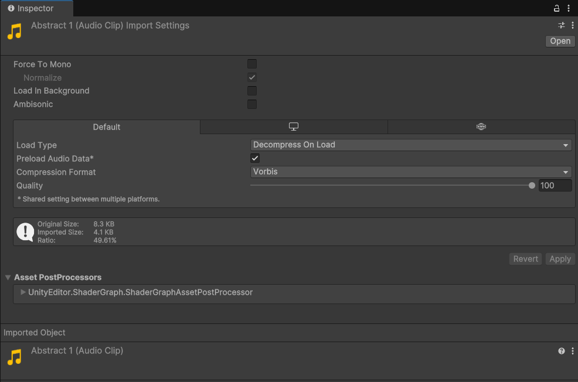

# Audio

## 音频文件与 *Audio Clip*

Unity 支持很多种格式的音频文件。

音频文件在被导入到 Unity 后，以 *Audio Clip* 的形式存在：

其中有很多属性：

- **Load Type**：共有三种
    - **Decompress On Load**：在加载之后立刻解压，通常用于较小的音频文件。
    - **Compressed In Memory**：加载后保持压缩，在播放时解压，有一定的性能消耗，常用于消耗内存较大的音频文件。
    - **Streaming**：在一个单独的 Streaming 线程进行流式解压，消耗最少的内存（至少 200KB）
- **Compression Format**：压缩格式，共有三种
    - **PCM**：较大尺寸，较高质量，常用于较小的音频文件。
    - **ADPCM**：比 PCM 小 3.5 倍，CPU 消耗远小于 Vorbis/MP3，常用于带有一定噪声且需要播放很多次的音频文件（脚步、武器、受击等）。
    - **Vorbis/MP3**：最小的尺寸，但质量较低，可以通过 Quality 调整压缩比例，常用于中等长度的音效或音乐。
- **Sample Rate Setting**：采样率（略）。
- **Force To Mono**：启用后会作为单声道声音。
- **Load In Background**：在后台加载，不占用主线程。
- **Quality**：压缩率

在脚本中被作为一个 `AudioClip` 的实例来访问。

## *Audio Listener* 与 *Audio Source*

在现实世界中，我们听到声音需要耳朵和声源，它们在 Unity 中分别对应着 *Audio Listener* 和 *Audio Source*。

一般来说，*Audio Listener* 会绑定在玩家摄像机上，依此可以根据玩家的位置、朝向来响应三维的 *Audio Source*。

而 *Audio Source*，则会被绑定在发声物体上，它有很多属性：

- **Audio Clip**：被播放的 *Audio Clip*
- **Output**：输出，默认为场景中的 *Audio Listener*，可以输出到 *Audio Mixer* 来在合成器中进一步调整（*Audio Mixer* 见后文）
- **Mute**：字面意思
- **Bypass Effects**：用于快速地跳过应用到 *Audio Source* 的效果
- **Bypass Listener Effects**：跳过 *Audio Listener* 的效果
- **Bypass Reverb Zone**：跳过 *Reverb Zone* 的效果
- **Play On Awake**：在场景启动时就播放，如果禁用则需要在脚本中通过 `Play()` 来播放
- **Loop**：字面意思
- **Priority**：优先级
- **Volume**：在一个世界单位（1 米）处的声音大小
- **Pitch**：虽然直接翻译是音高，但其实本质是倍速，所以默认是 1（即 1x）
- **Stereo Pan**：
- **Spatial Blend**：2D 与 3D 的混合
- ...
- **Rolloff Mode**：声音衰减模式，共有三种
    - **Logarithmic Rolloff**
    - **Linear Rolloff**
    - **Custom Rolloff**

以下属性可以被设定为距离函数：

- **Volume**
- **Spatial Blend**
- **Spread**
- **Low-Pass**
- **Reverb Zone**

### `AudioSource` 类

位于 `UnityEngine.AudioModule` 中。

可以使用 `Play()`，`Pause()` 和 `Stop()` 方法来控制播放。

`public void PlayOneShot(AudioClip clip, float volumeScale = 1.0f)`

可以指定 *Audio Clip* 和音量比例，不会中断当前 *Audio Source* 正在播放的 clip。

`public static void PlayClipAtPoint(AudioClip clip, Vector3 position, float volume = 1.0F);`

可以在指定位置以指定音量播放指定 clip。

每次调用都会会创建一个 *Audio Source* 并在播放完成时自动移除。

> [bilibili:【Unity搬运】在Unity中优化游戏音效：音频源的池化技术](https://www.bilibili.com/video/BV1xx4y1b7S2)
>
> [youtube: Optimize Game Sounds: Pooling Audio Sources in Unity](https://www.youtube.com/watch?v=BgpqoRFCNOs)

