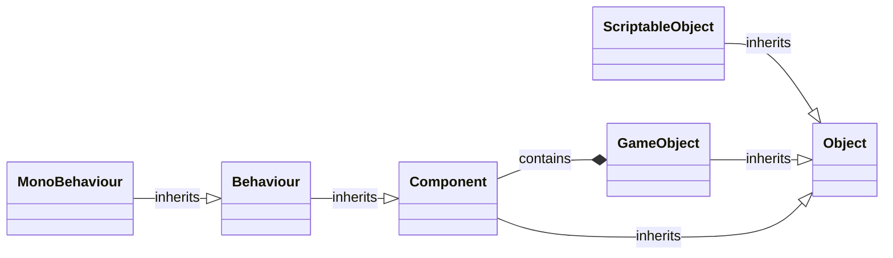
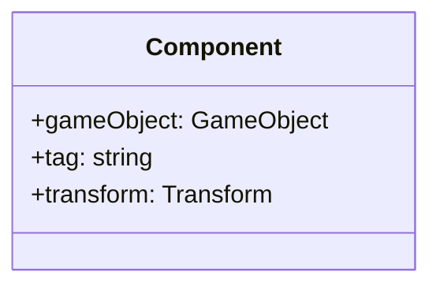
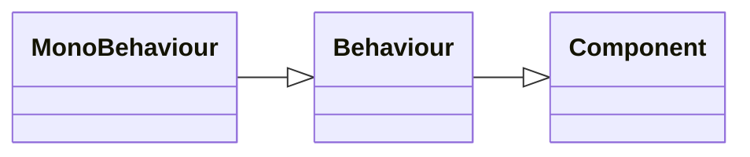
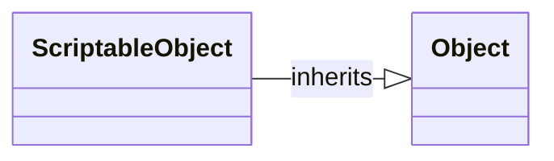

## 〇、一切的基类 —— Object 及对象关联模型

Unity 引擎本身并不是 C# 编写的，而是 C++，C# 只是作为脚本的接口。

换句话来说，C# 中的各种对象本质上只是对引擎中对象的引用，引擎中的各种对象并不存储在 C# 运行时的垃圾回收内存中，而是存储在 C++ 的内存中。

> [!WARNING]
>
> 也因此，非 `null` 的对象，是有可能与 C++ 对象断开了链接的。
>
> 此时由于 `Object` 的 `==`、`!=` 运算符以及 `bool` 方法有特殊实现，所以它们表现得像是 `null`。但是 `?.` 和 `??` 无法被重写，所以要谨慎使用。

而 `Object` 类则是搞定了这其中复杂的关联逻辑的，引擎在 C# 世界的一切的基类。

在 Unity 中，如果要自定义一个对象类型，一般会涉及到继承自三个类：

- `MonoBehaviour`：作为一个 `Component` 链接到 `GameObject` 上
- `ScriptableObject`：独立于 `GameObject`，可以理解为一个自定义的 `GameObject`
- `ScriptedImporter`：TODO

## 二、场景中存在的物体的基类 —— GameObject 

一个 `GameObject` 上可以挂载若干 `Component`，有一系列方法可以获取 GO 上的 `Component`：

- `GetComponent`
- `GetComponentAtIndex`
- `GetComponentCount`
- `GetComponentInChildren`
- `GetComponentIndex`
- `GetComponentInParent`
- `GetComponents`
- `GetComponentsInChildren`
- `GetComponentsInParent`
- `TryGetComponent`

### Component

所有绑定到 `GameObject` 上的组件的基类。

### 属性

其有三个属性：

- `gameObject`：绑定到的 `GameObject`
- `tag`：`gameObject` 的 `Tag`
- `transform`：`gameObject` 的 `Transform`

### 方法

`public bool CompareTag(string tag);`

字面意思。

`public T GetComponent();`

获取 `gameObject` 上类型为 `T` 的组件，若没有则为 `null`。

也可以通过传入 `Type` 或 `string` 来获取组件，但是不如泛型高效。

`public bool TryGetComponent(out T component);`

和 `GetComponent` 的主要区别是当请求的组件不存在时不会进行内存分配。

也可以传入 `Type`，但是不如泛型高效。

## MonoBehaviour

在创建 MonoBehaviour Script 时，其实就是通过继承的方式实现了一个新的 `MonoBehaviour`。

可以通过 `Object.Destroy` 或 `Object.DestroyImmediate` 来删除，当其父 `GameObject` 被删除时，所有的组件也会被自动删除。

当其组件被实际销毁时，C# 对象在垃圾回收之前依旧存在，这时 `MonoBehaviour` 表现与 `null` 一样（比如 `obj == null` 会为 `true`），但是不支持 `?.` 和 `??`。

## ScriptableObject

`ScriptableObject` 并不继承自 `GameObject`，因此它并不具有 `Update` 等生命周期，它可以被理解为一个 Util 类，可以被其他类所使用（比如作为某个 `Monobehaviour` 的属性，在其中被使用）

通过 `[CreateAssetMenu]` 特性注解，可以将一个 SO 类型注册为 Asset 文件，然后可以在 Asset -> Create 菜单中去创建这个文件。这个文件本质上就是一个 SO 实例的序列化，可以被当作一个 SO 实例来加载。

## 运行时场景管理 —— SceneManager

多个场景可以被同时加载，脚本中创建的 *GameObject* 会被添加到激活的场景（Active Scene）中。

`SceneManager` 中有三个事件：

- `activeSceneChanged`：

- `sceneLoaded`：
- `sceneUnloaded`：
