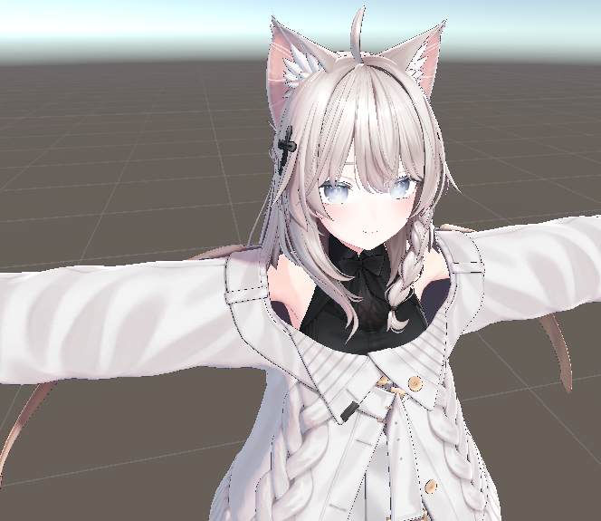

# Upload Avatar

VRChat 使用的是 Unity 引擎，其中的角色和世界也同样使用 Unity 创建。

要创作 Avatar 或 World，那么就需要两样东西：

- Unity 引擎
- VRChat SDK

官方提供了 VRChat Creator Companion（VCC），相当于是把它们绑在了一起，开箱即用：

## 上传 Avatar

> 参考：https://creators.vrchat.com/avatars/creating-your-first-avatar

首先创建一个 Avatar 项目：

然后打开：

这是一个下载下来的模型的内容：

可以导入到 Unity 的 Assets 中（也可以直接把 `.unityPackage` 拖进来）：

导入后，其中有一个场景，点开可以看到模型就在里面（不过有点奇怪）：

这是因为没有导入着色器导致的，一般模型的页面都会写使用了哪些东西，比如这个模型使用的是 liltoon：

导入之后就好了：

然后就是在 VRChat SDK 的控制面板里一通操作最后 Build & Publish 就好了>w<