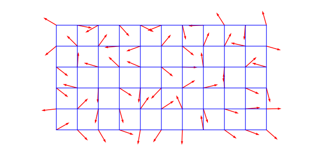

# 柏林噪声

## 一、引言

噪声 —— 本质上就是随机数生成。

对于一张二维噪声图来说，直接对每个像素生成随机数的效果是很差的，所以经常将图像划分为网格，对格点生成随机数，然后在格点之间进行插值。这样的好处是：

1. 噪声的连续性更好，更加平滑
2. 这种方式并不局限于有限分辨率（只要计算精度足够可以无限细分），换言之，输入随便一个浮点数向量“坐标”都可以计算出对应的结果

那么对于这种先划分网格，再生成随机数，最后进行插值的方法，主要就有了两种方式：

- Value Noise：直接生成值并插值
- Gradient Noise：生成梯度，根据梯度进行插值

而从直观上来感受，往往后者有更好的质量[^1]，而柏林噪声，正是后者。

## 二、算法思路

### 1. 网格定义

对于 n 维柏林噪声，定义一个 n 维网格，每一个格点都与一个固定的随机 n 维梯度向量相关联。

下图是一个二维的例子：



### 2. 点积

对于任意一个点，可以获取它与它所在格子的 n 个格点的 **偏移向量**，使用这个向量对对应格点的 **梯度向量** 做点积就可以得到对应格点对这个点的 **贡献**。

下图是二维情况下的，每个点得到的和它最近的格点的贡献：


### 3. 插值

上图仅仅展示了每一个点得到的和它最近的格点的贡献，但是实际上它应该按照自己与周围 $2^n$ 格点的距离来 **混合** 每个格点对它的贡献。

一维的情况很简单，两个数值进行插值（其中 $\text{smoothstep}$ 是后面会介绍的函数）：
$$
\begin{align}
f(x) = a_0 + \text{smoothstep}(x)\cdot(a_1 - a_0) && 0 \leq x \leq 1
\end{align}
$$
对于更高维就复杂了一些，要首先对任意一个轴进行插值（通过一次一维插值降一次维），然后再以此对剩下的每个轴插值。以二维为例就是先对 $x$ 或 $y$ 插值，将原本的 $2^n = 4$ 个点降到 $2^n / 2 = 2$ 个点，然后可以发现得到的这些点的一个分量已经相同的，所以本质上就是降到了一维，再进行一次插值就好：


最终完成插值后也就得到了每一个点的噪声值：


而对于 $\text{smoothstep}$[^2] 这个函数，如果简单地取 $x$，那么这其实就是个线性插值，但是这并不好，因为会导致在格点处有生硬的转折，也就是说它在格点处的一阶导数不是 $0$。

因此，Perlin 提出柏林噪声的时候使用的是 $-2x^3 + 3x^2$，不过它也有一些问题，它在格点处的二阶导不是 $0$，所以它会导致格点处不够“平滑”，因此后来改进的版本使用的是 $6x^5 - 15x^4 + 10x^3$。

## 三、实现细节

虽然说是给格点赋予“随机数”，但是为了确保对于相同的输入得到完全一致的结果，需要以特殊的方式来实现。在 Perlin 给出的代码[^3] 中是通过一个排列表 P，将坐标哈希映射得到梯度表 G 中实现的。

排列表 P，是 0~255 的排列重复两次：

```java
static final int p[] = new int[512], permutation[] = { 151, 160, 137, 91, 90, 15, 131, 13, 201, 95, 96, 53, 194, 233, 7,
225, 140, 36, 103, 30, 69, 142, 8, 99, 37, 240, 21, 10, 23, 190, 6, 148, 247,
120, 234, 75, 0, 26, 197, 62, 94, 252, 219, 203, 117, 35, 11, 32, 57, 177, 33,
88, 237, 149, 56, 87, 174, 20, 125, 136, 171, 168, 68, 175, 74, 165, 71, 134,
139, 48, 27, 166, 77, 146, 158, 231, 83, 111, 229, 122, 60, 211, 133, 230, 220,
105, 92, 41, 55, 46, 245, 40, 244, 102, 143, 54, 65, 25, 63, 161, 1, 216, 80,
73, 209, 76, 132, 187, 208, 89, 18, 169, 200, 196, 135, 130, 116, 188, 159, 86,
164, 100, 109, 198, 173, 186, 3, 64, 52, 217, 226, 250, 124, 123, 5, 202, 38,
147, 118, 126, 255, 82, 85, 212, 207, 206, 59, 227, 47, 16, 58, 17, 182, 189,
28, 42, 223, 183, 170, 213, 119, 248, 152, 2, 44, 154, 163, 70, 221, 153, 101,
155, 167, 43, 172, 9, 129, 22, 39, 253, 19, 98, 108, 110, 79, 113, 224, 232,
178, 185, 112, 104, 218, 246, 97, 228, 251, 34, 242, 193, 238, 210, 144, 12,
191, 179, 162, 241, 81, 51, 145, 235, 249, 14, 239, 107, 49, 192, 214, 31, 181,
199, 106, 157, 184, 84, 204, 176, 115, 121, 50, 45, 127, 4, 150, 254, 138, 236,
205, 93, 222, 114, 67, 29, 24, 72, 243, 141, 128, 195, 78, 66, 215, 61, 156, 180 };
static { for (int i=0; i < 256 ; i++) p[256+i] = p[i] = permutation[i]; }
```

梯度表 G（本质上是个表）：

```java
static double grad(int hash, double x, double y, double z) {
    int h = hash & 15;
    double u = h<8 ? x : y,
           v = h<4 ? y : h==12||h==14 ? x : z;
    return ((h&1) == 0 ? u : -u) + ((h&2) == 0 ? v : -v);
}
```

本质上相当于这样一张表：

```java
static final int g[][] = new int[16][3], g[][] = {
    {1, 1, 0}, {-1, 1, 0}, {1, -1, 0}, {-1, -1, 0},
    {1, 0, 1}, {-1, 0, 1}, {1, 0, -1}, {-1, 0, -1},
    {0, 1, 1}, {0, -1, 1}, {0, 1, -1}, {0, -1, -1},
    {1, 1, 0}, {0, -1, 1}, {-1, -1, 0}, {0, -1, -1},
}
```

而将坐标哈希映射到 0~255 的值的过程是这样做的：

```java
int A = p[X  ]+Y, AA = p[A]+Z, AB = p[A+1]+Z,
    B = p[X+1]+Y, BA = p[B]+Z, BB = p[B+1]+Z;
```

至于，为什么这么做，又会引出很多的思考和讨论，不过简单来说这是一种比较“粗糙”的随机，可以发现上面的 G 表中有几个梯度重复了两次，不过影响也不大，“基本上”是平均的，实际产生的效果也还不错。

> [algorithm - Why does Perlin noise use a hash function rather than computing random values? - Stack Overflow](https://stackoverflow.com/questions/45625145/why-does-perlin-noise-use-a-hash-function-rather-than-computing-random-values)
> 
> [Hash & Noise | Of Shaders & Triangles](https://blog.42yeah.is/rendering/noise/2023/01/02/hash-and-noise.html)
> 
> [What is a good hashing algorithm for perlin noise? : r/GraphicsProgramming](https://www.reddit.com/r/GraphicsProgramming/comments/1482ltl/what_is_a_good_hashing_algorithm_for_perlin_noise/)
> 
> [Hash Functions for GPU Rendering](https://www.shadertoy.com/view/XlGcRh)
> 
> [On Hash Functions for the GPU – gfx](https://rene.ruhr/gfx/gpuhash/)

于是将坐标用 P 表映射到 0~255 的下标，再由下标到 G 表中取梯度即可。

> [【Aegisub】随机烟雾、随机地形与柏林噪声简介 - 哔哩哔哩](https://www.bilibili.com/opus/704183094004940851)


## 参考

[^1]: [random functions - Why is gradient noise better quality than value noise? - Mathematics Stack Exchange](https://math.stackexchange.com/questions/184121/why-is-gradient-noise-better-quality-than-value-noise)
[^2]: [Smoothstep - Wikiwand](https://www.wikiwand.com/en/articles/Smoothstep)
[^3]: [mrl.cs.nyu.edu/~perlin/noise/](https://mrl.cs.nyu.edu/~perlin/noise/)


---

柏林噪声是个十分常用的工具，地形生成、材质纹理、着色渲染，各种地方都会出现它的身影。


## 二、柏林噪声

柏林噪声是基于晶格的


Ken Perlin 实现的柏林噪声（三维）的 Java 代码[^2]十分简洁，其定义如下：

```java
static public double noise(double x, double y, double z)
```

`x`，`y`，`z` 为输入坐标，输出为 0.0 到 1.0 的浮点数。

下面以二维讲解，三维同理，整个柏林噪声的计算过程如下：

1. 获取 $(x, y)$ 的周围的四个整点 $(x_0, y_0)$，$(x_1, y_0)$，$(x_0, y_1)$，$(x_1, y_1)$：

    

2. 为每一个整点生成一个 **伪随机梯度向量**：

    

3. 根据 $(x, y)$ 在这个单位方块中的位置 $(dx, dy)$，和这四个梯度向量进行 **插值** 即可得到结果

在实际的实现中，输入的 x, y, z 获取的整点 X, Y, Z 会 `& 255`（也就是说，实际的噪声图应该是以 `256` 大小为一个循环的。

而这个 X, Y, Z 会通过哈希映射到一个坐标值 V（取值 0 ~ 255），而其低 4 位或用于从下列向量中选择梯度向量：

```
(1,1,0),(-1,1,0),(1,-1,0),(-1,-1,0),
(1,0,1),(-1,0,1),(1,0,-1),(-1,0,-1),
(0,1,1),(0,-1,1),(0,1,-1),(0,-1,-1)
```

对于二维来说，就是下面八个：

```
(1,0),(-1,0),(0,1),(0,-1),
(1,1),(-1,1),(1,-1),(-1,-1)
```

而且插值时会使用平滑函数 $6t^5 - 15t^4 + 10t^3$ 替代原本的 $t$

```
0---01-----1
|   |      |
|   p      |
|   |      |
2---23-----3
```

## 三、倍频


 


## 参考

[^1]: [Understanding Perlin Noise (adrianb.io)](https://adrianb.io/2014/08/09/perlinnoise.html)
