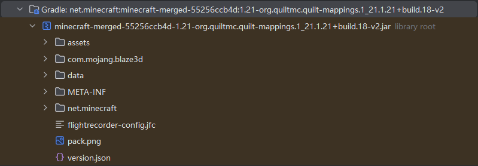

Minecraft 虽然使用 Java 编写的，将字节码反编译很容易，但是 Mojang 运用了混淆技术来使得代码难以阅读，因此需要借助一些其他工具进行反混淆。

## Yarn

FabricMC 的 Yarn 工具包含一系列开放的反混淆映射：[FabricMC/yarn: Libre Minecraft mappings, free to use for everyone. No exceptions. (github.com)](https://github.com/FabricMC/yarn)，非常的 Nice。

1. Clone Yarn 仓库

    ```terminal
    git clone https://github.com/FabricMC/yarn.git && cd yarn
    ```

2. 获取反混淆后的 jar

    > 可以编辑仓库根目录 的 `gradle.properties` 添加代理设置：
    >
    > ```
    > systemProp.http.proxyHost=127.0.0.1
    > systemProp.http.proxyPort=7890
    > 
    > systemProp.https.proxyHost=127.0.0.1
    > systemProp.https.proxyPort=7890
    > ```
    
    然后会在 `build` 目录下生成形如 `<minecraft version>-named.jar` 的 jar

3. 反编译 jar

    ```terminal
    ./gradlew decompileCFR
    ```

    然后 `build/namedSrc` 目录下就会出现反编译后的源码

缺点就是没有 IntelliSence，这下子真成“读”代码了。

## Quilt/Fabric

另一种办法就是创建一个 Quilt/Fabric 模板 Mod，然后使用 `genSourcesWithVineflower` 任务即可。

