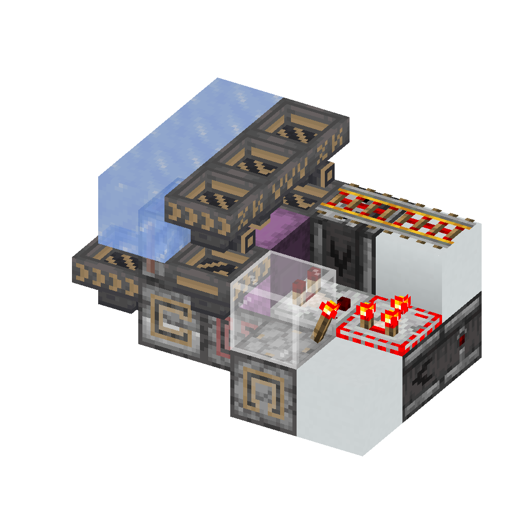

# 打包机

一个打包机的逻辑很简单：

1. 放置空盒
2. 装载空盒
3. 拆掉满盒
4. 循环 1~3

下图是一个最基本的单倍速打包机：

左侧的木桶输入空盒注入到投掷器中，上方的木桶输入物品到盒中：

1. 盒满时右侧侦测器上方红石线信号变为 15，下方粘性活塞被施加 2gt 的脉冲，开始推出

2. 经过 2gt 后，粘性活塞将侦测器推至投掷器下方

3. 经过 2gt 的延迟，侦测器以 2gt 的脉冲充能投掷器，因此，投掷器、活塞、发射器均被激活：

    - 活塞立刻开始推出（潜影盒立即被 **破坏**）
    - 投掷器与侦测器添加了 4gt 后响应的计划刻

4. 经过 2gt 脉冲结束，活塞立刻开始收回，活塞头被替换为空气。同时侦测器右侧信号变回 14

5. 再经过 2gt，到了投掷器与发射器计划刻响应的时间：

    1. 投掷器将一个空盒注入发射器
    2. 发射器将这个空盒 **放置** 在上方

    同时，右侧侦测器发出 2gt 脉冲，下方粘性活塞立刻开始推出

6. 经过 1gt，上方活塞彻底收回结束；再经过 1gt，脉冲结束，下方粘性活塞立刻开始收回

7. 经过 3gt，侦测器回到发射器下方

8. 在 2gt 的延迟后，发射器下方的侦测器发出 2gt 脉冲，发射器被充能，发射器与投掷器添加了 4gt 后相应的计划刻

9. 4gt 后，发射器与投掷器再次响应：

    1. 发射器尝试放置潜影盒。无物品，失败（第一次）；目标位置已有方块，失败（第二次及之后）。
    2. 投掷器注入一个潜影盒到发射器中。（因此下一次循环发射器中将多一个潜影盒）

## 三倍速

下图是一个三倍速打包机：

为了让同一个时间内
