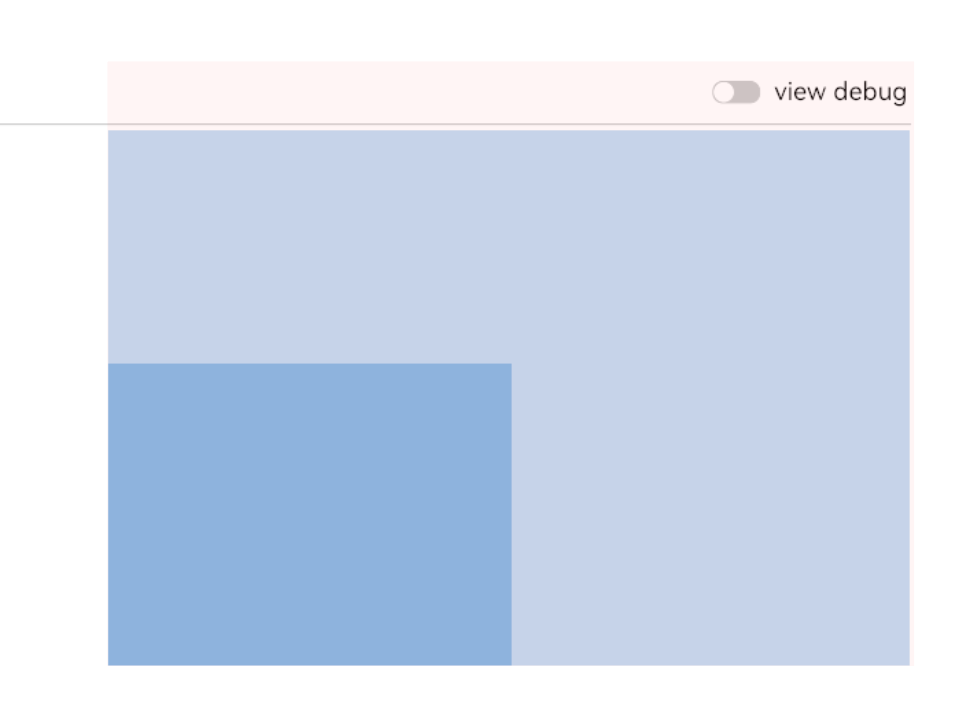
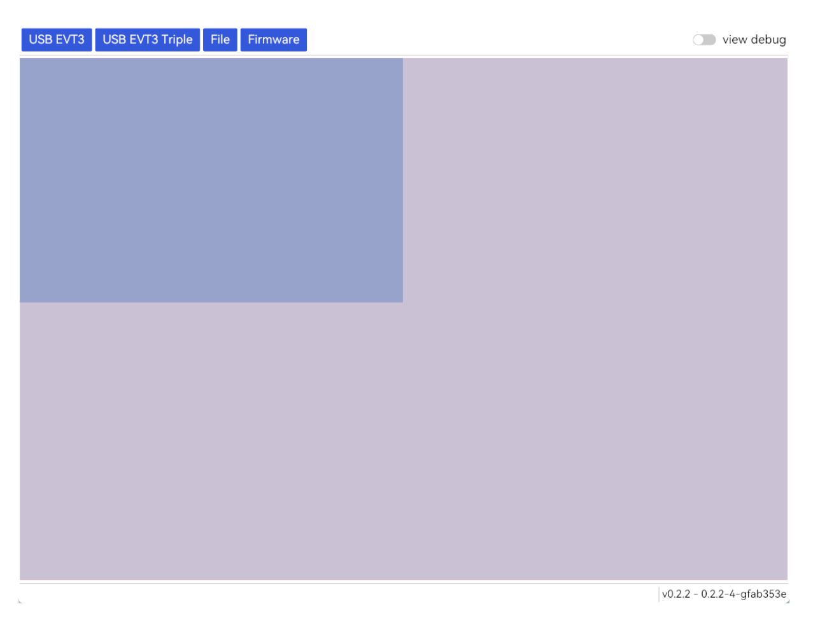

## Bevy

通过 `MaterialMesh2dBundle` 向世界中生成与事件对应的实体

将三个 Viewport 通过不同的 RenderLayer 渲染到三张纹理上，再用 Sprite 展示给最终的相机。

每个 Viewport 的 clip 和 flip 刚好可以通过更新 Sprite 的 flip 和 rect 来调整。

这种解决方案在每个 viewport 900 evt/ms 的条件下可以稳定在 30fps。

但是这远远不能达到实际的时间吞吐量的要求。

参考 [Instancing (bevyengine.org)](https://bevyengine.org/examples-webgpu/shaders/shader-instancing/) 将 Event 作为简单的数据 Component 生成，并为每一个 Viewport 生成一个带有 `Mesh` 组件的 Frame，然后在 Extract 阶段按照 RenderLayer 匹配创建  `ExtractedFrame(Vec<InstanceData>)`，通过 instancing 可以极大提高渲染性能。

在十分极端的情况下（3000 * 3 evt/ms）仍然能够维持 40fps。


## Iced

- Metavision SDK / Studio：[Index of /share/dists/public/windows/wohr2Cho (prophesee.ai)](https://files.prophesee.ai/share/dists/public/windows/wohr2Cho/)


Shader 组件所绘制的 [-1, 1] 坐标为整个 viewport 的坐标，下图为 `(0.0, 1.0)` 以及 `(0.0, 0.5)` 的矩形：



因此需要在视口变换之后（在 `(0, 1)` 坐标系下）乘上下面的矩阵：

```rust
// transform the whole viewport to the bounds
// Note: this mat should be performed after the viewport transformation
mat: glam::Mat4::from_scale_rotation_translation(
    glam::vec3(
        bounds.width / viewport.logical_size().width,
        bounds.height / viewport.logical_size().height,
        1.0,
    ),
    glam::Quat::IDENTITY,
    glam::vec3(
        bounds.x / viewport.logical_size().width,
        bounds.y / viewport.logical_size().height,
        0.0,
    ),
),
```

下图为 `(-1, 1)` 和 `(-0.5, 0.5)`：

