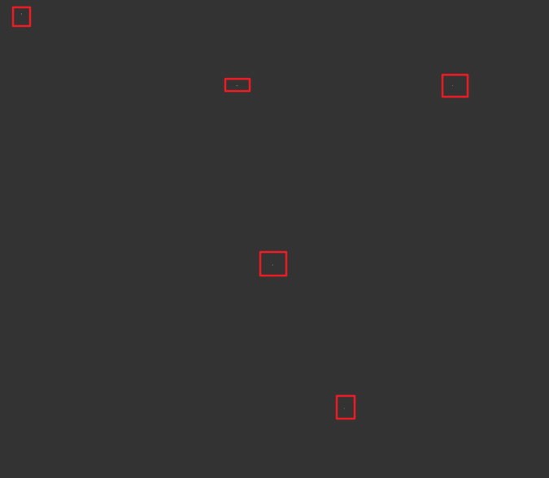

```rust
let mut polygon = Polygon::new(vec![
    vec2(-100.0, -300.0),
    vec2(0.0, 0.0),
    vec2(200.0, 300.0),
    vec2(0.0, 700.0),
    vec2(500.0, 0.0),
])
```

```wgsl
out.position = vec4<f32>(f32(vertex_index) / 80.0, 0.0, 0.0, 1.0);

var inpos = uniforms.matrix * in.pos;
inpos.x *= uniforms.rescale_factors.x;
inpos.y *= uniforms.rescale_factors.y;
inpos.z *= uniforms.rescale_factors.z;

out.color = abs(inpos);
```



https://www.youtube.com/watch?v=mmW_RbTyj8c

https://simbleau.github.io/rust/graphics/2023/11/20/using-vello-for-video-games.html
