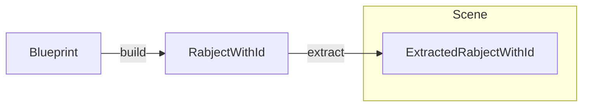
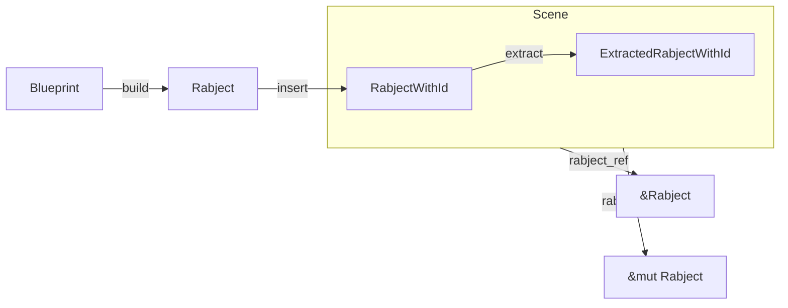
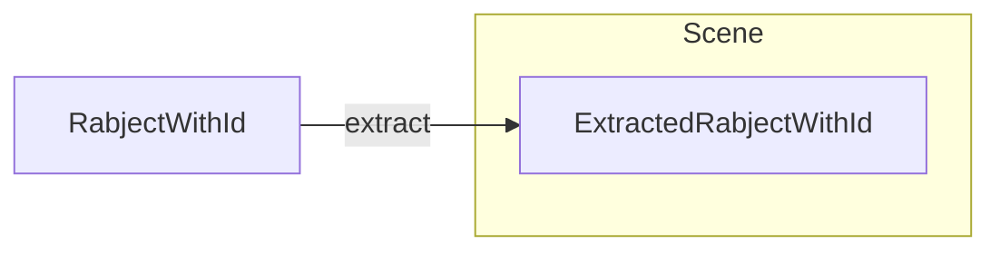
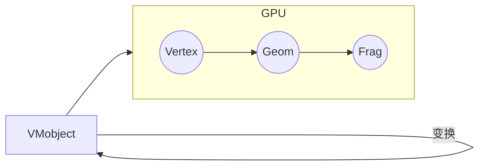
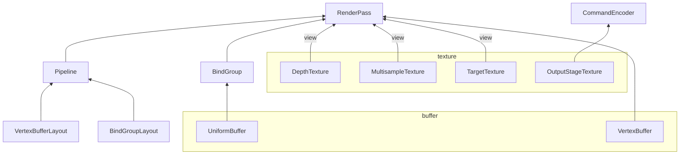

# Ranim

用 Rust 重写 manim 的核心！

manim 的主要使用方式是通过 *manimgl* 命令从 py 文件中提取 Scene，然后将其运行。


ranim 的整个场景是 3D 的，如果想要渲染 2D 内容，则需要在 3D 空间中添加一个“2D面板”

camera.overlay 是一个特殊的“2D面板”，会固定在相机上随着相机的旋转移动而移动


## 坐标系

对于 2D 图形来说，最符合逻辑的坐标系应当是 x 轴正方向朝右，y 轴正方向朝下。

但是 wgpu 的 NDC 坐标系是 x 轴正方向朝右，y 轴正方向朝上的左手系。

## 架构

一旦涉及逻辑与渲染，必然离不开一个问题：如何合理地设计这两部分的数据交互。

*manim* 中的对象 `Mobject` 是所有 **数学对象** 的基类，简单来说就是一个存储着顶点信息的类，以及包含一个 `ShaderWrapper`，其中包装了渲染这个对象所需要用到的一切东西：程序、缓冲等，每一个子类会去覆盖渲染的方法以符合自己的需要。

Python / OOP当然可以这么设计，虽然各种晚初始化的 field 和各种子类对父类的覆盖很容易搞得很乱，但是既然是 **用 Rust 实现**，既然是 **我** 来，那必须要设计一个优雅的模式。

### 场景（Scene）与对象管理

*ranim* 中的对象管理十分简单，对象之间没有层级关系，向场景中插入对象会转移对象所有权并获得一个对象的标识符 `RabjectId<R: Rabject>`，后续可以根据这个 Id 获取到对象的引用或可变引用。

**对象** 在 *ranim* 中被称作 `Rabject`，它实际上就是下面这个 Trait：

```rust
pub trait Rabject {
    type RenderData: Default;
    type RenderResource: Primitive;

    fn extract(&self) -> Self::RenderData;
}
```

在场景中一个对象的相关数据被以下面的形式保存：

```rust
pub struct RabjectStore<R: Rabject> {
    /// The rabject
    pub rabject: R,
    /// The extracted data from the rabject
    pub render_data: Option<R::RenderData>,
    /// The prepared render resource of the rabject
    pub render_resource: Option<R::RenderResource>,
}
```

一个是 `Rabject` 本身的数据，而另两个正对应着 `Rabject` 的两个关联类型：

- `RenderData`：更新渲染资源所需的数据，由 `Rabject::extract` 获取

- `RenderResource`：实际渲染时所使用的资源（如 bindgroup、buffer、texture 等），实现了 `Primitive` Trait，可以被直接渲染：

    ```rust
    pub trait Primitive {
        type Data;
        fn init(wgpu_ctx: &WgpuContext, data: &Self::Data) -> Self;
        fn update(&mut self, wgpu_ctx: &WgpuContext, data: &Self::Data);
        fn render(
            &self,
            wgpu_ctx: &WgpuContext,
            pipelines: &mut RenderResourceStorage,
            multisample_view: &wgpu::TextureView,
            target_view: &wgpu::TextureView,
            depth_view: &wgpu::TextureView,
            uniforms_bind_group: &wgpu::BindGroup,
        );
    }
    ```

而这两个关联类型，正恰好对应了 *ranim* 中渲染相关的核心阶段

### 渲染核心阶段

对象从数据到被渲染的过程可以被表示为下面这张图：


- *Extract Phase*（CPU）：从逻辑数据提取出渲染所需的渲染数据 `RenderData`

    对应 `Rabject::extract`

- *Prepare Phase*（CPU -> GPU）：使用渲染数据来初始化/更新渲染资源 `RenderResource`，

    对应 `Primitive::init` 和 `Primitive::update`

- *Render Phase*（CPU -> GPU）：进行实际的渲染调用

    对应 `Primitive::render`

### 更新器 与 动画

在这个全新的架构下，由于 `Rabject` 的逻辑数据也被 `Scene` 管理，于是 `Scene` 便可以“自主”地更新 `Rabject`。

一个最简单的 **更新器** 可以是一个在每 *tick* 运行的闭包，但是简单的闭包无法保存状态信息，因此将其作为一个 Trait 封装：

```rust
pub trait Updater<R: Rabject> {
    #[allow(unused)]
    /// Called when the updater is created
    fn on_create(&mut self, rabject: &mut R){}
    /// Return false if the updater is done, then it will be removed from the scene
    fn on_update(&mut self, rabject: &mut R, dt: f32) -> bool;
    #[allow(unused)]
    /// Called when the updater is destroyed
    fn on_destroy(&mut self, rabject: &mut R){}
}
```

当然，一个简单的闭包也可以是一个更新器：

```rust
impl<R: Rabject, T: FnMut(&mut R, f32) -> bool> Updater<R> for T {
    fn on_update(&mut self, rabject: &mut R, dt: f32) -> bool {
        self(rabject, dt)
    }
}
```


---

18ced3a85a04633b8547e8239a31dd53becfbad5 之前


### 场景（Scene）与对象管理

在 *manim* 中，对象与动画均被组织在 `Scene` 中，其 API 主要通过继承自 `Scene` 并在 `construct` 函数中调用自身方法的方式来使用。一个 `Scene` 可以直接运行输出视频，也可以作为一个可交互场景运行。

每个对象的渲染和逻辑数据都位于同一个结构中，`Scene` 中直接保存着这些对象（因为是 Python，所以可以在 `construct` 中与 `Scene` 内部同时保存同一个对象的引用）。


#### 思路一：场景中只保存渲染数据



逻辑侧：每一个 `Rabject` 只能由 Blueprint 创建，创建出来会被包装在一个 `RabjectWithId<R: Rabject>` 中。

渲染测：通过 `Scene::insert_rabject` 可以向场景插入或更新 `Rabject`，对应会创建或更新渲染资源。


- Extract：从逻辑数据生成渲染数据
- Prepare：从渲染数据更新缓冲等资源
- Render：渲染


##### 1. Rabject

*Rabject（Ranim Object）*是 Ranim 的场景所管理的对象，它其实是一个 Trait：

```rust
pub trait Rabject: 'static + Clone {
    type Renderer: Renderer<Self> + RenderResource;
    type RenderInstance: RenderInstance<Self>;
}
```

每个 Rabject 都有一个与之关联的 `RenderInstance` 类型。它定义了所有在渲染 Rabject 时所需要的资源，比如顶点数据、额外的 Uniform 数据等等。

对应的有两个方法：`init_render_resource` 和 `update_render_resource`，分别用于初始化和更新。

剩下的 `begin_render_pass` 和 `render` 则用于渲染。

Ranim 目前内部实现的 Rabject 只有一个 VMobject，其内部保存的是图形的路径数据，在更新渲染资源时解析为 `render` 中用到的管线中所需的数据。

##### 2. Blueprint\<T: Rabject> 与 RabjectWithId\<T: Rabject>

在使用 *ranim* 时，并不会直接操作 `Rabject`，而是操作的一个实现了 `Deref` 到 `Rabject` 和 `DerefMut` 的 `RabjectWithId<T: Rabject>`：

```rust
#[derive(Clone)]
pub struct RabjectWithId<T: Rabject> {
    id: Id,
    rabject: T,
}

```

它在被创建时会生成一个唯一的 `Id`，而它的创建只能通过 `Blueprint` 的 `build` 方法获得：

```rust
pub trait Blueprint<T: Rabject> {
    fn build(self) -> RabjectWithId<T>;
}
```

**Blueprint** 是一系列 **Rabject** 的 builder，比如对于 `VMobject`，有如下的 `Blueprint`：

- `Arc`：圆弧
- `ArcBetweenPoints`：两点间的圆弧
- `Circle`：圆
- `Point`：点
- `Polygon`：多边形
- ......

##### 3. Scene 与 ExtractedRabjectWithId\<T: Rabject>

*ranim* 的场景管理的对象不是 `Rabject` 也不是 `RabjectWithId`，而是 `ExtractedRabjectWithId`：

```rust
pub struct ExtractedRabjectWithId<T: Rabject> {
    id: Id,
    pub(crate) render_resource: T::RenderResource,
}

impl<T: Rabject> ExtractedRabjectWithId<T> {
    pub fn update_render_resource(&mut self, ctx: &mut RanimContext, rabject: &RabjectWithId<T>) {
        T::update_render_resource(ctx, rabject, &mut self.render_resource);
    }
}

```

它可以由 `RabjectWithId` 的 `extract` 方法得到：

```rust
impl<T: Rabject> RabjectWithId<T> {
    pub fn extract(&self, ctx: &mut RanimContext) -> ExtractedRabjectWithId<T> {
        ExtractedRabjectWithId {
            id: self.id,
            render_resource: T::init_render_resource(ctx, &self.rabject),
        }
    }
}
```

场景中用于添加对象的方法为：

```rust
pub fn insert_rabject<R: Rabject>(
      &mut self,
      ctx: &mut RanimContext,
      rabject: &RabjectWithId<R>,
  )
```

保存这些对象的结构为一个 `HashMap<TypeId, Vec<(Id, Box<dyn Any>)>>`：

- `TypeId`：`std::any::TypeId::of::<R>()`
- `Id`：`rabject` 的 Id
- `Box<dyn Any>`：经过类型擦除后的 `rabject`

当对应 `Id` 已存在时，则调用 `ExtractedRabjectWithId<R>` 的 `update_render_resource` 方法更新渲染数据；

对应 `Id` 不存在时，则调用 `RabjectWithId<R>` 的 `extract` 方法构建一个对应的 `ExtractedRabjectWithId<R>`。

#### 思路二：场景中分开保存逻辑与渲染对象




### 动画

### 



每一个 `Rabject` 在被创建时都有一个唯一的 `id`。

每一个动画可以被考虑为一个 **初始 Rabject** 和 **结束 Rabject** 的某种插值，有的还涉及 Rabject 的添加/移除：

- 移动：对顶点数据的位置进行插值
- 颜色变换：对顶点数据的颜色进行插值
    - FadeIn：从透明度 1.0 到透明度 0.0，**移除 Mobject**
    - FadeOut：**添加 Mobject**，从透明度 0.0 到透明度 1.0
- Transform：对两个 Mobject 的顶点数据进行插值，**移除第一个 Mobject，添加第二个 Mobject**
- ......

而这个 **初始 Rabject** 和 **结束 Rabject** 又分为显性和隐性：

- 显性：即指定前者和后者，可以认为就是 Transform
- 隐性，没有显性指定，而是在动画进行过程中隐式计算


基本有三个属性 **是否移除**、**结束 Rabject**：

- 对于 **是否移除**，决定动画完成时是否移除 **动画 Rabject**

- 对于 **结束 Rabject**，决定动画结束时是否添加 **结束 Rabject**


对其进行简化，可以认为每一个动画都拥有一个对应的 `Rabject`：

- 播放动画前向场景中插入这个 `Rabject`
- 随着动画的进行，对这个 `Rabject` 进行插值更新，并更新到场景中
- 最终根据是否移除对场景的 rabjects 进行变更

所有的 **插值函数** 都可以抽象为一个 Trait：

```rust
pub trait AnimationFunc<Vertex: PipelineVertex> {
    #[allow(unused)]
    fn pre_anim(&mut self, mobject: &mut Mobject<Vertex>) {}

    fn interpolate(&mut self, mobject: &mut Mobject<Vertex>, alpha: f32);

    #[allow(unused)]
    fn post_anim(&mut self, mobject: &mut Mobject<Vertex>) {}
}
```


---

Draft

### 渲染相关设计

由于 *manim* 使用的是 *mordengl*，可以借助 **几何着色器** 来生成图元。

因此，其 `VMobject` 存储了贝塞尔曲线的原始控制点和宽度、转角等参数，而后通过几何着色器生成实际用于渲染的三角形：



但是这个方案对于 *ranim* 并不可行，因为 *wgpu* 并不支持几何着色器，因此「由贝塞尔曲线原始控制点生成三角形」这件事只能在实际的渲染 Pass 前单独完成。


在 *ranim* 中，一切可以被渲染、变换的对象被称作 **Rabject**（Ranim Object），它对应着是一个 Trait：

```rust
pub trait Rabject {
    type RenderResource;

    fn init_render_resource(ctx: &mut RanimContext, rabject: &Self) -> Self::RenderResource;

    fn update_render_resource(
        ctx: &mut RanimContext,
        rabject: &Self,
        render_resource: &mut Self::RenderResource,
    );

    fn render(ctx: &mut RanimContext, render_resource: &Self::RenderResource);
}
```

目前，有如下几种 **Rabject**：

- `VMobject`：Vectorized Mobject

  其中存储的是路径，而非实际的三角形顶点。

- ......

对应有一个 **Blueprint** 的概念：

```rust
pub trait Blueprint<T: Rabject> {
    fn build(&self) -> RabjectWithId<T>;
}
```

比如 `VMobject` 有这些 **Blueprint**：`Arc`、`ArcBetweenPoints`、`Circle`、`Point`、`Polygon` 等。


*wgpu* 的逻辑与 *morderngl* 有很大的差别，在 *wgpu* 下，我们更适合以 **资源** 的方式来去考虑各种结构。

`Pipeline` 是资源，`BindGroup` 是资源，各种 `Buffer` 和 `Texture` 也是资源，在渲染管线中，真正的使用者是在实际进行渲染工作时使用的 `CommandEncoder` 以及 `RenderPass`，要想做出优雅的设计，必须捋清楚它们之间的关系。

以下是一部分对象的使用关系：



第一个首先，就是一个 `WgpuContext`：

```rust
pub struct WgpuContext {
    pub instance: wgpu::Instance,
    pub adapter: wgpu::Adapter,

    pub device: wgpu::Device,
    pub queue: wgpu::Queue,
}
```

在后续的各种操作（比如创建纹理和缓冲、写入缓冲等等）都要用到其中的内容。

而第二个首先，就是对 `wgpu::Buffer` 进行简单封装，以包含其所存储的数据类型信息（当然还有各种辅助函数，比如传入对象切片，自动调整缓冲大小并用 `bytemuck` 转换数据写入）：

```rust
pub struct WgpuBuffer<T: bytemuck::Pod + bytemuck::Zeroable> {
    pub buffer: wgpu::Buffer,
    _phantom: std::marker::PhantomData<T>,
}

impl<T: bytemuck::Pod + bytemuck::Zeroable> WgpuBuffer<T> {
    // ...
    pub fn len(&self) -> u64 {
        self.size() / std::mem::size_of::<T>() as u64
    }
}
```

这样就可以计算得到缓冲中的 **对象个数**，这一点在执行 `pass.draw` 的时候会很有用。

然后，在 `RenderPass` 中要使用“资源”的无非以下几个：

- `Pipeline`：用于 `pass.set_pipeline(&pipeline)`
- `BindGroup`：用于 `pass.set_bind_group(index, &bindgroup, &[]);`
- `WgpuBuffer`：用于 `pass.set_vertex_buffer(slot, buffer_slice)` 以及 `pass.draw(0..buffer.len())`

而在创建 `RenderPass` 的过程中则需要使用以下几个“资源”：

- `target_texture` 的 `view`
- `multisample_texture` 的 `view`
- `depth_texture` 的 `view`


不同对象渲染方式的不同，必定对应着 `Pipeline` 类型的不同，主要可能体现在几点：

- 使用的顶点数据类型不同
- 使用的 uniform（其实也就是 `BindGroup` 不同）
- 使用的 shader 不同（**这其实是导致上面两个不同的根本**）

其实这些也就是创建 `Pipeline` 时所用的 `RenderPipelineDescriptor` 中的字段。

所以，其实 `Pipeline` 是最底层的资源，有几种不同的 `Pipeline` 决定了有几种不同的可渲染对象。而且整个画面的渲染过程不可避免的会需要手动指定 `Pipeline` 类型及其顺序。

因此，创建了 `RenderPipeline` 这个 Trait：

```rust
/// A render pipeline.
pub trait RenderPipeline: Deref<Target = wgpu::RenderPipeline> {
    /// The vertex type.
    type Vertex: PipelineVertex;

    /// The uniform type.
    type Uniforms: bytemuck::Pod + bytemuck::Zeroable;

    fn new(ctx: &WgpuContext) -> Self
    where
        Self: Sized;
}
```

每一个 `RenderPipeline` 都有唯一的关联的 `Vertex` 和 `Uniforms` 类型，对于 `Vertex` 又创建了一个 `PipelineVertex` Trait：

```rust
pub trait PipelineVertex: bytemuck::Pod + bytemuck::Zeroable {
    fn desc<'a>() -> wgpu::VertexBufferLayout<'a>;

    fn position(&self) -> Vec3;
    fn set_position(&mut self, position: Vec3);

    fn color(&self) -> Vec4;
    fn set_color(&mut self, color: Vec4);

    fn interpolate(&self, other: &Self, t: f32) -> Self;
}
```

考虑几乎全部定点类型会包含 `position` 和 `color` 两个属性，因此暂时把他们两个写死在 Trait 中。（其实更好的方式是创建一个基础结构，对不同的顶点数据类型实现向这个基础结构的转化）

同时，`Pipeline` 也是一个全局的资源，因此我创建了一个 `RanimContext` 来管理它：

```rust
pub struct RanimContext {
    pub(crate) wgpu_ctx: WgpuContext,
    pub(crate) pipelines: HashMap<TypeId, Box<dyn Any>>,
}

impl RanimContext {
    pub fn new() -> Self {
        let wgpu_ctx = pollster::block_on(WgpuContext::new());
        let pipelines = HashMap::<TypeId, Box<dyn Any>>::new();

        Self {
            wgpu_ctx,
            pipelines,
        }
    }

    pub(crate) fn get_or_init_pipeline<P: RenderPipeline + 'static>(&mut self) -> &P {
        let id = std::any::TypeId::of::<P>();
        self.pipelines
            .entry(id)
            .or_insert_with(|| Box::new(P::new(&self.wgpu_ctx)))
            .downcast_ref::<P>()
            .unwrap()
    }
}
```

这里利用了 `std::any` 抹除了 `RenderPipeline` 的类型，因为带有不同关联类型的相同 Trait 不能作为同一个类型。

那么对于渲染的对象，对应着 *manim*，在 *ranim* 中，同样有一个结构体 `Mobject`，但是它是一个泛型结构体：

```rust
#[derive(Clone)]
pub struct Mobject<Vertex: PipelineVertex> {
    pub id: Id,
    pub pipeline_id: std::any::TypeId,
    points: Arc<RwLock<Vec<Vertex>>>,
}
```

其中：

- `id` 在对象创建时生成，可用于唯一标识该对象
- `pipeline_id` 标识在渲染该对象时应使用的 `Pipeline`
- `points` 则是该对象的顶点数据

这只是渲染对象的逻辑表示，真正的渲染的对象应当与一个顶点缓冲相关联，而这个缓冲应当在进入场景时被创建，在渲染前被更新，在离开场景时被移除，因此实现了一个与 `Mobject` 对应的 `ExtractedMobject`，可以通过 `Mobject::extract(&self, ctx: &WgpuContext)` 创建：

```rust
pub struct ExtractedMobject<Vertex: PipelineVertex> {
    pub id: Id,
    pub pipeline_id: std::any::TypeId,
    pub points: Arc<RwLock<Vec<Vertex>>>,
    pub(crate) buffer: WgpuBuffer<Vertex>,
}

impl<Vertex: PipelineVertex> Mobject<Vertex> {
    pub(crate) fn extract(&self, ctx: &WgpuContext) -> ExtractedMobject<Vertex> {
        let Mobject {
            id,
            pipeline_id,
            points,
        } = self.clone();
        let buffer = WgpuBuffer::new_init(
            &ctx,
            &self.points.read().unwrap(),
            wgpu::BufferUsages::VERTEX | wgpu::BufferUsages::COPY_DST,
        );
        ExtractedMobject {
            id,
            pipeline_id,
            points,
            buffer,
        }
    }
}
```

其中：

- `id`、`pipeline_id` 保持与 Extract 前的逻辑上的 Mobject 一致
- `points` 则通过 `Arc<RwLock<>>` 与 Extract 前的数据共享

对应在 `Scene` 中，存储的则是 `ExtractedMobject`，不过由于这个结构带有泛型类型，因此需要对其进行类型擦除才能够将不同泛型类型的 `ExrtactedMobject` 视为相同类型的对象存储在一个集合中：

```rust
pub struct Scene {
    /// (Mobject's id, Mobject's pipeline id, Mobject)
    pub mobjects: HashMap<TypeId, Vec<(Id, Box<dyn Any>)>>,
    // ...
}
```

此处使用以 `Pipeline` 的 `TypeId` 为键的 `HashMap` 是为了方便后续进行 `batch`，而保存的是包含 Id 的元组的原因是为了避免在频繁添加/移除对象时对 `Box<dyn Any>` 进行 `downcast` 操作的性能消耗。

- `add_mobject` 接受 `Mobject` 的不可变引用为参数，通过 `extract` 创建对应的 `ExtractedMobject` 加入到场景对象中


### 动画

无多采样：


有多采样（4x）：


有多采样（4x + alpha_to_coverageenabled)：


## 思路整理

manim 中的基本的对象是 `Mobject` 类，以及继承自它的 `VMobject` 类。

每一个 `Mobject` 中都有一个 `data` 字段，保存着 **顶点数据**：

- `Mobject` 的 `data` 的 dtype 是这样的：

    ```python
    np.dtype([
        ('point', np.float32, (3,)),
        ('rgba', np.float32, (4,)),
    ])
    ```

- `VMobject` 的 `data` 的 `dtype` 是这样的：

    ```python
    np.dtype([
        ('point', np.float32, (3,)),
        ('stroke_rgba', np.float32, (4,)),
        ('stroke_width', np.float32, (1,)),
        ('joint_angle', np.float32, (1,)),
        ('fill_rgba', np.float32, (4,)),
        ('base_normal', np.float32, (3,)),  # Base points and unit normal vectors are interleaved in this array
        ('fill_border_width', np.float32, (1,)),
    ])
    ```

同时，每一个 `Mobject` 都有一个 `shader_wrapper` 字段，保存着渲染管线相关的资源：

- `Mobject` 使用的是 `ShaderWrapper`：

    有一个 `ctx` 字段用于保存 *moderngl* 的上下文。

    有一个 `shader_folder` 字段用于保存着色器所在的文件夹位置。

    有一个 `program_code` 字段用于保存 `vertex_shader`、`geometry_shader`、`fragment_shader` 三个着色器的代码，从 `shader_folder` 中的 `vert`、`geom`、`frag` 三个文件中获取，默认为空。

    有一个 `program` 用于保存 *moderngl* 中的 Program，用 `ctx` 和 `program_code` 创建。

    同时有一个 `programs` 保存所有的 Program，在这里就只是 `[program]`

    有一个 `vert_attributes` 字段用于保存顶点字段名，由传入的 `vert_data` 的 `dtype.names` 得到。

    有一个 `vert_format` 用于保存 *vao* 的格式，由 *moderngl* 根据 `program` 和 `vert_attributes` 推断而得。

    有一个 `render_permitive` 来保存图元类型，默认为 `TRIANGLE_STRIP`

    然后是关键的 `vbo` 和 `vao` 字段：

    - `vbo` 会在 `read_in` 读入顶点数据时创建/更新
    - `vao` 则是由 `programs` 中的每一个 `program` 创建

- `VMobject` 则使用的是继承自 `ShaderWrapper` 的 `VShaderWrapper`：

    它的 `programs` 包含四个：`stroke_program`、`fill_program`、`fill_border_program`、`fill_depth_program`。其中 `stroke` 和 `fill_border` 其实是一个，只是 `frag_color` 被替换了。

    它们的代码都是直接忽略 `shader_folder`，从 `quadratic_bezier` 文件夹中加载的，其中有 `stroke`、`fill`、`depth` 三个子文件夹，每个子文件夹中又都有 `vert`、`geom`、`frag` 三个着色器文件。

    它们的 `vert_format` 和 `vert_attributes` 都是手动写的：

    ```python
    # Full vert format looks like this (total of 4x23 = 92 bytes):
    # point 3
    # stroke_rgba 4
    # stroke_width 1
    # joint_angle 1
    # fill_rgba 4
    # base_normal 3
    # fill_border_width 1
    self.stroke_vert_format = '3f 4f 1f 1f 16x 3f 4x'
    self.stroke_vert_attributes = ['point', 'stroke_rgba', 'stroke_width', 'joint_angle', 'unit_normal']
    
    self.fill_vert_format = '3f 24x 4f 3f 4x'
    self.fill_vert_attributes = ['point', 'fill_rgba', 'base_normal']
    
    self.fill_border_vert_format = '3f 20x 1f 4f 3f 1f'
    self.fill_border_vert_attributes = ['point', 'joint_angle', 'stroke_rgba', 'unit_normal', 'stroke_width']
    
    self.fill_depth_vert_format = '3f 40x 3f 4x'
    self.fill_depth_vert_attributes = ['point', 'base_normal']
    ```

    `render` 也是分别进行 stroke 和 fill 进行渲染，fill 中又包含 depth、fill_border、fill_tx 的渲染。

由于 *wgpu* 与 *moderngl* 的思路和概念有所区别，所以经过思考后，得出结论应当以 *渲染管线* 为单位去构筑整个程序：

实现若干个管线，对于不同的 `Mobject` 将其转化为对应管线的数据并调用相关渲染函数。