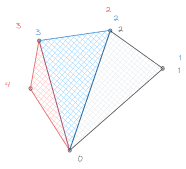
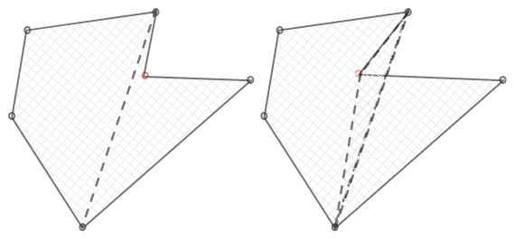
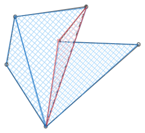
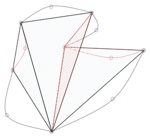

# manim - VMobject

`VMobject` 的 point 类型如下：

```python
np.dtype([
    ('point', np.float32, (3,)),
    ('stroke_rgba', np.float32, (4,)),
    ('stroke_width', np.float32, (1,)),
    ('joint_angle', np.float32, (1,)),
    ('fill_rgba', np.float32, (4,)),
    ('base_normal', np.float32, (3,)),  # Base points and unit normal vectors are interleaved in this array
    ('fill_border_width', np.float32, (1,)),
])
```

其使用的 `VShaderWrapper` 中，着色器使用的定点格式如下：

```python
# Full vert format looks like this (total of 4x23 = 92 bytes):
# point 3
# stroke_rgba 4
# stroke_width 1
# joint_angle 1
# fill_rgba 4
# base_normal 3
# fill_border_width 1
self.stroke_vert_format = '3f 4f 1f 1f 16x 3f 4x'
self.stroke_vert_attributes = ['point', 'stroke_rgba', 'stroke_width', 'joint_angle', 'unit_normal']

self.fill_vert_format = '3f 24x 4f 3f 4x'
self.fill_vert_attributes = ['point', 'fill_rgba', 'base_normal']

self.fill_border_vert_format = '3f 20x 1f 4f 3f 1f'
self.fill_border_vert_attributes = ['point', 'joint_angle', 'stroke_rgba', 'unit_normal', 'stroke_width']

self.fill_depth_vert_format = '3f 40x 3f 4x'
self.fill_depth_vert_attributes = ['point', 'base_normal']
```

## FillVert

关闭深度测试，调整 blend 函数为：

```python
gl.glBlendFuncSeparate(
    gl.GL_SRC_ALPHA, gl.GL_ONE_MINUS_SRC_ALPHA,
    gl.GL_ONE_MINUS_DST_ALPHA, gl.GL_ONE
)
```

$$
C_{out} = A_{src} C_{src} + (1 - A_{src}) C_{dst}\\
A_{out} = (1 - A_{dst}) A_{src} + A_{dst}
$$

渲染完成后还原深度测试，调整 blend 函数为：

```python
gl.glBlendFunc(gl.GL_SRC_ALPHA, gl.GL_ONE_MINUS_SRC_ALPHA)
```

$$
out = A_{src}src + (1 - A_{src}) dst
$$


### 1. vert

简单的直接传递数据给 geom：

- `point` -> `verts`
- `fill_rgba` -> `v_color`
- `base_normal` -> `v_base_normal`

### 2. geom

> [OpenGL（二十五）：Geometry Shader - 知乎](https://zhuanlan.zhihu.com/p/633225923)

输入为 triangles，输出为 triangle_strip，最多 6 个顶点。

虽然是 triangle_strip，但是每三个 `EmitVertex()` 后接一个 `EndPrimitive()` 其实还是 triangles。

整个几何着色器的过程如下：

- 检查 `verts[0]` 和 `verts[1]`，如果相同则为是曲线的结束，直接返回
- 检查三个颜色的 alpha 值，如果都为 0 则无填充，直接返回
- 从 `v_base_normal` 下标 0 和 1 取 `base_point` 和 `unit_normal`
    - 生成 `fill_all = 1.0` 的三角形 `base_point`, `verts[0]`, `verts[2]`
    - 生成 `fill_all = 0.0` 的三角形 `verts[0]`, `verts[1]`, `verts[2]`

---

**PART 1**：多边形填充

一个凸多边形的填充很好进行，只要以一个点为 *base_point*，按照某个方向（比如逆时针）按照 TriangleStrip 的方式连接每个三角形的后两个顶点即可：



而对于一些凹多边形，就会有问题：



但是如果让方向相反的三角形相互抵消，那么其实也可以填充：



**PART 2**：贝塞尔曲线多边形填充

贝塞尔曲线多边形的填充可以看作是在多边形的基础上增加多个由一条直线段和一条二阶贝塞尔曲线组成的“曲边三角形”：



于是问题来了，如何让正向与负向的三角形相互抵消。

一个很简单的办法是，令负向的三角形 alpha 为负，即 $A_{src} = - A_{dst}$，那么最终的结果为：
$$
out
= (1-A_{src}) \cdot dst +  A_{src} \cdot src\\
= (1+A_{dst}) \cdot dst - A_{dst} \cdot src\\
= A_{dst} \cdot (dst - src)
$$
相同的颜色确实会被抵消，但是如果是不同的颜色会导致颜色混合错误，且 alpha 值也有问题。

*manim* 中使用 $A_{src} = - A_{dst} / (1-A_{dst})$ 来表示负向的三角形 alpha，并且对 alpha 使用了不同的 blend 函数：
$$
A_{out} = (1-A_{dst}) \cdot A_{src} + A_{dst}
$$


rgba(0, 0, 1, 1) + rgba(1, 0, 0, 0.4) = rgba(0.4, 0, 0.6, 0.6 + 0.16)

rgba(0.4, 0, 0.6, 0.6 + 0.16) + rgba(0, 1, 0, 0.6) = rgba(0.4\*0.4, 0.6, 0.4\*0.6, x) = rgba(0.16, 0.6)

已有的颜色 $dst$，要画的颜色是 $src$，画完了之后的颜色是 $out$：
$$
out = (1-A_{src}) \cdot dst +  A_{src} \cdot src
$$

[OpenGL - transparency (alpha blending)](https://www.youtube.com/watch?v=wVkLeaWQOlQ)
