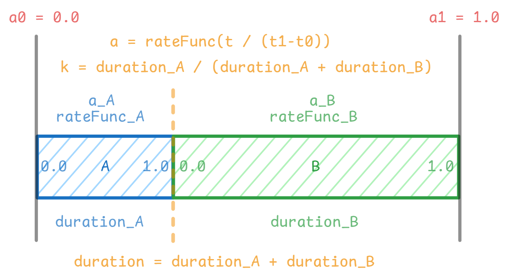

https://www.youtube.com/watch?v=mmW_RbTyj8c

https://simbleau.github.io/rust/graphics/2023/11/20/using-vello-for-video-games.html

https://webglfundamentals.org/webgl/lessons/webgl-3d-geometry-lathe.html

https://github.com/antvis/g/issues/288

[Cubic Bezier SDF Approximation](https://www.shadertoy.com/view/lcyBz3)


```mermaid
```

发现学校给的 [](附件8-北京交通大学本科毕设论文模板-论文主体.doc) 里有很多问题：

- 页眉不统一，有的是“毕业论文（设计）”，有的是“毕业设计（论文）”

- 中文摘要&英文摘要页的“摘要：”和“ABSTRACT: ”一个带换行一个不带。

## 模块

- `ranim`：引擎核心，渲染实现、动画 API。

    通过 `ranim` 库能够编写一个动画应用，其输出为渲染出来的动画和时间轴数据。

    - **渲染模块**：

        SDF

    - **实体管理模块**：

    - **动画控制模块**：

- `ranim-viewer`：工作流辅助，监听源文件自动构建运行、GUI 预览


## <s>Timeline 设计</s>

> [!CAUTION]
>
> 与其使用一个庞大的 Timeline 来管理整个动画进程，不如将整个动画进程拆分

首先，对于每一个实体，都有一条对应的 Timeine：


Timeline 中有若干元素，均由 `(起始状态, 动画类型)` 组成。

- `start() -> Time` 返回 Timeline 的起始点
- `end() -> Time` 返回 Timeline 的终点
- `insert(animation, duration, wait_time) -> Time`
- `get(time) -> Entity`


对于整个 Scene，有一个 TimelineMap 维护着 EntityId 到对应实体 Timeline 的关系：


---

## 动画引擎的本质

动画引擎的本质：有一堆随着时间变化的物体，把他们画出来。

这个“随时间变化”可以看作是一个函数 $f(t)$。

这时候求值的方式会分两种情况：

- 如果 $f(t)$ 是一个递推 $f(t) = h(f(t - \Delta t)), t > t_0$，则需要由初始状态 $f(t_0)$ 来计算。

    如果经过的帧数 $k$，那么直接询问的复杂度为 $O(k)$。

- 如果 $f(t)$ 不是一个递推，那么就可以通过单次计算直接得到

    复杂度为 $O(1)$。

## 目标性能及优化思路

10000 个物体，30 fps。

假设：

- 绝大部分时间内，只有很少一部分物体是动态的（具有动画），其他都是静态的

    减少与 GPU 之间交互的频率

目前（`00a7a83`），整个一帧的渲染进程分割为每个实体进行一次指令提交。

经过测试，多次 commit 与单独 pass 影响不算很大（对于 100 个 Arc 大概 1s 左右）。

通过添加 Clip Box 将 10s 优化到了 4s。


## 设想中的 Ranim 工作流

> [!IMPORTANT]
>
> `ranim` 本体的核心功能在于，编写一个 Ranim 应用。
>
> Ranim 应用运行输出为视频以及时间轴数据。

> [!TIP]
>
> 或许可以通过 `build.rs` 来使其直接输出视频？

首先，确定动画使用 Rust 来创建，所以动画视频的任何一个片段的修改与输出必然涉及到 Rust 代码的 **编译** 和 **运行**：

- 修改代码、保存
- **编译** & **运行**
- 查看视频

JAnim 的 *实时预览* 其实就是渲染出视频，然后播放，只是额外增添了用于辅助的 **时间轴** 信息。

既然如此，这个“预览”完全不消耗性能，完全可以基于前端技术来实现，那么就需要输出的时候额外输出时间轴信息：

- 加载时间轴数据 & 视频
- 更新界面

既然如此，那么还可以额外引入一个微型的 Rust 服务器，一方面是 serve 前端，另一方面就是完成场景修改重新编译的自动化：

- 监听源目录发生变化
- 重新 **编译** & **运行**
- 重新加载输出目录文件
- 更新界面

如此就形成了一个完整的工作流：

```mermaid
flowchart LR
	
	e([Edit])
	
	SourceFile --> e --> SourceFile
	SourceFile -.-> Binary
		
    SourceFile --> c
	Binary --> r
    
	subgraph Viewer
        c([Compile])
        r([Run])
        
        FileWatcher --invoke--> Command
        Command --controls--> c
        Command --controls--> r
        GUI
	end
	
    FileWatcher --watch--o e
    c --> Binary
    
	Binary -.-> Output
    subgraph Output
    	direction LR
    	Video
    	TimelineData
    end
	
	r --generate--> Output
	Output --"load to"--> GUI
```

## 交互 API

一个比较理想的动画交互是将即时生效的操作与动画化的相同操作统一起来，如：

```rust
vitem.points.shift(Vec3::X)
app.play(vitem.points.shift(Vec3::X))
```

2025-01-30：目前 ranim 的交互设计架构为：

- 有一个 World 管理全部物体，通过 API 添加物体 `T` 返回一个 `EntityId<T>`
- 通过 API 可以由 `EntityId<T>` 获取对应物体的引用和可变引用来访问实际的物体
- 核心渲染流程即对 World 进行 tick，而后进行 extract、prepare、render

有一些设计上的不合理：

- **<font color="red">是否应该使用 Extract？</font>**

    Extract 的优势在于可以将下一 Tick 的逻辑与前一 Tick 的渲染并行化（Bevy 是这样做的）

    但是一个动画引擎与游戏引擎的差别在于，实体数量更少，渲染复杂度以及逻辑、交互复杂度都没有那么高。

    所以似乎没必要，反而引入了额外的复杂度。

正在思考是否应该重构整个交互架构。

- **动画是一维线性时间结构，不需要考虑多线程**

- **动画为一类“预先设计”的表现形式，不需要引入过多的物体交互**

    或者唯一的交互形式应当只有“进度调整”这一种形式。

- **命题 3**：**在同一时刻，同一个物体只能应用一个动画**

    同时将两个动画并列施加在一个物体上产生的结果是不合理且不确定的，即便有需求也应当定义“符合变换”作为一个动画，而非同时施加两个动画。

    本质上，“动画”可以被看做持续一段时间对某个物体的“变换”。

    所以要么获取所有权，要么可变引用。

- **只有当帧“推进”的时候才会产生画面**

    而在推进的时候必定设计 API 的调用，也必定包含“推进”的方式相关信息 —— 因此集中式的物体数据管理似乎并不必要。

接下来的重构：

- 移除 Extract，将 Prepare 并入 Render
- 弃用当前集中管理物体数据的 EntityStore 方式以及 Scene 和 World
- 使用 Animation 作为渲染对象
- 实现一个基于 `Rc<RefCell<T>>` 的 Wrapper 类型，暂定取名为 `Rabject<T>`，并基于此重构动画系统

新的动画系统：

- 每一个动画都会获取 `Rabject<T>` 的所有权，并在运行结束后返回被修改后的物体

    （基于 **命题 3**）

    对于一个相同物体的连续的多个动画，其渲染状态是连续的。也就是说其渲染资源以及操作的对象应该为同一个。

- 一个动画包含两个重要属性：

    - `rateFunc`：由 **进度** $\dfrac{t}{t_1-t_0}$ 计算 **动画参数** $a$ 的计算函数
    - `duration`：持续时间 $t_1 - t_0$

    

- 定义两种动画复合方式：

    - 定义 `chain` 动画为两个动画相继进行

        

        `chain` 复合动画的持续时间 `duration` 默认为二者相加（可以通过修改的方式来缩放内部动画）

        当 $0 < a \leq k$ 时，计算 $a_A = \dfrac{a}{k}$ 作为子动画 $A$ 的 **进度**，

        当 $k < a \leq 1$ 时，计算 $a_B = \dfrac{a - k}{1 - k}$ 作为自动化 $B$ 的 **进度**。

    - 定义 `stack` 动画为两个动画同时进行

        

        `stack` 复合动画的持续时间 `duration` 默认为二者最大值

        本质上并不是两个动画直接复合，而是时长更短的动画经过一次与 Wait 动画的 `chain` 复合后时长相等的两个动画的复合。

#### 动画系统

`EntityTimeline<T: Entity>` 实现 `Animator`

每一个动画 `Animation` 被拆分为 `Animator` 和 `AnimationParams`：

- `Animator`：为 0.0 ~ 1.0 进度值到渲染的映射的实现。
- `AnimationParams`：包含持续时长、速率函数。

##### 1. 实体动画

实体动画即对于某一个特定物体的对象的动画。

`EntityAnimator`：

```rust
pub trait EntityAnimator<T: Entity> {
    fn eval_alpha(&mut self, alpha: f32) -> T;
}
```


##### 2. 整体动画

首先每一个动画背后都有一个 `Animator`，其与动画持续时长、速率函数无关，只是一个 0.0 到 1.0 进度值到渲染命令的映射的实现：

```rust
pub trait Animatior {
    fn update_alpha(&mut self, alpha: f32);
    fn update_clip_info(&self, ctx: &WgpuContext, camera: &CameraFrame);
    fn render(
        &self,
        ctx: &WgpuContext,
        pipelines: &mut RenderResourceStorage,
        encoder: &mut wgpu::CommandEncoder,
        uniforms_bind_group: &wgpu::BindGroup,
        multisample_view: &wgpu::TextureView,
        target_view: &wgpu::TextureView,
    );
}
```

对于一个物体来说，单独的一个动画与整个物体的时间线都应该是一个 Animator。


**时间线**：全局层级的动画

动画有两种层级：物体层级与全局层级。

物体层级的动画的构建必然涉及到物体数据，换句话来说也就是其构造方法必然接受一个物体类型作为参数。

全局层级的动画本质上是对多个动画进行复合。

编写代码的地方实际上是一个全局层级的动画的 Builder。

- `Animation` 和 `ItemAnimation`


## 设计

### Trait

首先是一个 `Renderable`：

- `update_clip_info`

- `encode_render_command`


```rust
/// An `Rabject` is a wrapper of an entity that can be rendered.
pub struct Rabject<T: Entity> {
    id: Id,
    inner: T,
    render_instance: Rc<RefCell<Box<dyn Primitive<T>>>>,
}
```

相同 Id 的 `Rabject` 共享同一个 `render_instance`。

每一个 `Rabject` 都有一个自己的 `EntityTimeline`：

```rust
pub struct EntityTimeline<T: Entity> {
    initial: Rabject<T>,
    pub(crate) rabject: Rabject<T>,
    anims: Vec<EntityAnimation<T>>,
    end_sec: Vec<f32>,
    total_sec: f32,
}
```

在实际渲染的时候其实渲染的是其中的 `Rabject`。


那么对于 `Rabject` 就需要有以下方法：

- `update_clip_box`：当摄像机或物体的点发生变化时更新 `render_instance` 的 Clip Box

- `encode_render_command`：使用自己当前的 `inner` 值编码渲染命令

    很简单的就是用 `self.inner` 更新 `render_instance` 后再编码渲染命令


### 场景 Scene 与世界 World

`World` 就是纯粹的 **世界**，应当仅包含其中的数据、场景的设置等，

不应该带有 `video_writer` 等渲染时使用的结构，同时也不应该包含 `save_frames` 这类渲染选项。

这些渲染选项应当单独提出到一个 `RanimApp` 之中。

这些选项应当都能够在运行时通过命令行参数或配置文件来配置，与场景无关。

```rust

struct SceneHello {
}

impl Scene for SceneHello {
    fn construct<T: RanimApp>(&mut self, scene: &mut T) {
        
    }
}

fn main() {
    ranim::cli_from_scenes(vec![SceneHello::default()]);
}
```

场景实体操作：

- `insert`
- `remove`
- `get`
- `get_mut`

场景渲染操作：

- `play`
- `play_remove`
- `wait`


有一个 `RanimApp` Trait 封装了所有 API：

- `RanimFrameCounterApp`：只是计算整个动画的帧数，类似 manim 的 dry_run
- `RanimRenderApp`：实际渲染，输出视频

`RanimRenderApp` 的内部是 `World` 和 `Renderer` 还有 `Camera`，带有 App 状态变量（比如当前帧）。

### 组件数据

首先，操作的对象是实体，而实体不过是组件数据的容器。

比如对于 `VItem` 来说，就包含用于表示贝塞尔曲线段的点 `VPoint` 的列表

而对于 `Item` 来说，其包含的是三角形的点 `Point` 的列表

然而他们可能都包含着表示对应点颜色 `Rgba` 的列表

不同的组件数据在对齐、插值时有不同的性质，而实体则是在不同的组件数据之上构建自己的渲染、更新逻辑。

定义一个组件数据 `ComponentData<T>` 为 `Vec<T>` 的 Wrapper：

```rust
#[derive(Default, Clone)]
pub struct ComponentData<T: Default + Clone>(Vec<T>);
```


### 渲染

#### Signed Distance Function

一个点 $x$ 与一个集合 $\Omega$ 的边界 $\partial\Omega$ 之间的正交距离。

- 正数：点 $x$ 在边界 $\partial\Omega$ 外
- 零：点 $x$ 在边界 $\partial\Omega$ 上
- 负数：点 $x$ 在边界 $\partial\Omega$ 外

#### JAnim 实现

其 `VPoints` 与 *manim* 同样为若干二阶贝塞尔曲线的拼接：

- 相连的贝塞尔曲线共用锚点：

    - 实际数据：`[锚点a, 控制点b, 锚点c, 控制点d, 锚点e, ...]`

    - 表示曲线列表：`[a, b, c], [c, d, e], ...`

- 用 `NAN_POINT` 表示子路径的结束：

    - 实际数据：`[锚点a, 控制点b, 锚点c, 控制点d, 锚点e, NAN_POINT, 锚点f, 控制点g, 锚点h ...]`

    - 表示曲线列表：`[a, b, c], [c, d, e], [f, g, h], ...`

- 当子路径的起始点与种植点相同时，视为子路径闭合，此时具有填充

其渲染没有用到几何着色器，直接通过 SDF 在片段着色器上实现。


输入顶点数据：

- 首先根据 `VPoints` 的 `get_closepath_flags` 方法可以获得一个与 `points` 长度相同的数组，表示对应点所在的子路径是否闭合。将其作为对应子路径中点的第四个分量添加到 `points` 中，即 `(x, y, z)` 变为 `(x, y, z, is_closed)`。
- 然后通过计算着色器将其映射到相机平面上，即 `(x, y, z, is_closed)` 变为 `(x', y', is_closed)`。


首先有一个函数 `get_subpath_attr` 可以获取到一段子路径的如下属性：

- `end_ix`：子路径的结束索引
- `idx`：子路径中距离当前片元最近的 **锚点** 的索引（用于后续插值）
- `d`：当前子路径的最小距离值（也就是片元到此子路径的正交距离）
- `sgn`：符号

用这个函数遍历处理整个路径，让距离取累计的 `min`、符号累乘，获得对于整个路径的 `d` 和 `sgn`。

- 距离取累积的 `min` 很好理解，就是得到了到整个路径的正交距离
- 而符号类乘其实是为了实现 `EvenOdd` 的填充。比如当对于两个子路径都为负时，也就是当前位置位于两个闭合曲线中间，此时不填充。

此时即得到了当前位置的 SDF，值为 `sgn_d = sgn * d`。


！！！注意 compute shader 按 16 bit 对齐 vec3

- Closed：

    

- Not Closed

    


not closed


closed


```
2c2c6c
6c2c6c
6c6c2c
8f6c6c
6c8f6c
```

