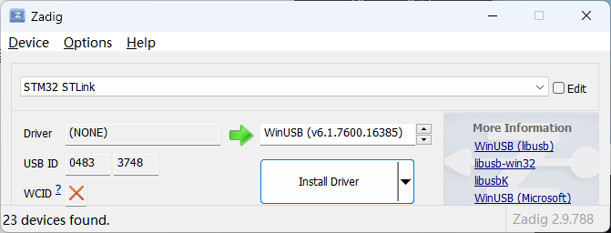
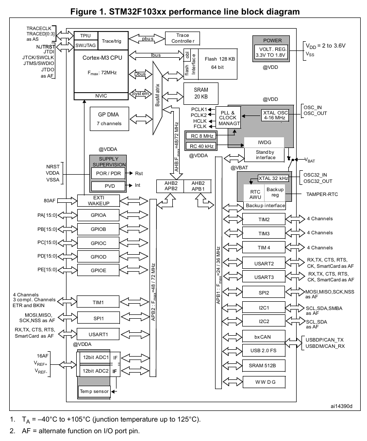
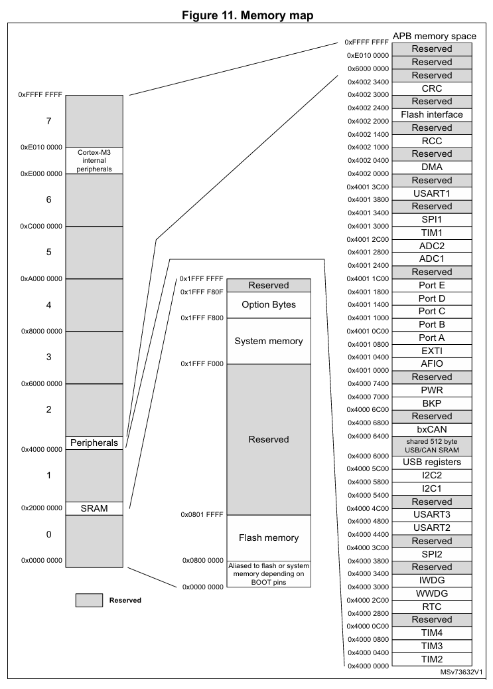
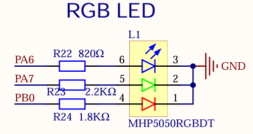
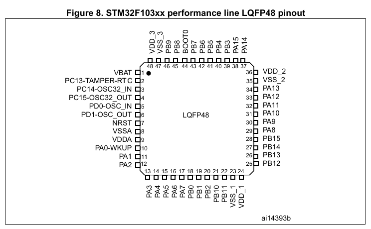

# c1-cortex-m-quickstart

**PART1**：`p1-hello`：基于 `cortex_m` 这个 **Micro-architecture Crate** 编写的在微控制器上运行的 Hello World。

然而只使用 Micro-architecture 库，只能做到执行普通的 Rust 代码并在 RAM 内移动数据。

如果想要做到信息的输入输出（比如闪烁一个 LED、检测按钮按下等）就需要访问 **外围设备** 以及他们的 Memory Mapped Registers。


底层的库：

- Micro-architecture Crate，如 [cortex-m - crates.io: Rust Package Registry](https://crates.io/crates/cortex-m)：

    可以启用/禁用处理器的中断、访问 SysTick 外围设备等（都是 Cortex-M 架构处理器具有的功能）

- Peripheral Access Crate，如 [stm32f1 - crates.io: Rust Package Registry](https://crates.io/crates/stm32f1)：

    外围设备访问，可以直接访问到对应的寄存器。

**PART2**：`p2-cortex-syst`：访问 *Cortex-M* 的 *SYST* 外围设备来实现一个 1 秒的等待

前面提到了 *Cortex-M* 处理器也自带一些外围设备，这个 *SYST* 就是个例子。

**PART3**：`p3-pac`：使用 *stm32f1* 这个 **Peripheral Access Crate** 来点亮开发板的 LED

这就是在 STM32  中 *Cortex-M* 处理器以外的外围设备了。

通过 RCC（Reset and Clock Control）启用 GPIOA，然后通过 GPIOA 的 CR（Configuration Register）来设置针脚模式（输出）以及配置（推挽输出），最后通过针脚的 BSRR（Bit Set/Reset Register）来设置针脚的输出位为 `1` 点亮 LED。

然后用 **PART2** 的等待方式，配上设置输出位为 `0` 和 `1` 就可以实现 1Hz 的 LED 闪烁。

**PART4**：`p4-hal`：使用 *stm32f1xx-hal* 这个 **HAL Crate** 来重写 **PART3**。

---

## 一、p1-hello

基于 *cortex-m* 库的 Hello World，以及基础调试操作。

### 1. 创建项目

首先用 `cargo-generate` 创建一个模板项目：

```
cargo generate --git https://github.com/rust-embedded/cortex-m-quickstart
```

创建完成后除了 `Cargo.toml` 之外还有有几个主要的文件：

- `.cargo/config.toml`：包含一些有关构建的设置（比如目标架构等）
- `memory.x`：内存布局文件，会被 `build.rs` 使用，最终会被用于控制写入设备
- `openocd.cfg`、`openocd.gdb`：*openocd* 相关

修改 `cargo/config.toml`，修改 target 为 STM32F1 对应的 Cortex-M3 的架构，并且安装对应的编译目标：

```toml
[build]
target = "thumbv7m-none-eabi"        # Cortex-M3
```

```
rustup target add thumbv7m-none-eabi
```

根据芯片的内存布局修改 `memory.x`，（参考 [../assets/stm32f103c8.pdf](../assets/stm32f103c8.pdf) 中的 *4 Memory mapping*）调整 FLASH 和 RAM 的位置和大小：

```
MEMORY
{
  /* NOTE 1 K = 1 KiBi = 1024 bytes */
  FLASH : ORIGIN = 0x00000000, LENGTH = 64K
  RAM : ORIGIN = 0x20000000, LENGTH = 20K
}
```

然后就是修改一下 `main.rs`，打印个 `Hello, world!`：

```rust
//! Prints "Hello, world!" on the host console using semihosting

#![no_main]
#![no_std]

use panic_halt as _;

use cortex_m_rt::entry;
use cortex_m_semihosting::{debug, hprintln};

#[entry]
fn main() -> ! {
    hprintln!("Hello, world!");

    // exit QEMU
    // NOTE do not run this on hardware; it can corrupt OpenOCD state
    // debug::exit(debug::EXIT_SUCCESS);

    loop {}
}

```

然后就可以构建了：

```
cargo build
```

### 2. Openocd



```
PS > openocd -f interface/stlink.cfg -f target/stm32f1x.cfg
Open On-Chip Debugger 0.12.0 (2023-01-14-23:37)
Licensed under GNU GPL v2
For bug reports, read
        http://openocd.org/doc/doxygen/bugs.html
Info : auto-selecting first available session transport "hla_swd". To override use 'transport select <transport>'.
Info : The selected transport took over low-level target control. The results might differ compared to plain JTAG/SWD      
Info : Listening on port 6666 for tcl connections
Info : Listening on port 4444 for telnet connections
Info : clock speed 1000 kHz
Info : STLINK V2J37S7 (API v2) VID:PID 0483:3748
Info : Target voltage: 3.175000
Info : [stm32f1x.cpu] Cortex-M3 r1p1 processor detected
Info : [stm32f1x.cpu] target has 6 breakpoints, 4 watchpoints
Info : starting gdb server for stm32f1x.cpu on 3333
Info : Listening on port 3333 for gdb connections
```

修改 `openocd.cfg`：

```
source [find interface/stlink.cfg]
source [find target/stm32f1x.cfg]
```

之后就可以直接：

```
PS > openocd
Open On-Chip Debugger 0.12.0 (2023-01-14-23:37)
Licensed under GNU GPL v2
For bug reports, read
        http://openocd.org/doc/doxygen/bugs.html
Info : auto-selecting first available session transport "hla_swd". To override use 'transport select <transport>'.
Info : The selected transport took over low-level target control. The results might differ compared to plain JTAG/SWD
Info : Listening on port 6666 for tcl connections
Info : Listening on port 4444 for telnet connections
Info : clock speed 1000 kHz
Info : STLINK V2J37S7 (API v2) VID:PID 0483:3748
Info : Target voltage: 3.154688
Info : [stm32f1x.cpu] Cortex-M3 r1p1 processor detected
Info : [stm32f1x.cpu] target has 6 breakpoints, 4 watchpoints
Info : starting gdb server for stm32f1x.cpu on 3333
Info : Listening on port 3333 for gdb connections
```

### 3. arm-none-eabi-gdb

可以通过安装 gcc-arm-none-eabi 来安装。

```
arm-none-eabi-gdb target/thumbv7m-none-eabi/debug/p1-cortex-m-quickstart
```

> ```
> GNU gdb (Arm GNU Toolchain 13.3.Rel1 (Build arm-13.24)) 14.2.90.20240526-git
> Copyright (C) 2023 Free Software Foundation, Inc.
> License GPLv3+: GNU GPL version 3 or later <http://gnu.org/licenses/gpl.html>
> This is free software: you are free to change and redistribute it.
> There is NO WARRANTY, to the extent permitted by law.
> Type "show copying" and "show warranty" for details.
> This GDB was configured as "--host=i686-w64-mingw32 --target=arm-none-eabi".
> Type "show configuration" for configuration details.
> For bug reporting instructions, please see:
> <https://bugs.linaro.org/>.
> Find the GDB manual and other documentation resources online at:
>     <http://www.gnu.org/software/gdb/documentation/>.
> 
> For help, type "help".
> Type "apropos word" to search for commands related to "word"...
> Reading symbols from .\target\thumbv7m-none-eabi\debug\p1-cortex-m-quickstart...
> 
> warning: could not convert 'main' from the host encoding (CP1252) to UTF-32.
> This normally should not happen, please file a bug report.
> (gdb) 
> ```

连接到 OpenOCD：

```
(gdb) target remote :3333
Remote debugging using :3333
0x08003bd2 in ?? ()
```

> 对应的 openocd 产生输出：
>
> ```
> Info : accepting 'gdb' connection on tcp/3333
> Info : device id = 0x20036410
> Info : flash size = 64 KiB
> Warn : Prefer GDB command "target extended-remote :3333" instead of "target remote :3333"
> ```

加载程序到微控制器：

```
(gdb) load
Loading section .vector_table, size 0x400 lma 0x8000000
Loading section .text, size 0x6a8 lma 0x8000400
Loading section .rodata, size 0x374 lma 0x8000aa8
Start address 0x08000400, load size 3612
Transfer rate: 8 KB/sec, 1204 bytes/write.
```

This program uses semihosting so before we do any semihosting call we have to tell OpenOCD to enable semihosting. You can send commands to OpenOCD using the `monitor` command.

```
(gdb) monitor arm semihosting enable
semihosting is enabled
```

可以设置到 `main` 的断点，并用 `continue` 直接运行到那里：

```
(gdb) break main
Note: breakpoint 4 also set at pc 0x8000440.
Breakpoint 5 at 0x8000440: file src/main.rs, line 13.
(gdb) continue
Continuing.

Breakpoint 4, c1_cortex_m_quickstart::__cortex_m_rt_main_trampoline () at src/main.rs:13      
13      #[entry]
```

用 `step` 可以进入到 `main` 函数：

```
(gdb) step
halted: PC: 0x08000444
c1_cortex_m_quickstart::__cortex_m_rt_main () at src/main.rs:15
15          hprintln!("Hello, world!");
```

最后，用 `next` 来向前一步，应该可以看到 openocd 打出了 `Hello, world!`：

```
(gdb) next
halted: PC: 0x0800044c
halted: PC: 0x08000450
halted: PC: 0x08000452
halted: PC: 0x0800064c
halted: PC: 0x08000458
17          loop {
```

> ```
> Info : halted: PC: 0x0800044c
> Info : halted: PC: 0x08000450
> Info : halted: PC: 0x08000452
> Info : halted: PC: 0x0800064c
> Hello, world!
> Info : halted: PC: 0x08000458
> ```

最后可以通过 `quit` 来退出 GDB：

```
(gdb) quit
A debugging session is active.

        Inferior 1 [Remote target] will be detached.

Quit anyway? (y or n) y
Detaching from program: F:\Notes\STM32\learn-stm32\c1-cortex-m-quickstart\target\thumbv7m-none-eabi\debug\c1-cortex-m-quickstart, Remote target
[Inferior 1 (Remote target) detached]
```

### 4. openocd.gdb

上面手动敲 gdb 命令太繁琐了，所以都xie'zai了 `openocd.gdb` 里（像是个脚本：

```
target extended-remote :3333

# print demangled symbols
set print asm-demangle on

# set backtrace limit to not have infinite backtrace loops
set backtrace limit 32

# detect unhandled exceptions, hard faults and panics
break DefaultHandler
break HardFault
break rust_begin_unwind
# # run the next few lines so the panic message is printed immediately
# # the number needs to be adjusted for your panic handler
# commands $bpnum
# next 4
# end

# *try* to stop at the user entry point (it might be gone due to inlining)
break main

monitor arm semihosting enable

# # send captured ITM to the file itm.fifo
# # (the microcontroller SWO pin must be connected to the programmer SWO pin)
# # 8000000 must match the core clock frequency
# monitor tpiu config internal itm.txt uart off 8000000

# # OR: make the microcontroller SWO pin output compatible with UART (8N1)
# # 8000000 must match the core clock frequency
# # 2000000 is the frequency of the SWO pin
# monitor tpiu config external uart off 8000000 2000000

# # enable ITM port 0
# monitor itm port 0 on

load

# start the process but immediately halt the processor
stepi

```

然后就可以通过简单的一行命令连接并加载程序启动进程：

```
arm-none-eabi-gdb -x openocd.gdb target/thumbv7m-none-eabi/debug/p1-cortex-m-quickstart
```

此外可以通过调整 `.config/config.toml` 来用 `cargo run` 来执行：

```toml
[target.thumbv7m-none-eabi]
# uncomment this to make `cargo run` execute programs on QEMU
# runner = "qemu-system-arm -cpu cortex-m3 -machine lm3s6965evb -nographic -semihosting-config enable=on,target=native -kernel"

[target.'cfg(all(target_arch = "arm", target_os = "none"))']
# uncomment ONE of these three option to make `cargo run` start a GDB session
# which option to pick depends on your system
runner = "arm-none-eabi-gdb -x openocd.gdb"
# runner = "gdb-multiarch -x openocd.gdb"
# runner = "gdb -x openocd.gdb"
```

```terminal
PS > cargo run --example p1-hello
// ...
warning: `p1-hello` (bin "p1-cortex-m-quickstart") generated 1 warning
    Finished `dev` profile [unoptimized + debuginfo] target(s) in 0.04s
     Running `arm-none-eabi-gdb -q -x openocd.gdb target\thumbv7m-none-eabi\debug\p1-hello`
Reading symbols from target\thumbv7m-none-eabi\debug\p1-cortex-m-quickstart...

warning: could not convert 'main' from the host encoding (CP1252) to UTF-32.
This normally should not happen, please file a bug report.
p1_cortex_m_quickstart::__cortex_m_rt_main () at src/main.rs:17
17          loop {
Breakpoint 1 at 0x80006fa: file src/lib.rs, line 570.
Note: automatically using hardware breakpoints for read-only addresses.
Breakpoint 2 at 0x8000e10: file src/lib.rs, line 560.
Breakpoint 3 at 0x8000780: file src/lib.rs, line 32.
Breakpoint 4 at 0x8000440: file src/main.rs, line 13.
semihosting is enabled
Loading section .vector_table, size 0x400 lma 0x8000000
Loading section .text, size 0xa24 lma 0x8000400
Loading section .rodata, size 0x624 lma 0x8000e24
Start address 0x08000400, load size 5192
Transfer rate: 9 KB/sec, 1730 bytes/write.
halted: PC: 0x08000402
0x08000402 in cortex_m_rt::Reset () at src/lib.rs:497
497     pub unsafe extern "C" fn Reset() -> ! {
(gdb) 
```

## 一些必要概念

首先要了解一个 SoC 的概念（System on Chip），一块芯片中集成了处理器、内存、IO 接口等，就像是一台完整的电脑，不过都封装在一个芯片中。



也就是说：

- STM32 芯片中包含 **微处理器** 以及各种 **外围设备**
- 微处理器中同样具有一些 **外围设备**




## 二、p2-cortex-syst

通过 *cortex_m* 的 syst 外围设备用 `while` 来模拟了一个 1 秒的等待：

```rust
//! Implement a delay of 1 second using systick and while loop

#![no_main]
#![no_std]

use cortex_m::{peripheral::syst::SystClkSource, Peripherals};
use panic_halt as _;

use cortex_m_rt::entry;
use cortex_m_semihosting::{debug, hprintln};

#[entry]
fn main() -> ! {
    hprintln!("Hello, world!");

    let peripherals = Peripherals::take().unwrap();
    let mut syst = peripherals.SYST;
    syst.set_clock_source(SystClkSource::Core);
    // 8 MHz according to 2.3.7 Clocks and startup of the datasheet
    syst.set_reload(8_000_000);
    syst.clear_current();
    syst.enable_counter();
    while !syst.has_wrapped() {}

    hprintln!("Hello, world! after 1 second");

    // exit QEMU
    // NOTE do not run this on hardware; it can corrupt OpenOCD state
    // debug::exit(debug::EXIT_SUCCESS);

    loop {}
}

```

## 三、p3-pac

通过 [stm32f1 - crates.io: Rust Package Registry](https://crates.io/crates/stm32f1) 访问 STM32 的外围设备。

在 [../assets/PCB原理图.pdf](../assets/PCB原理图.pdf) 中可以找到开发板上 RGB LED 的部分：



还可以捋着 PCB 上的线路对应到 STM32 的针脚上（什么盯针）：



```rust
//! Light up the LED on PA6 using PAC

#![no_main]
#![no_std]

#[allow(unused_extern_crates)]
use panic_halt as _;

use cortex_m::peripheral::syst::SystClkSource;
use cortex_m_rt::entry;
use stm32f1::stm32f103;

#[entry]
fn main() -> ! {
    let cp = cortex_m::Peripherals::take().unwrap();
    let p = stm32f103::Peripherals::take().unwrap();

    let mut syst = cp.SYST;
    // configure the system timer to wrap around every second
    syst.set_clock_source(SystClkSource::Core);
    syst.set_reload(8_000_000); // 1s
    syst.enable_counter();

    // enable the GPIOA clocks
    p.RCC
        .apb2enr
        .modify(|_, w| w.iopaen().set_bit());

    // configure PA6 to output mode using push-pull
    p.GPIOA
        .crl
        .modify(|_, w| 
            // set PA6 to output mode
            w.mode6().output()
            // set PA6 to push-pull output
            .cnf6().push_pull()
        );

    loop {
        // busy wait until the timer wraps around
        while !syst.has_wrapped() {}
        syst.clear_current();
        // set PA6 to high
        p.GPIOA.bsrr.write(|w| w.bs6().set_bit());

        while !syst.has_wrapped() {}
        syst.clear_current();
        // set PA6 to low
        p.GPIOA.bsrr.write(|w| w.br6().set_bit());
    }
}

```

## 四、p4-hal

```rust
//! Light up the LED on PA6 using PAC

#![no_main]
#![no_std]

use nb::block;
#[allow(unused_extern_crates)]
use panic_halt as _;

use cortex_m_rt::entry;
use stm32f1xx_hal::{pac, prelude::*, timer::Timer};

#[entry]
fn main() -> ! {
    let cp = cortex_m::Peripherals::take().unwrap();
    let p = pac::Peripherals::take().unwrap();

    // Take ownership of the flash and rcc peripherals and convert them into HAL structs
    let mut flash = p.FLASH.constrain();
    let rcc = p.RCC.constrain();
    let clocks = rcc.cfgr.freeze(&mut flash.acr);

    // Acquire the GPIOA peripheral and split it into individual GPIO pins
    let mut gpioa = p.GPIOA.split();

    // Define the pa6 as a push-pull output
    let mut led = gpioa.pa6.into_push_pull_output(&mut gpioa.crl);
    let mut timer = Timer::syst(cp.SYST, &clocks).counter_hz();
    timer.start(1.Hz()).unwrap();

    loop {
        // busy wait until the timer wraps around
        block!(timer.wait()).unwrap();
        led.set_high();
        block!(timer.wait()).unwrap();
        led.set_low();
    }
}

```

