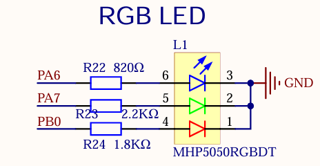
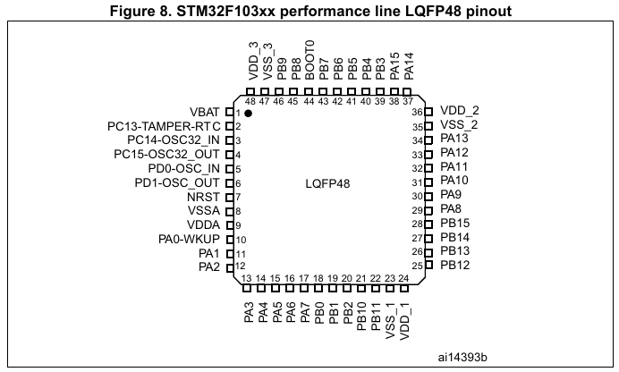
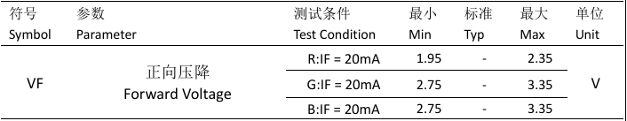
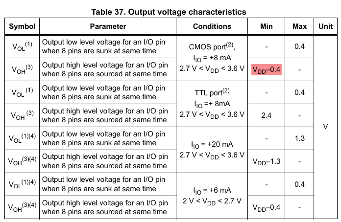
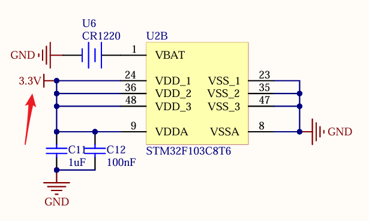
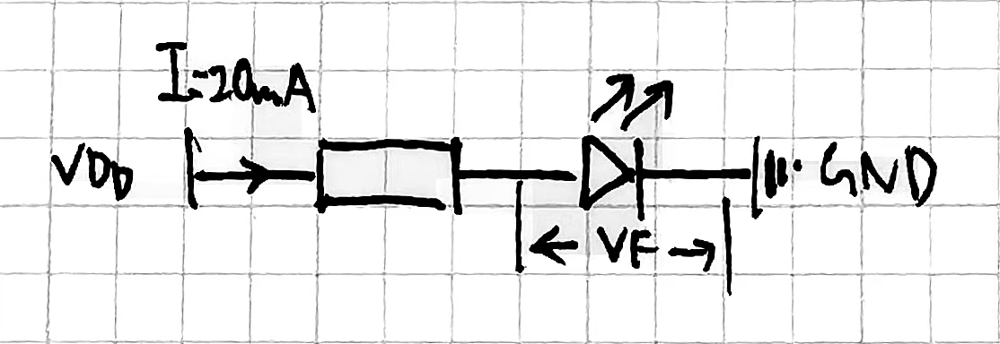

# p1-led-keys

在开发板的原理图[^1]中可以找到 RGB LED 的原理图：

很简单，从 STM32F103C8T6 的三个 IO 引脚引过来输出信号，然后接到 GND。

对应着也可以在 SoC 的 Datasheet[^2] 中找到对应封装上的引脚位置：

捋着 PCB 上的线路，也可以对的上引脚（什么盯针）：

## 一、点灯

### 1. 有关电路

为什么R22，R23，R24 分别是 $820 \Omega$，$2.2K\Omega$，$1.8K\Omega$？

查询 LED 器件 MHP5050RGBDT 的手册[^3]，可以找到它的正向压降 $VF$ 和对应的电流：

查询 STM32F103C8 的 Datasheet，也可以找到 IO 口输出的电压大小：

查询开发板的原理图可以得到 $V_{DD}$ 大小：

那么就可以将问题转化为下面这张电路图：

但是有点不知道为什么最后用那几个，可能还有三个颜色发光强度的差异的修正，以及留了一手发光只发了一点？（）

### 2. 代码

见 [../../../c1-cortex-m-quikstart/README.md](../../../c1-cortex-m-quikstart/README.md) 的 **PART4**。

## 二、按钮

## 参考

[^1]: [../../../assets/PCB原理图.pdf](../../../assets/PCB原理图.pdf)
[^2]: [../../../assets/stm32f103c8.pdf](../../../assets/stm32f103c8.pdf)
[^3]: [../../../assets/MHP5050RGBDT V5.pdf](../../../assets/MHP5050RGBDT V5.pdf)
