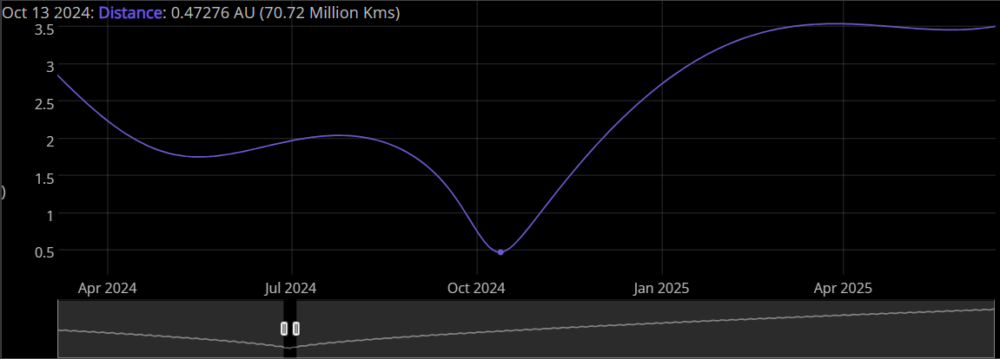
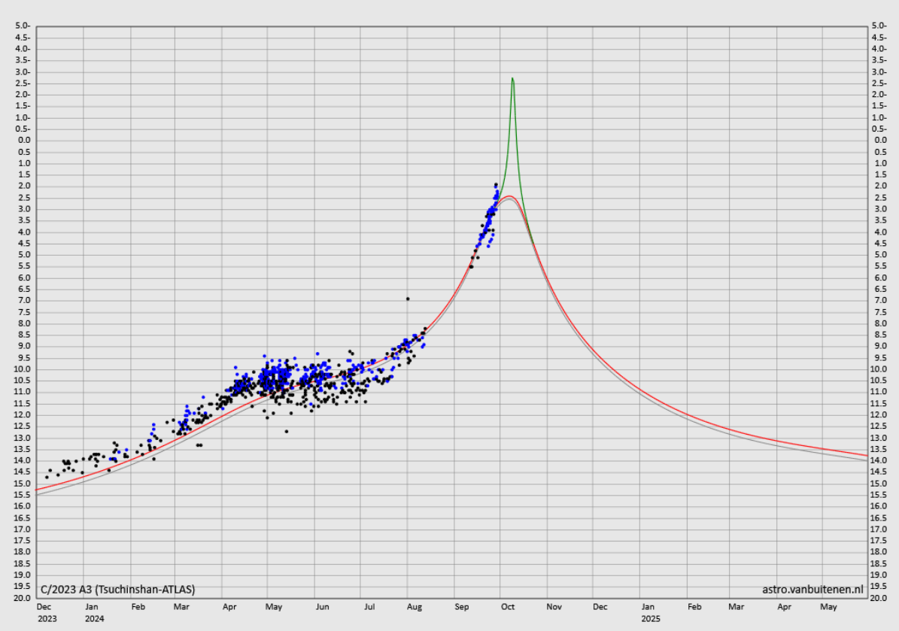
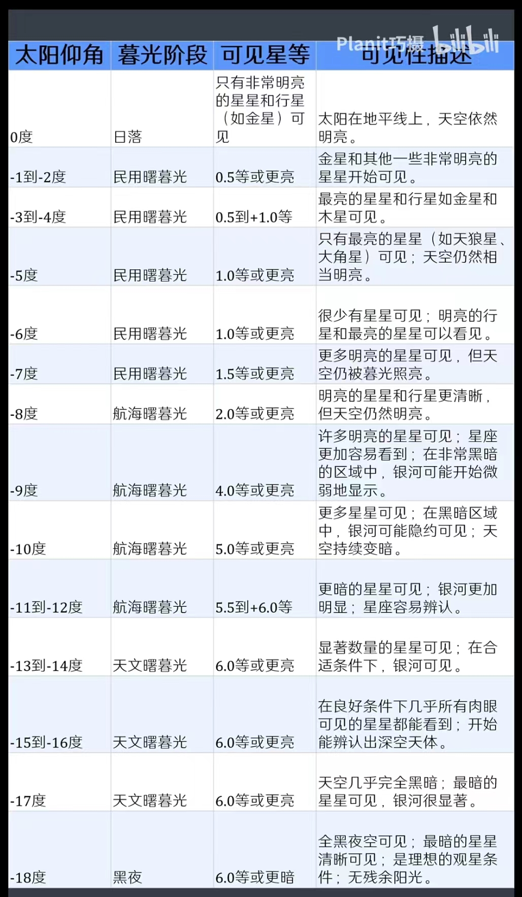

## 彗星

[COBS - Comet OBServation database](https://cobs.si/)

[Visual comets | astro.vanbuitenen.nl](http://astro.vanbuitenen.nl/comets)

[Comet C/2023 A3 (Tsuchinshan-ATLAS) | TheSkyLive](https://theskylive.com/c2023a3-info)

距地球距离：

亮度：

## 光污染

[Light pollution map](https://www.lightpollutionmap.info/#zoom=4.84&lat=39.5657&lon=119.8434&state=eyJiYXNlbWFwIjoiTGF5ZXJCaW5nUm9hZCIsIm92ZXJsYXkiOiJ3YV8yMDE1Iiwib3ZlcmxheWNvbG9yIjpmYWxzZSwib3ZlcmxheW9wYWNpdHkiOjYwLCJmZWF0dXJlc29wYWNpdHkiOjg1fQ==)

[天文通 - 全球光污染地图 - Light Pollution Map (darkmap.cn)](https://www.darkmap.cn/)

波特尔光害：

| 波特尔光害等级 | 极限星等  | 地面亮度       | 银河         | M31          | M33          | 黄道光       |
| -------------- | --------- | -------------- | ------------ | ------------ | ------------ | ------------ |
| 8              | 4.1 ~ 4.5 | 明亮到可读报   | /            | 目视不可见   | /            | /            |
| 7              | 4.6 ~ 5.0 | 可辨近处小物   | 目视不可见   | 斜视勉强可见 | /            | /            |
| 6              | 5.1 ~ 5.5 | 可辨近处小物   | 天顶隐约可见 | 目斜视可见   | 目视不可见   | 目视不可见   |
| 5              | 5.6 ~ 6.0 | 可辨远处物体   | 较难辨认     | 目视可见     | 目视不可见   | 隐约可见     |
| 4              | 6.1 ~ 6.5 | 可辨远处大物   | 大体结构可见 | 非常明显     | 斜视勉强可见 | 大体结构可见 |
| 3              | 6.6 ~ 7.0 | 隐约见远处大物 | 复杂结构可见 | 非常明显     | 斜视可见     | 明显可见     |
| 2              | 7.1 ~ 7.5 | 只可见物体影子 | 可投射阴影   | 非常明显     | 非常明显     | 惊人可见     |
| 1              | 7.6 ~ 8.0 | 只可见物体影子 | 可投射阴影   | 非常明显     | 非常明显     | 惊人可见     |

## 太阳仰角

